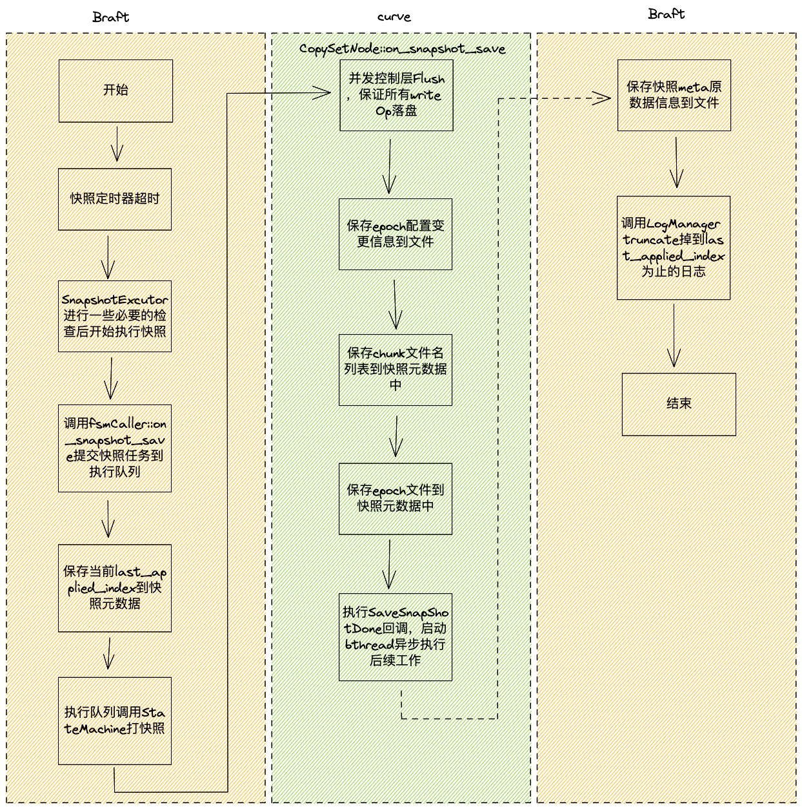

## 1 CurveBS写时延优化方案
### 1.1 背景

目前CurveBS写Op是在raft apply 到datastore时，使用了基于O_DSYNC打开的sync写的方式。实际上，在基于raft已经写了日志的情况下，写Op不需要sync就可以安全的向client端返回，从而降低写Op的时延。

其中的代码如下，在chunkfile的Open函数中使用了O_DSYNC的标志。

```C++
CSErrorCode CSChunkFile::Open(bool createFile) {
    WriteLockGuard writeGuard(rwLock_);
    string chunkFilePath = path();
    // Create a new file, if the chunk file already exists, no need to create
    // The existence of chunk files may be caused by two situations:
    // 1. getchunk succeeded, but failed in stat or load metapage last time;
    // 2. Two write requests concurrently create new chunk files
    if (createFile
        && !lfs_->FileExists(chunkFilePath)
        && metaPage_.sn > 0) {
        std::unique_ptr<char[]> buf(new char[pageSize_]);
        memset(buf.get(), 0, pageSize_);
        metaPage_.version = FORMAT_VERSION_V2;
        metaPage_.encode(buf.get());

        int rc = chunkFilePool_->GetFile(chunkFilePath, buf.get(), true);
        // When creating files concurrently, the previous thread may have been
        // created successfully, then -EEXIST will be returned here. At this
        // point, you can continue to open the generated file
        // But the current operation of the same chunk is serial, this problem
        // will not occur
        if (rc != 0  && rc != -EEXIST) {
            LOG(ERROR) << "Error occurred when create file."
                       << " filepath = " << chunkFilePath;
            return CSErrorCode::InternalError;
        }
    }
    int rc = lfs_->Open(chunkFilePath, O_RDWR|O_NOATIME|O_DSYNC);
    if (rc < 0) {
        LOG(ERROR) << "Error occurred when opening file."
                   << " filepath = " << chunkFilePath;
        return CSErrorCode::InternalError;
    }
...
}
```

### 1.2 问题分析

先前之所以使用O_DSYNC，是考虑到raft的快照场景下，数据如果没有落盘，一旦日志也被Truncate掉的场景下，可能会丢数据，目前修改Apply写不sync首先需要解决这个问题。  
首先需要分析清楚curve chunkserver端打快照的过程，如下图所示：



打快照过程的几个关键点：

1.  打快照这一过程是进StateMachine与读写Op的Apply在StateMachine排队执行的；
2.  快照所包含的last_applied_index在调用StateMachine执行保存快照之前，就已经保存了，也就是说执行快照的时候一定可以保证保存的last_applied_index已经被StateMachine执行过Apply了；
3.  而如果修改StatusMachine的写Op Apply去掉O_DSYNC，即不sync，那么就会存在可能快照在truncate到last_applied_index，写Op的Apply还没真正sync到磁盘，这是我们需要解决的问题；

### 1.3 解决方案

解决方案有两个：

#### 1.3.1 方案一

1.  既然打快照需要保证last_applied_index为止apply的写Op必须Sync过，那么最简单的方式，就是在执行打快照时，执行一次Sync。这里有3种方式，第一是对全盘进行一次FsSync。第二种方式，既然我们的打快照过程需要保存当前copyset中的所有chunk文件到快照元数据中，那么我们天然就有当前快照的所有文件名列表，那么我们可以在打快照时，对所有文件进行一次逐一Sync。第三种方式，鉴于一个复制组的chunk数量可能很多，而写过的chunk数量可能不会很多，那么可以在datastore执行写op时，保存需要sync的chunkid列表，那么在打快照时，只要sync上述列表中的chunk就可以了。
2.  鉴于上述3种sync方式可能比较耗时，而且我们的打快照过程目前在状态机中是“同步”的执行的，即打快照过程会阻塞IO，那么可以考虑将打快照过程改为异步执行，同时这一修改也可减少打快照时对IO抖动的影响。
      
#### 1.3.2 方案二

方案二则更为复杂，既然去掉O_DSYNC写之后，我们目前不能保证last_applied_index为止的写Op都被Sync了，那么考虑将ApplyIndex拆分称为两个，即last_applied_index和last_synced_index。具体做法如下：

1.  将last_applied_index拆分成两个last_applied_index和last_synced_index，其中last_applied_index意义不变，增加last_synced_index，在执行一次全盘FsSync之后，将last_applied_index赋值给last_synced_index;
2.  在前述打快照步骤中，将打快照前保存last_applied_index到快照元数据变更为last_synced_index，这样即可保证在打快照时，快照包含的数据一定被sync过了；
3.  我们需要一个后台线程定期去执行FsSync，通过定时器，定期执行Sync Task。执行过程可能是这样的： 首先后台sync线程遍历所有的状态机，拿到当前的所有last_applied_index，执行FsSync，然后将上述last_applied_index赋值给对于状态机的last_synced_index；

#### 1.3.3 两种方案的优缺点：

1.  方案一改动较为简单，只需要改动curve代码，不需要动braft的代码，对braft框架是非侵入式的；方案二则较为复杂，需要改动braft代码；
2.  从快照执行性能来看，方案一会使得原有快照变慢，由于原有快照时同步的，因此最好在这次修改中改成异步执行快照；当然方案二也可以优化原有快照为异步，从而减少对IO的影响；

#### 1.3.4 总结：

1.  采用方案一实现方式，原因是对braft的非侵入式修改，对于代码的稳定性和对后续的兼容性都有好处。
2. 至于对chunk的sync方式，采用方案一的第3种方式，即在datastore执行写op时，保存需要sync的chunkid列表，同时在打快照时，sync上述列表中的chunkid，从而保证chunk全部落盘。这一做法避免频繁的FsSync对全部所有chunkserver的造成IO的影响。


### 1.4 POC
以下进行poc测试，测试在直接去掉O_DSYNC情况下，针对各种场景对IOPS，时延等是否有优化，每组测试至少测试两次，取其中一组。

测试所用fio测试参数如下：
- 4k随机写测试单卷IOPS：
```
[global]
rw=randwrite
direct=1
iodepth=128
ioengine=libaio
bsrange=4k-4k
runtime=300
group_reporting
size=100G

[disk01]
filename=/dev/nbd0
```

- 512k顺序写测单卷带宽：
```
[global]
rw=write
direct=1
iodepth=128
ioengine=libaio
bsrange=512k-512k
runtime=300
group_reporting
size=100G
 
 
[disk01]
filename=/dev/nbd0
```

- 4k单深度随机写测试时延：

```
[global]
rw=randwrite
direct=1
iodepth=1
ioengine=libaio
bsrange=4k-4k
runtime=300
group_reporting
size=100G

[disk01]
filename=/dev/nbd0
```

集群配置：
| 机器    | roles                  | disk     |
| ------- | ---------------------- | -------- |
| server1 | client,mds,chunkserver | ssd/hdd * 18 |
| server2 | mds,chunkserver        | ssd/hdd * 18 |
| server3 | mds,chunkserver        | ssd/hdd * 18 |

#### 1.4.1 HDD对比测试结果

| 场景               | 优化前                                    | 优化后                                    |
| ------------------ | ----------------------------------------- | ----------------------------------------- |
| 4k 随机写          | IOPS=5928, BW=23.2MiB/s, lat=21587.15usec | IOPS=6253, BW=24.4MiB/s, lat=20465.94usec |
| 512k 128深度顺序写 | IOPS=550, BW=275MiB/s,lat=232.30msec      | IOPS=472, BW=236MiB/s,lat=271.14msec      |
| 4k单深度随机写     | IOPS=928, BW=3713KiB/s, lat=1074.32usec   | IOPS=936, BW=3745KiB/s, lat=1065.45usec   |

上述测试在raid卡writeback下性能有略微提高，但是提升效果并不明显，512k顺序写场景下甚至略有下降，并且还发现在去掉O_DSYNC后存在IO剧烈抖动的现象。

我们怀疑由于raid卡缓存的关系，使得性能提升不太明显，因此，我们又将raid卡设置为writethough模式，继续进行测试：

| 场景               | 优化前                                   | 优化后                                     |
| ------------------ | ---------------------------------------- | ------------------------------------------ |
| 单卷4k随机写       | IOPS=993, BW=3974KiB/s,lat=128827.93usec | IOPS=1202, BW=4811KiB/s, lat=106426.74usec |
| 单卷单深度4k随机写  | IOPS=21, BW=85.8KiB/s,lat=46.63msec      | IOPS=38, BW=154KiB/s,lat=26021.48usec      | 

在raid卡writethough模式下，性能提升较为明显，单卷4k随机写大约有20%左右的提升。

#### 1.4.2 SSD对比测试结果

| 场景           | 优化前                                   | 优化后                                    |
| -------------- | ---------------------------------------- | ----------------------------------------- |
| 4k随机写       | bw=83571KB/s, iops=20892,lat=6124.95usec | bw=178920KB/s, iops=44729,lat=2860.37usec |
| 512k顺序写     | bw=140847KB/s, iops=275,lat=465.08msec   | bw=193975KB/s, iops=378,lat=337.72msec    |
| 单深度4k随机写 | bw=3247.3KB/s, iops=811,lat=1228.62usec  | bw=4308.8KB/s, iops=1077,lat=925.48usec   |

可以看到在ssd场景下，测试效果有较大提升，4k随机写场景下IOPS几乎提升了100%，512k顺序写也有较大提升，时延也有较大降低。

