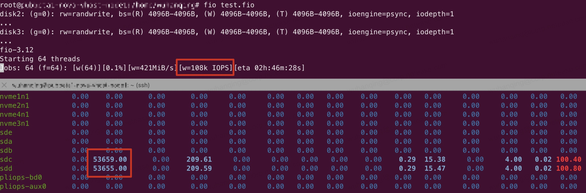
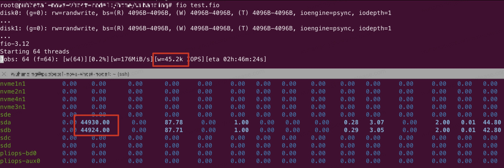
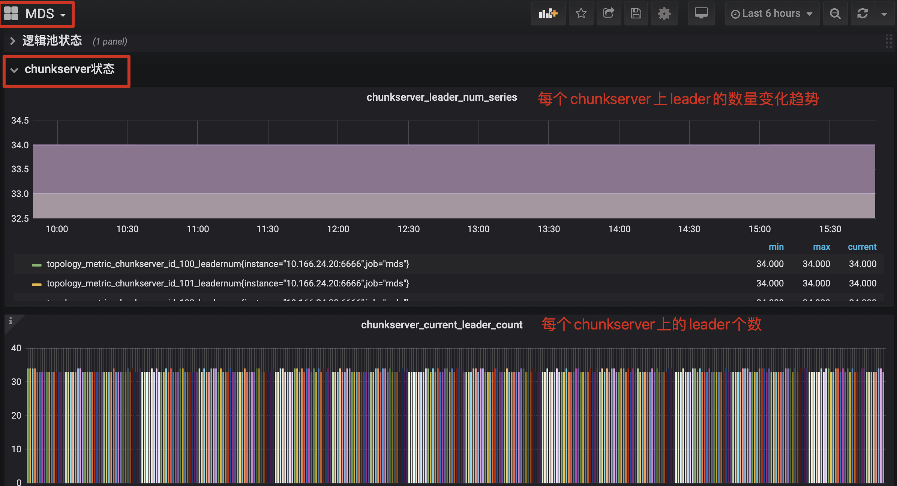
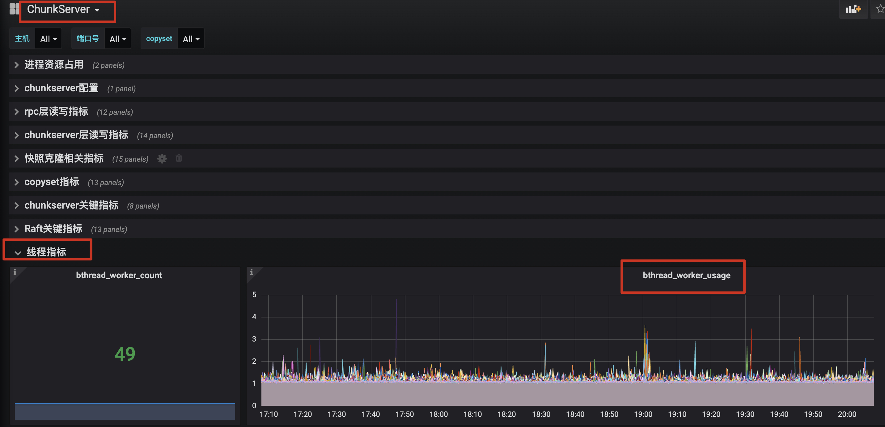
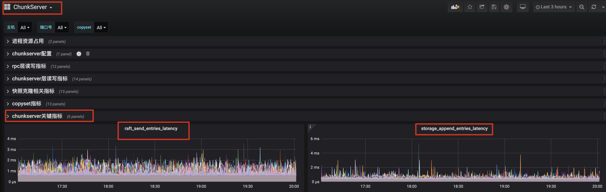

# Curve块存储性能调优指南

## 背景

本文档主要描述Curve块存储的参数是如何影响性能的，以及要如何调整，可以使得性能到达最优。

## 参考性能

测试场景：3台机器*10块/盘

盘的型号：Intel® Solid State Drive DC S3510 Series

测试工具：[curve-fio](https://github.com/opencurve/fio#readme)

测试版本：v1.2.5 (配置copyset.enable_odsync_when_open_chunkfile=true。 这个选项默认为false，可以优化性能，但是会有iops或者带宽抖动，请根据业务场景进行确定)

测试卷大小：100GB

条带化卷参数：stripeUnit=16k stripeCount=64（大io建议创建条带化卷测试）

### 8k随机写测试数据

**客户端个数：** 3

**fio配置：**
```
[global]
bs=8K
iodepth=128
rw=randwrite
direct=1
numjobs=1
size=100G
ioengine=cbd
runtime=999999
time_based
group_reporting
ramp_time=10s
```

**性能数据：**
|iops(k)|avg lat(us)|99th lat(us)
|----|-----|----|
|27.9|4590|27919
|27.7|4614|27919
|28.1|4549|27657

### 512k顺序写测试数据

**客户端个数：** 3

**fio配置：**
```
[global]
bs=512k
iodepth=128
rw=write
direct=1
numjobs=1
size=100G
ioengine=cbd
group_reporting
runtime=90
ramp_time=10s
```

|bandwidth(MB/s)|avg lat(ms)|99th lat(ms)
|----|-----|----|
|338|189|372
|338|189|485
|343|186|397


## 影响性能的关键指标

性能指标的查看途径有两种：
1. 直接通过服务的ip:port获取
2. 通过监控查看（[块存储监控部署](https://github.com/opencurve/curveadm/wiki/curvebs-monitor-deployment)）

### 环境配置


环境配置可以参考: [推荐配置设置](https://github.com/opencurve/curve/blob/master/docs/cn/%E6%B5%8B%E8%AF%95%E7%8E%AF%E5%A2%83%E9%85%8D%E7%BD%AE%E4%BF%A1%E6%81%AF.md)

**需要特别说明的是**，对于使用RAID/SAS卡及Sata SSD的环境，**需要在关闭磁盘缓存后，重启机器，使 RAID/SAS 卡识别磁盘缓存已经关闭。** 如果磁盘缓存打开，对文件的sync操作会发送至磁盘，导致磁盘性能下降。

重启后，对SSD盘上的文件系统，进行 fio 测试，验证缓存是否关闭。

fio脚本：

```
[global]
rw=randwrite
iodepth=1
ioengine=psync
fdatasync=1
bsrange=4k-4k
size=4G
numjobs=32
group_reporting
time_based=1
thread=1
runtime=10000

[disk0]
filename=/data/chunkserver0/data
[disk1]
filename=/data/chunkserver1/data
```

> 如果有多个SSD盘，在 fio 脚本的后面加上对应的盘。

> fio 测试写入的文件，最好提前通过 dd 命令创建或覆盖写一遍，dd if=/dev/zero of=/data/chunkserver0/data bs=1M count=4096 oflag=direct

如果关闭成功，fio 报告的 IOPS 与 iostat -mtx 1 看到的 SSD 盘上的 w/s 是一致的



如果缓存未关闭或机器未重启，会出现 fio 报告的 IOPS 只有 SSD 盘上 w/s 一半的情况



### 服务端

**1. 复制组的leader在chunkserver上的分布是否均衡**

在Curve块存储中，所有的读写请求都是发往leader处理的，如果复制组的leader在chunkserver上分布不均衡，会导致chunkserver上接受到请求的压力不同，导致无法完全发挥集群性能。

- metric指标查看：```curl leadermdsip:leadermdsport/vars | grep leadernum_range```
查看chunkserver上leader数量最大和最小的差值, **一般这个值在5以内认为集群是均衡的**

    ```
   topology_metric_logical_pool_default_logical_pool_leadernum_range : 1.000
    ```

- 监控：```MDS DashBord/chunkserver状态 panel```

    

- leader不均衡时可以通过命令触发快速均衡：```curve bs update leader-schedule```。这个命令创建的配置变更任务是随着心跳上报的，所以均衡效果在几个心跳周期之后可以看到（默认心跳周期是10s）。

**2. 复制组之间的心跳周期**

在Curve块存储中，复制组的心跳周期通过chunkserver的配置项```copyset.election_timeout_ms=1000```确定，默认是1s。由于复制组的心跳和用户数据的复制都是使用的bthread，当集群压力特别大时，会导致复制组心跳超时，复制组的leader在不断的切换。有三个表现：
- 从监控上可以看到每个chunkserver上的leader不均衡，并且单个chunkserver上的leader总是在变动（参考 **1. 复制组的leader在chunkserver上的分布是否均衡**）

- 监控项 ```chunkserver Dashbord/线程指标 Panels``` 中bthread的使用率持续飙高。更多信息的获取可以参考[brpc线程数量查看](https://github.com/apache/incubator-brpc/blob/master/docs/cn/server_debugging.md#1%E6%A3%80%E6%9F%A5%E5%B7%A5%E4%BD%9C%E7%BA%BF%E7%A8%8B%E7%9A%84%E6%95%B0%E9%87%8F)

    

- chunkserver的日志中有大量leader选举日志

    ```
        LOG(INFO) << "node " << _group_id << ":" << _server_id
              << " received PreVoteResponse from " << peer_id
              << " term " << response.term() << " granted " << response.granted();
    ```

这会导致client端有很多重试的rpc，加剧集群压力。

这种情况可以通过增大心跳周期规避leader频繁切换对性能的影响，即chunkserver配置项```copyset.election_timeout_ms=1000```。但这种规避方法不建议在生产环境中使用，复制组的心跳周期变大，会导致异常情况下IO的卡顿时间边长。复制组的心跳不受IO压力影响已经在优化中了，预计Q1会发布版本。

**3. 查看chunkserver节点上磁盘的压力**

Curve块存储性能测试时，理想的状态是可以把磁盘跑满。如果发现有性能瓶颈，可以先查询一下，磁盘是否被打满。

- 通过linux命令```iostat```查看磁盘压力情况，一般看观察```util```是否接近100%，cpu 的```idle```是否接近0

- 通过查看监控项 ```chunkserver Dashbord/Raft关键指标 Panels```

    ```storage_append_entries_latency``` : 写盘的延迟（一般ssd的延时在百us~几ms级别；hdd延迟在数十ms级别）

    ```raft_send_entries_latency```: 一次写盘延迟+一次rpc延迟（一般rpc的延迟在百us~几ms级别）

    

如果底层磁盘已经压满，理论上就已经达到了集群性能上限。

### 客户端

**1. 大IO顺序写场景建议使用条带化卷**

条带化卷的原理可以参考：[条带化设计](https://github.com/opencurve/curve/blob/master/docs/cn/curve-stripe.pdf)。概括来说，条带化是将大IO按照指定的配置，分发到多个复制组上，从而提高性能。

条带化卷的创建：```curve create file --path=/test --user=test --password=123 --size=20 --stripeunit=32KiB --stripecount=32```

**2. 直接使用 ```curve fio```测试**

当前Curve块存储支持的几个协议nbd、openstack、iscsi都是要跟Curve[热升级](https://github.com/opencurve/curve/blob/master/docs/cn/nebd.md)模块对接的，在IO链路上会多一次RPC。当前Curve块存储版本已经稳定，如果不考虑热升级，可以去掉热升级模块，提高性能。

Curve块存储fio的使用方式可以参考：[Fio for Curve README](https://github.com/opencurve/fio#readme)

## 其他指标简析

详见[Curve块存储监控项说明](https://github.com/opencurve/curve/blob/master/docs/cn/Curve%E7%9B%91%E6%8E%A7%E6%8C%87%E6%A0%87%E8%A7%A3%E6%9E%90.md)

IO过程中全链路关键阶段时延的metric查看(DashBord/Pannel，指标的具体含义请查看[Curve块存储监控项说明](https://github.com/opencurve/curve/blob/master/docs/cn/Curve%E7%9B%91%E6%8E%A7%E6%8C%87%E6%A0%87%E8%A7%A3%E6%9E%90.md))：

```
client端：
用户接口层指标/client_write_latency
rpc层指标/write_rpc_latency

chunkserver端：
rpc层读写指标/avg_write_lat
chunkserver层读写指标/avg_write_lat
Raft关键指标/raft_send_entries_latency
Raft关键指标/raft_service_append_entries_latency
Raft关键指标/storage_append_entries_latency
```