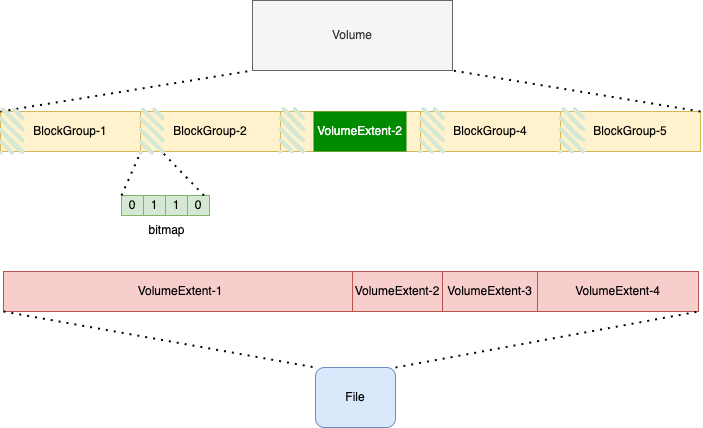
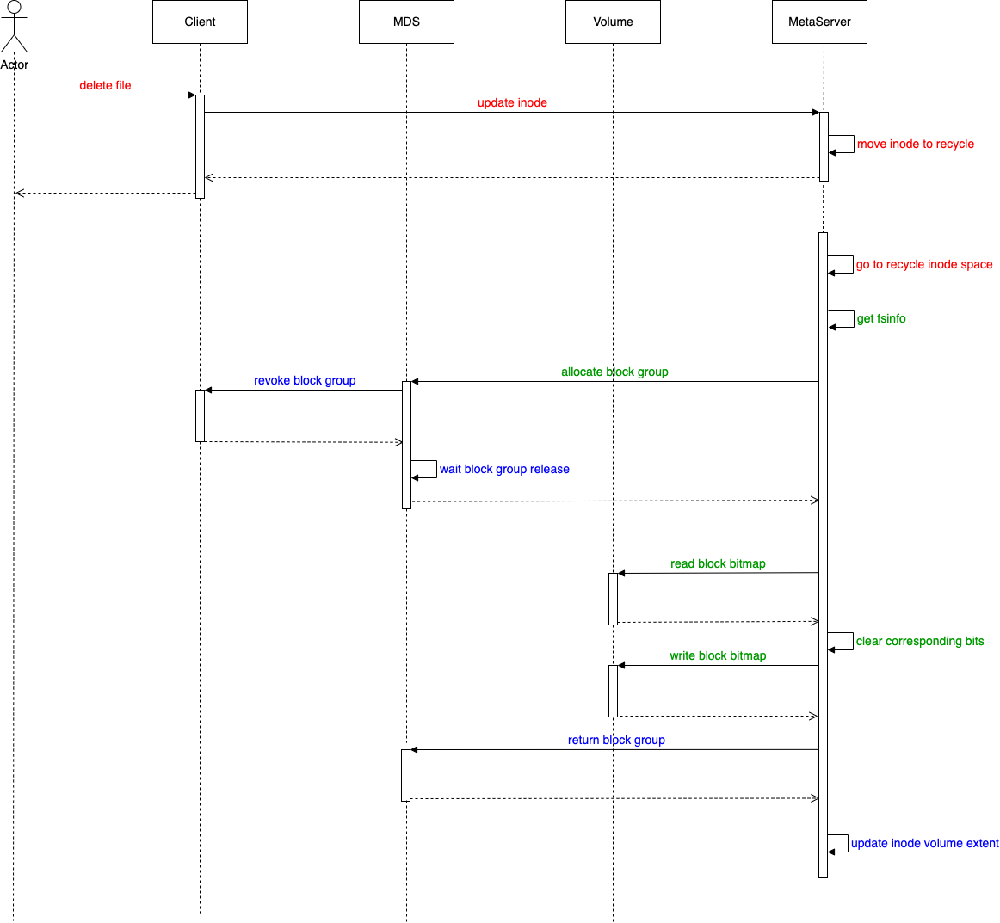

# Curve文件系统Volume后端空间管理

## 背景

Curve文件系统使用Curve块存储作为后端，空间管理相关的文档有：[curvefs_volume_space_design](https://github.com/opencurve/curve/blob/master/docs/cn/curvefs_volume_space_design.md) 和 [curvefs_volume_space_deallocate](https://github.com/opencurve/curve/blob/master/docs/cn/curvefs_volume_space_deallocate.md)。

当前空间回收功能还有缺失，尤其是异常情况下的处理没有给出比较好的方案。本文主要梳理下空间回收整体内容、对异常部分的方案进行调研和设计，并对需要进行的开发任务进行拆分。

首先总体介绍一下当前对接Curve块存储（Volume）作为后端的管理策略。



1. 文件系统上的一个文件和```Volume```空间上的映射关系。

    - 一个文件```File```占用的地址空间可以用多个不等长的```VolumeExtent``` 表示
    - ```VolumeExtent``` 包含了 ```{fsOffset, volumeOffset, length, isused}``` 信息
    - 根据这些信息可以知道文件数据片段在 ```Volume``` 上的位置信息

2. ```Volume```的空间管理。

    - ```Volume```的空间有多个等长的 ```BlockGoup```组成
    - 每个 ```BlockGroup``` 的头部空间使用bitmap记录当前 ```BlockGroup``` 指定粒度的分配情况
    - ```BlockGroup``` 包含的信息 ```{offset, size, used, available, blocksize, bitmap, owner}```
    - 根据这些信息，可以知道 ```Volume``` 的空间当前被使用的情况。
    - **空间分配：** 文件写入数据的时候需要分配空间
    - **空间回收：**

        - 触发条件1文件删除。在Curve文件系统中，```inode``` 的 ```nlink``` 为0，可以被后台异步清理
        - 触发条件2文件系统删除。在Curve文件系统中，文件系统和 ```volume```的关系是一对一的，文件系统删除需要删除对应的 ```Volume```
        - 触发条件3Truncate。需要清理新的 ```length``` 以外的空间，当前先不解决

## 空间回收

### 方案介绍

Curve文件系统中:
- **文件的写入需要分配空间**，因此 ```Client``` 需要对 ```BlockGroup``` 进行操作以分配空间。
- **文件的删除需要清理空间**，元数据是在 ```Metaserver``` 管理的，因此 ```Metaserver``` 需要对 ```BlockGroup``` 进行操作以回收空间。

当前空间回收流程如下：

1. ```Client``` 收到用户删除文件的请求 （空间回收的触发条件1）并处理

    - 如果配置了回收站，则把文件放到回收站中（相当于rename的操作)
    - 如果没有配置回收站，则直接调用删除Inode的请求

2. ```Metaserver``` 处理用户删除文件的请求

    - 如果是配置了回收站，文件进入回收站（延迟删除），等待超时时间后递交给空间回收模块
    - 如果没有配置回收站，直接递交给空间回收模块

3. ```Metaserver``` 进行空间回收。遍历 inode 中的 ```VolumeExtent```

    - 获取 ```VolumeExtent``` 对应的 ```Volume``` 空间的 ```BlockGroup```
    - 清理对应 ```BlockGroup``` 上的 bitmap信息
    - 更新 Inode

以下为空间回收的流程图，其中红色表示已经开发完成；绿色表示逻辑完成单元测试未完成；蓝色表示单元测试和逻辑都未完成。



### 细节说明

#### 1. metaserver重启这种异常处理

**问题**： 在上述流程中，对于 ```VolumeExtent``` 的删除, 先清理对应 ```BlockGroup``` 的 ```bitmap```, 再更新 Inode. 这两个步骤分别是在 CurveBS 和 Metaserver上操作的，如果 ```bitmap``` 清理完成之后 Metaserver 异常，Metaserver重启后，如何处理中断更新的 Inode?

**解决方法**：清理之前标记 Inode 为 ```deleting``` 状态，清理完成标记为 ```done```. 重启后 ```deleting``` 状态的 Inode 空间不再被处理

优点：不考虑两个操作之间的事务类型的方案，这种方式很简单；认为 Metaserver 重启不是一个常态操作

缺点： 被中断的 Inode 剩余空间无法在空间回收流程中被清理，后续需要通过 fscheck 等其他方式回收

#### 2. 清理效率问题

**问题**：```BlockGroup``` 会被多个 Client 和 Metaserver 同时挣抢。各端获取和释放权限的策略是什么？

**解决方法1**：各端持有 ```BlockGroup``` 超时释放的策略。

具体说明：
各端持有 ```BlockGroup``` 设置一个超时时间，超时归还。其他端可以尝试申请。

优点：
- 简单易实现

缺点：
- 对分配的影响。由于持有的 ```BlockGroup``` 频繁更换，会导致一个文件的数据分布在数个 ```BlockGroup``` 上， 回收所要集齐的 ```BlockGroup``` 更多了。
- 回收效率未知。尤其是当文件数据非常巨大的时候，如果未获取 ```BlockGroup``` 直接跳过，那么在处理过程中正好能获得对应 ```BlockGroup``` 的概率是未知且不可控的。如果一直等待某个 ```BlockGroup``` 的释放，要完成一个 Inode 空间的回收耗时也会很长，因为 ``` BlockGroup``` 会释放后会遭到其他 Client 和 Metaserver 的争抢。

**解决方法2**：通知对应的 ```BlockGroup``` 持有方进行处理。

具体说明：
Metaserver 确定需要清理的 ```BlockGroup```, 通知持有它的 ```BlockGroup``` 端去清理对应的 bitmap.

优点：可以精准通知，对 ```BlockGroup``` 的竞争小很多
缺点：
- 因为需要通知其他服务器操作，那么在通知过程中的异常怎么处理。比如重复收到清理消息的问题。要保证清理操作的幂等需要额外比较复杂的方案
- 上述两个方法可以做到的是遇到可以回收的空间即可清理，在文件量超级大的情况下，这种无差别的清理不能保证清理效率，只能看当前遍历的 Inode 的可回收空间的大小

**解决方法3**：先做统计再做清理

具体说明：

- Metaserver 遍历需要清理 Inode，统计出 ```BlockGroup``` 各自需要清理的空间大小
- Metaserver 将该信息汇总上报给 MDS 汇总，然后对 ```BlockGroup``` 需要回收的空间进行排序，可以根据可回收空间的大小，依次向 ```Client``` 端收回权限，下放给 ```Metaserver```做清理

这里需要解决的一个问题是：在 MetaServer 上的信息汇总如何记录？

- 如果用这样一个结构 ```map<std::string, vector<uint64>>``` 来记录 ```BlockGroup``` 和 InodeId 的对应关系。假设后端空间为 1PB 大小，BlockGroup 大小为 64MB，则 BlockGroup的个数为 1PB/64MB=16384，如果一个 Metaserver 上待删除的 InodeId 为 5000w，则大概估计上述结构体需要占用的空间为 (64Byte*16384)+16384*(5000w/16384)*64Byt≈3GB. 
相比较于 Metaserver 本身允许占用的内存空间来说 ```storage.max_memory_quota_bytes```（默认30GB）,  这个数据量占用的空间还算可以接受。但是对这个 map 的访问时间应该会很大。如果数据规模继续增大, 这部分数据存在内存里显然是不合适的。

- 对这个结果进行持久化。待处理的 inode 集合{inode_wait_to_delete}
    - 每次从 {inode_wait_to_delete} 取 n 个 Inode 进行处理
    - 在内存中更新 ```BlockGroup``` 可删除空间
    - 持久化 ```BlockGroup``` 和 Inode 的对应关系（可以直接以 ```BlockGroup``` 作为文件名，Inode append到文件中, 或者直接作为key-value来存储，一个64MB的 ```BlockGroup``, 最多包含的 Indoe 的个数： 64MB/4K=16384, 占用空间大小最多为：16384*64Byte=1MB）
    - **这个过程如何同步到三个节点上以保证leader挂掉之后新的leader可以继续进行处理？** 为了保证这个过程中的一致性， {inode_wait_to_delete} , BlockGroup 对应的 Inode 这两个信息的持久化需要走一致性协议。为了恢复的一致性，这两个持久化最好都在rocksdb中。

优点：
- 可以清楚的知道需要清理的空间，可以优先回收占用更满的空间，回收效率是三个方法中最高的
- 极大的减少了对 ```BlockGroup``` 的争抢

缺点：
- 在要删除的文件数量特别大的情况下，Metaserver 端对需要清理空间大小统计可能会很慢，可以选择阶段性的结果上报。


#### 3. 已有实现问题

当前数据清模块为: [trash](https://github.com/opencurve/curve/blob/87664bd392f3a74c6d126333ebd37088f87f0c58/curvefs/src/metaserver/trash.h#L92), 这个名字是有歧义的，后面会变更为 ```InodeSpaceDeallocate```.

现在的实现中，任务需要通过 [Add](https://github.com/opencurve/curve/blob/87664bd392f3a74c6d126333ebd37088f87f0c58/curvefs/src/metaserver/trash.h#L101) 接口加入，并且不持久化。当任务中断时，需要依赖 Metaserver 重启遍历一遍 Inode 来恢复任务。

**这里存在的问题是：** Metaserver 重启进行过优化，为了加速重启，现在是通过 snapshot + wal 回放的方式来重建 rocksdb 数据库，已经不会全量重放了。所以当前这种方式，会导致中断的任务不再被加载处理。

**解决方法：** 数据清理模块持久化需要处理的InodeId

具体说明：在 Inode 的 nlink 被更新之前加入到数据清理模块，数据清理模块将对应的 InodeId 持久化。异常情况下 nlink 未更新，InodeId 已被持久化，清理模块在扫描的时候判断一下即可。

优点：
- 不需要全部遍历所有的 InodeId, 清理效率会大大提高

缺点：
- 三副本上需要同步这一信息，因此 InodeId 的持久化需要通过一致性协议，在删除的文件数量很大的情况下，会有比较大的时间开销

