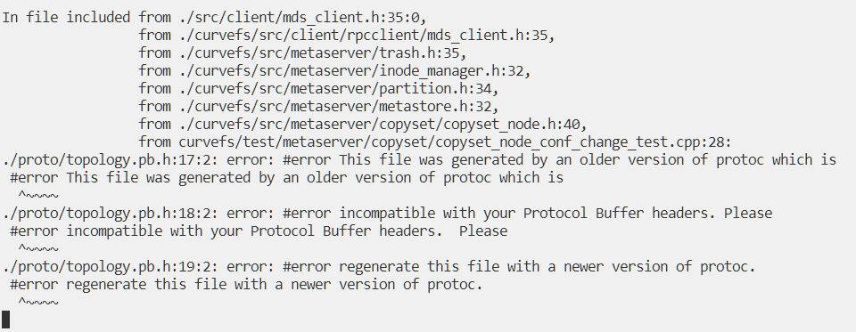

## 生成compile_commands.json

1. 清楚之前的编译缓存，`bazel clean`
2. 编译整个项目，`bazel build //...`
3. 生成compile_commands.json，`bazel run @hedron_compile_commands//:refresh_all` (更多使用方式可以参考https://github.com/hedronvision/bazel-compile-commands-extractor)

   过程中可能会有如下报错：

   

   需要把之前手动生成的pb.h/cc文件删除（proto目录、curvefs/proto目录下）
 
   如果没有其他问题，会在工程目录下生成compile_command.json文件
   如果遇到 python 脚本等报错, 请升级 python 版本.
## vscode clangd 配置

1. 卸载或禁用ms-vscode.cpptools
2. 搜索clangd并安装
3. 在设置中，对clangd.arguments加入如下参数
   
   ```json
   "clangd.arguments": [
       "-j=4",
       "--background-index",
       "--all-scopes-completion",
       "--pch-storage=disk",
       "--completion-style=detailed",
       "--header-insertion=iwyu",
       "--malloc-trim",
       "--query-driver=/usr/bin/clang++-11"  # 修改为本机clang++或者g++的路径
   ]
   ```

4. 第一次需要手动启动clangd

   按F1打开命令面板，选择 `clangd: Manually activate extension`

5. 【可选】可以在工程目录下新建.clangd文件（或者放到 `~/.config/clangd/config.yaml`），开启更多的检查和提示

   ```
   Diagnostics:
     ClangTidy:
       Add: [performance-*, modernize-*, readability-*,bugprone-*,]
       Remove: [modernize-use-trailing-return-type]
       CheckOptions:
          readability-identifier-naming.VariableCase: camelBack
     UnusedIncludes: Strict
   
   # 下面几个可以设置为True，可以在对应的地方显示函数形参名称和auto推导出的类型
   InlayHints:
     Enabled: False
     ParameterNames: False
     DeducedTypes: False
   ```

### clangd 官网

https://clangd.llvm.org/installation

### clangd 配置说明

https://clangd.llvm.org/config
