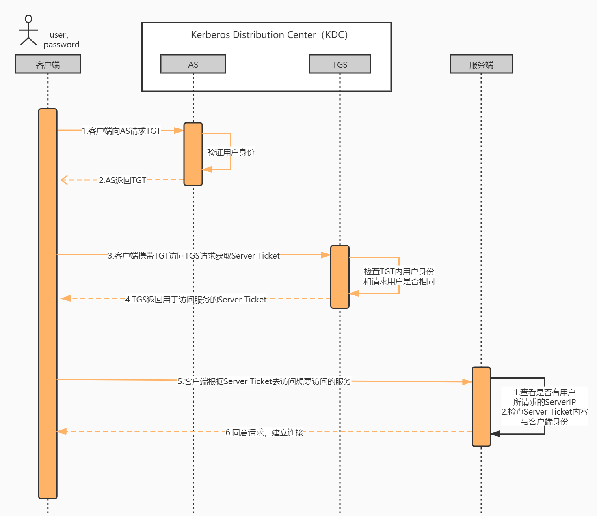
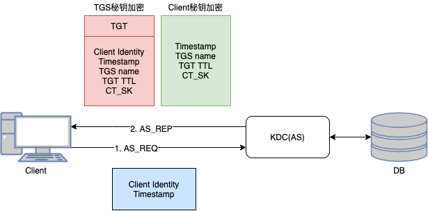
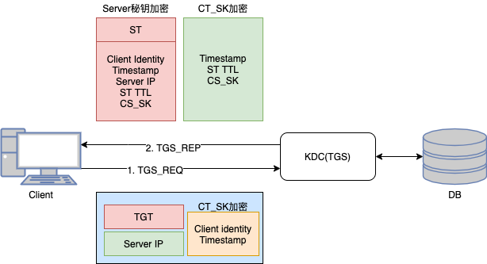
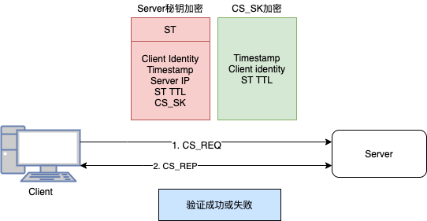
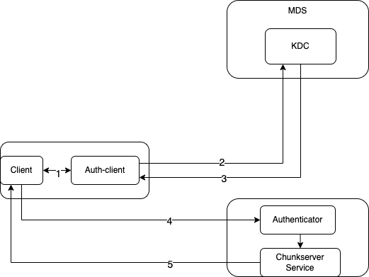

## Curve系统鉴权方案

### 背景

目前Curve系统并未对集群的“用户”进行任何身份验证，这里的用户包括curve-client、tools、各服务组件等集群参与者，在不安全的网络环境中可能存在数据安全问题。例如，在攻破网络环境的情况下，攻击者能够轻松操作集群。所以我们希望能为Curve系统设计一个鉴权系统，使得只有具有相应权限的用户才能够访问对应服务的特定资源。

### 认证协议

Curve系统鉴权的思路基于[Kerberos](https://en.wikipedia.org/wiki/Kerberos_(protocol))认证协议，为了便于对后续认证过程的理解，首先对Kerberos进行简要介绍：

协议中主要有三种角色：

1. client: 发送请求的一方

2. server: 接收请求的一方

3. KDC(Key Distribution Center): 秘钥分发中心，一般由三部分组成：

   **AS(Authentication Server)**: 认证服务器，用于认证客户端的身份，并发放客户端用于访问TGS(Ticket Granting Server)的TGT(Ticket Granting Ticket)

   **TGS**: 发放整个认证过程和客户端访问服务端时所需的服务授予票据（Ticket）

   **DB**: 一个用于存储认证信息的数据库

#### 如何证明“我就是我”

在Kerberos协议中，通信双方需要在通信前互证自己的身份是可靠并具有访问权限的，直接将身份信息携带在请求中，对方是无法确认身份信息的真实性（可能被冒充），所以借助可信第三方KDC，KDC能够提前知道各方角色的身份和权限信息，所以，通信方可以去KDC进行自身身份验证，通过认证后会获得访问服务的Ticket，服务方只需要验证Ticket的合法性即可。

这里涉及两个关键的问题：

1. KDC如何验证来获取Service Ticket的客户端的身份？
2. 服务端如何验证Ticket的合法性？

认证的前置条件：

1. 需要提前在KDC中添加用户，包括身份信息、秘钥和权限等
2. 认证过程采用对称加密，即所有用户和KDC共享密钥

通信前的认证过程如下，涉及client和KDC的三次通信过程：

1. 认证的第一次通信

client发送明文身份标识到KDC(AS)，AS会在DB中查找该用户是否存在，存在则返回图示的两个信息

2. 认证的第二次通信

client收到第一次返回的信息后，使用自己的秘钥解密第二部分内容（如果是伪造的client这步解密会失败），获取到下步通信的TGS name和用于通信的CT_SK（Client to TGS Session Key）。client会向TGS发送包括想要访问server在内的三种信息，TGS同样会先在DB中查找该server是否存在，存在则使用自己的密钥解密TGT，验证有效期并获取到client info from db和CT_SK，使用CT_SK解密client发送的身份信息，验证client发送的身份信息和db中记录的是否一致，如果一致则返回图示的两部分信息。

3. 认证的第三次通信

client 使用CT_SK解密获取与server通信的session key(CS_SK)，最后向server发送图示两部分内容进行最后的验证。

整个kerberos认证的过程较为复杂，三次通信中都使用了密钥，且密钥的种类一直在变化，并且为了防止网络拦截密钥，这些密钥都是临时生成的Session Key，即他们只在一次Session会话中起作用，即使密钥被劫持，等到密钥被破解可能这次会话都早已结束。

### Curve的认证过程

同样首先考虑核心三种角色：

1. Client: curve-client、tools、（mds、chunkserver、snapshotcloneserver 进程内包的client）
2. Server: mds、chunkserver、snapshotcloneserver
3. KDC: 考虑到目前Curve自身的架构，可以在MDS中新增AuthServive，让MDS兼任KDC的角色并且合并AS和TGS的功能，密钥和用户身份信息可存储在ETCD中。

#### 认证过程

下面以 client访问chunkserver为例介绍一次请求的过程：

1. client 发送请求前会先判断是否开启鉴权，开启则从全局单例 Auth Client中获取chunkserver服务的Token。
2. 首次获取Token时需要Auth Client去KDC获取Ticket。
3. 获取到Ticket并缓存在Auth Client中，且有后台任务在过期之前从KDC刷新回来，后续请求都直接从Auth Client的缓存中获取。
4. 将获取的Token添加到请求中进行发送。
5. 在chunkserver服务入口出会检测授权信息，合法则可进行资源访问，否则直接返回。

#### 加密算法

整个认证过程采用AES-128对称加密算法，具有较高安全性和加解密性能

#### 用户管理和密钥分发

用户的身份信息、秘钥和权限存储在ETCD中，可通过工具进行用户的管理。由于认证使用对称加密，所以服务和MDS(KDC)共享相同的秘钥，通过Curveadm进行秘钥分发，在集群部署通过Curveadm分发秘钥到各服务配置和MDS(KDC)中。后续如有新增租户，需要先使用工具增加该租户秘钥和权限信息，该用户使用授权的秘钥才可访问服务。

#### Ticket的获取与更新

开启服务身份验证功能后，请求发起方需要先获取相应服务的Ticket，在过期之前可从自己的缓存中直接获取，目前实现后台任务会在过期之前从KDC中获取新的Ticket来更新本地缓存。

#### 验证信息的传递

client和server端之间的认证信息传递和认证有两种方式，目前实现采用第一种：

1. 在所有request中携带认证信息，server端在收到请求后先进行权限验证。

   优点：比较灵活，可适应使用不同协议框架的client和server

   缺点：每个请求都需要进行验证，性能会有一定损耗

2. 使用brpc框架提供的[基于连接的认证](https://github.com/apache/brpc/blob/master/docs/cn/client.md#%E8%AE%A4%E8%AF%81)，用户只需要继承实现Authenticator即可

   优点：基于连接的认证在TCP连接建立后，会发送验证包，认证通过后该连接的后续请求不需要再验证，对性能损耗较小

   缺点：不够灵活，一般只能携带本机的静态信息，且不能适应不同框架间的通信（client是grpc或http而rpc server是brpc）

#### 秘钥的轮换

为了提高系统安全性，避免因密钥泄露带来系统风险，秘钥需要进行轮换，目前Curve考虑采用基于事件的主动轮换策略，即人为主动的触发秘钥轮换，为保证在秘钥轮换过程中服务的平滑过度，采用服务支持多秘钥设计，使得在秘钥轮换过程中服务的新老秘钥可在一段时间内同时有效。
