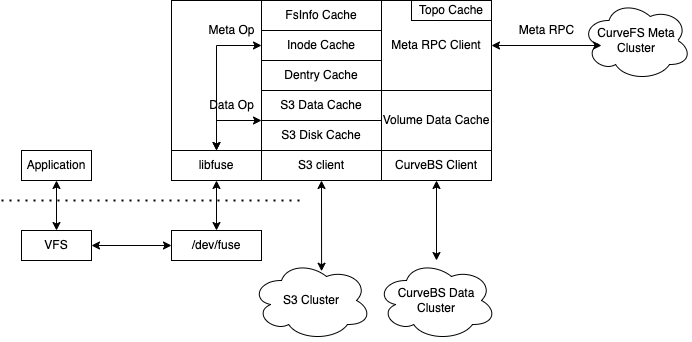
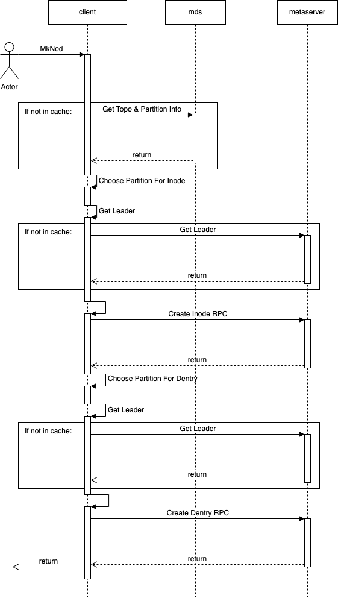
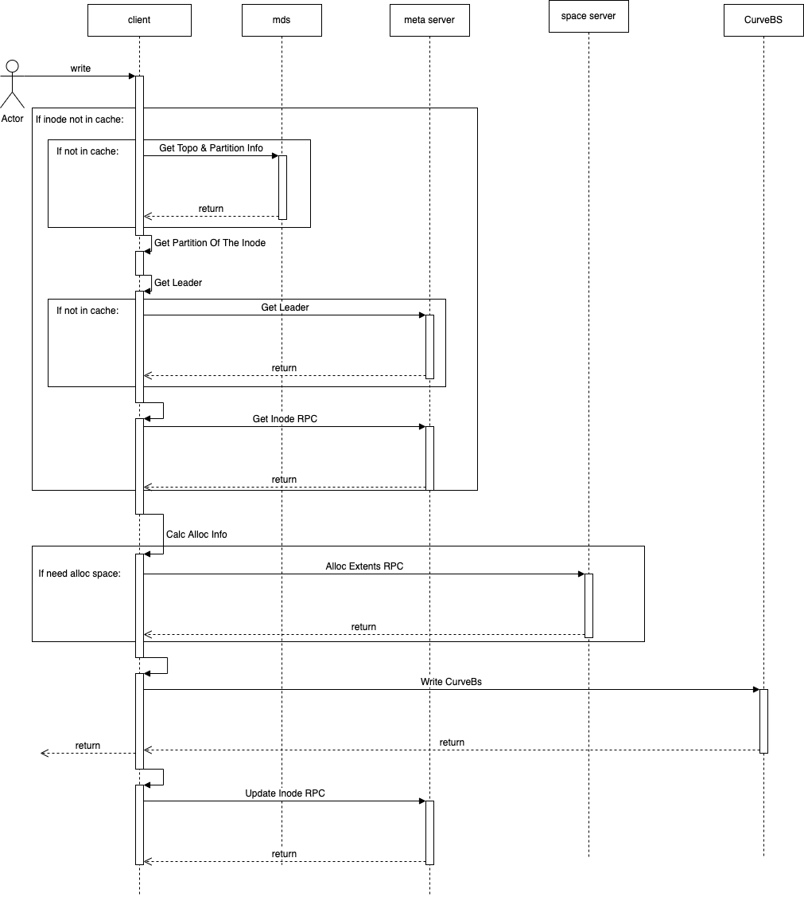
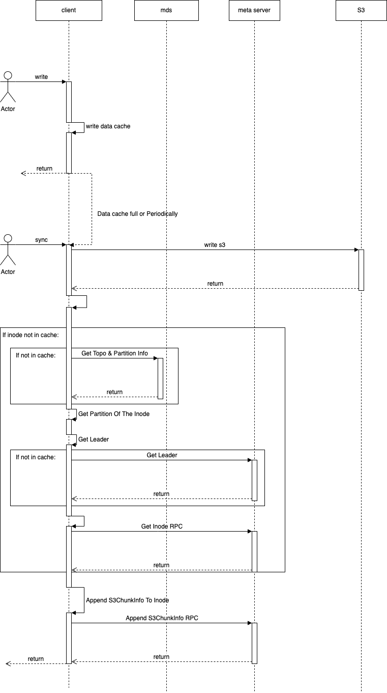
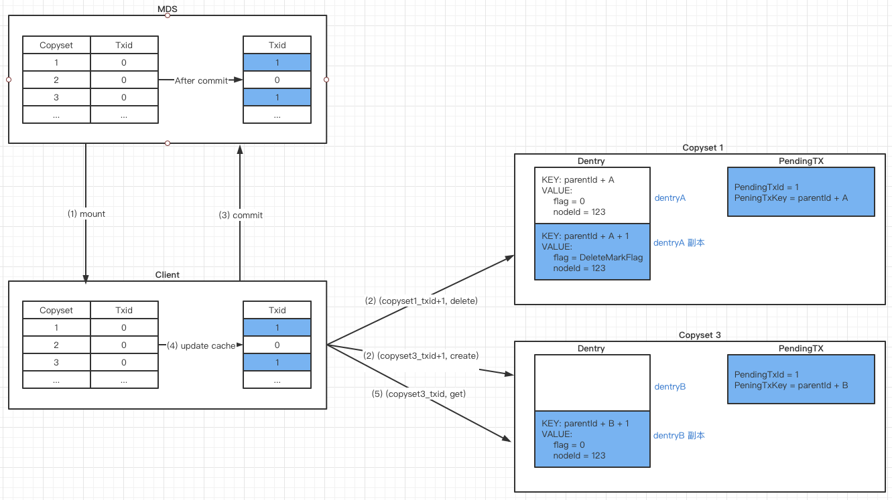

## 1 概要
CurveFS client 作为CurveFS的客户端，使用rpc接口向后端的元数据集群和数据集群发送请求，调用后端相应接口，实现相应的功能。其通过对接fuse用户态文件系统接口，向上提供文件系统接口功能。CurveFS client支持数据存储在两种数据存储后端，分别是Curve块存储和S3兼容的对象存储，后续还可能支持CurveBS和S3混合存储，让数据根据冷热程度在CurveBS与S3之间流动。

## 2 功能介绍
### 2.1 提供标准POSIX文件系统接口
CurveFS client通过对接libfuse 的 lowlevel fuse api，支持fuse用户态文件系统，实现标准POSIX文件系统接口。

### 2.2 支持CurveBS 后端存储引擎存储数据与缓存
CurveFS client 支持将文件系统数据，存储在CurveBS中。CurveBS提供的是块设备的接口，CurveFS client将文件系统数据组织成一定的结构，写入到CurveBS块设备中，从而实现CurveBS的后端数据存储。
CurveFS client支持将CurveBS中存储的数据缓存在内存中，以加速数据的读写性能。

### 2.3 支持S3存储引擎存储数据与缓存
CurveFS client 支持将文件系统数据，通过一定的格式，转换称为对象存储中的对象，并通过S3接口兼容的客户端（使用S3 C++ sdk）将文件数据保存在S3存储引擎中。
CurveFS client支持内存与磁盘缓存的二级的数据缓存，从而加速S3数据的读写性能。

### 2.4 元数据获取和缓存
CurveFS client 将文件系统元数据存储于CurveFS元数据集群，CurveFS client支持将元数据缓存在client端，从而提供更快速地元数据访问。其缓存的元数据信息有:
- 文件系统全局信息，即FsInfo。
- 各文件和目录的元数据，包括dentry信息和inode信息两大部分。
- 各文件和目录的元数据的分布于的Copyset与Partition信息，CurveFS client缓存这些信息，从而向对应的Copyset与Partition请求元数据操作。
- 元数据集群的拓扑信息，CurveFS client需要知道元数据集群的ip、端口等拓扑信息，从而知道向哪个ip、端口发送rpc。

### 2.5 元数据请求的异常处理和重试
CurveFS mds 和 CurveFS metaserver集群，实现了高可用部署，其中
- CurveFS mds 同一时刻只有一个mds提供服务，其他mds节点通过etcd监听，当主mds发生异常时，备mds能够随时替代成为leader，此时需要CurveFS client寻找主mds和重试rpc请求以处理该种情况。
- CurveFS metaserver集群，是以mutiraft集群的方式，对CurveFS client提供服务的，也会存在类似的leader切换等场景，此时也需要CurveFS client 去GetLeader以及在切换leader后重试rpc请求。

除此之外，
- CurveFS client与上述组件的通信，也会因为网络繁忙等原因，造成rpc的超时等问题，那么同样需要CurveFS client 实现请求的重试。

## 3 架构

CurveFS client包含几个主要模块：

-   libfuse，对接了其lowlevel fuse api，支持fuse用户态文件系统；
-   元数据cache，包含fsinfo, inode cache, dentry cache, 实现对元数据的缓存；
-   meta rpc client， 主要对接元数据集群，实现meta op的发送，超时重试等功能；
-   S3 client， 通过对接S3接口，将数据存储在S3中；
-   S3 data cache， 这是S3数据存储的内存缓存层，作为数据缓存，加速S3数据的读写性能；
-   S3 disk cache，这是S3数据存储的本地持久化缓存，通过磁盘缓存，将对S3数据的读写暂时缓存在本地磁盘上，稍后在异步上传到S3，从而有效降低时延，提供吞吐；
-   curvebs client 通过对接Curve块存储SDK，实现将数据存储在Curve块存储集群中；
-   volume data cache，这是当数据存储在Curve块存储中的缓存层，以加速数据读写性能（开发中）；

## 4 IO流程
CurveFS Client的IO流程分为两大部分，分别是元数据Meta IO流和数据Data IO流。

### 4.1 Meta IO 流

CurveFS 的元数据IO流，以MkNod为例，包含如下过程：
- 用户调用文件系统MkNod接口，经过用户态文件系统fuse low level api，到达CurveFS client接口；
- MkNod需要执行两步操作，分别是CreateInode和CreateDentry。CreateInode过程首先需要决定创建Inode的partition。通常情况下，topo信息和partition信息缓存在CurveFS client端，如果缓存中没有这些信息，那么CurveFS Client首先会去mds获取这些信息；
- CurveFS client根据缓存中的partition信息，根据一定的策略，决定创建Inode的partiton；
- 根据缓存中或者获取到的topo信息以及partiton信息，找到需要创建Inode的copyset；
- 如果该copyset中缓存了leader信息，那么就可以直接发送CreateInode的rpc请求到对应的metaserver，否则，此时还需要向copyset中任一metaserver获取leader信息；
- 调用CreateInode的rpc创建完Inode后，接下来就要CreateDentry了；
- 同样的，Create Dentry过程，首先也需要根据一定的策略，决定创建Dentry的partiton；
- 之后，Create Dentry过程根据缓存中或者获取到的topo信息以及partiton信息，找到需要创建Dentry的copyset；
- 如果该copyset中缓存了leader信息，那么就可以直接发送CreateDentry的rpc请求到对应的metaserver，否则还需要向copyset中任一metaserver获取leader信息；
- 创建Dentry完成后，即完成了MkNod的功能。

### 4.2 Data IO 流
数据IO流分为两大部分，分别是数据存储到CurveBS的Data IO流与数据存储到S3的Data IO流，两者有少许区分，分别如下：

#### 4.2.1 存储于CurveBS Data IO流：

存储到CurveBS的Data IO流包含如下过程：
- 用户调用文件系统write接口，经过用户态文件系统fuse low level api，到达CurveFS client接口；
- CurveFS client 的write接口首先会获取Inode，如果Inode不在cache中，那么走类似上一节元数据的流程，从metaserver端获取Inode；
- 获取到Inode信息后，write接口首先会根据write的offset，len，判断是否需要分配新的空间；
- 如果需要分配新的空间，那么将调用AllocExtent RPC接口，向space server申请空间（以extent表示）；
- 分配到空间后，CurveFS client将调用CurveBS client的块设备接口，将数据写入CurveBS；
- 完成数据写入后，CurveFS client将数据写入信息和分配信息更新到Inode，并调用UpdateInode RPC，将Inode更新到metaserver。

#### 4.2.2 存储与S3 Data IO流：

存储到S3的Data IO流包含如下过程：
- 用户调用文件系统write接口，经过用户态文件系统fuse low level api，到达CurveFS client接口；
- CurveFS client 的write接口会先将数据写入Data Cache中；
- 当DataCache数据满或者周期性的刷新时候到了的时候，CurveFS client将开始数据的Sync过程；
- CurveFS client首先会将数据写入S3，（如果有disk cache，会先将数据写入disk cache，稍后再异步将数据写入S3）;
- 数据写入S3之后，CurveFS client会记录写入S3的数据的元信息，组织成ChunkInfo；
- 如果此时CurveFS client 没有缓存Inode信息，那么将会走前一节流程中的元数据流从metaserver获取Inode；
- 得到Inode后，CurveFS client会将ChunkInfo信息添加到Inode中；
- 完成本地Inode更新之后，CurveFS client 将会调用AppendChunkInfo RPC接口增量更新metaserver端的Inode信息；

## 5 异常处理
CurveFS client 的异常处理，主要指的是对元数据集群的各种异常，进行幂等的请求返回。主要涉及到对元数据集群mds和metaserver的rpc请求的重试，涉及包括如下功能：
- 向mds节点请求的rpc，如果发现mds请求超时，那么需要重试，如果多次重试失败，那么可能切换了主mds，此时需要切换mds继续重试；
- 向metaserver的节点请求rpc，如果收到redirect的回复或者请求超时，则可能是因为切换了leader，此时需要重新获取leader，然后重试请求；

上述重试过程还需要保证请求的幂等性，CurveFS Client对于请求的幂等性的保证，主要通过以下几种方式：
- 对于删除类的请求，如果返回NOT EXIST错误，那么CurveFS Client会直接认为已经删除成功，从而幂等地执行成功。
- 对于向mds请求的，如Mount FS等请求，这些请求对于性能要求不高，CurveFS Client首先会通过Get FsInfo获取当前挂载点的情况，之后再去Mount FS。通过这种方式，保证Mount FS请求发送前没有被挂载，如果仍然返回了EXIST，那么可以肯定是rpc重试请求造成的，因此幂等的返回执行成功。
- 其他一些请求，如CreateDentry等，则根据CreateDentry请求内容中InodeId唯一性（重试的CreateDentry中请求的inodeId是一致的，非重试的请求InodeId一定不同）来区分是否是重试的请求，从而幂等的返回成功，或者返回EXIST错误。

## 6 关键设计
### 6.1 Rename
CurveFS 的rename 接口，为了保证原子性，借鉴了 leveldb 与 etcd(boltdb) 中事务的实现，设计如下图所示：

 
-  rename机制设计在 MDS 所有 copyset 中增加一个 txid 字段，保存当前 copyset 已成功的事务 id（该事务 id 顺序递增，事务每成功一次则加一）；
-   每次 rename 开始时，将 srcDentry, dstDentry 所在 copyset 对应的 txid 分别加 1 (copyset_txid+1) 去删除/创建/修改 dentry（其实就是创建副本，不管是删除/创建/更改都是创建相应 copyset_txid+1 为 key 的副本，原始 dentry 不动），并设置 PendingTx 为本次事务；
-   如果上一步骤成功了，就提交事务，将 srcDentry, dstDentry 所在 copyset 的 txid 都加 1（这一步是通过 etcd 的事务保证的），如果上一步或这一步失败，因为 txid 不变，原始数据版本也在，还是保证原子性（其实就是一个 txid 对应一个版本的数据）；
-   下次访问的时候，带上对应 copyset 的最新 txid (copyset_txid)，判断 PendingTx，如果 (copyset_txid >= PendingTxId && rpc_request.key == PendingTxKey)，则表明 PendingTx 对应的事务是已经成功了的，并且 PendingTx 对应事务刚好操作的是请求的 dentry，则返回 PendingTxKey + PendingTxId 对应的副本 dentry，否则返回原始 dentry；
-   PendingTx 与 dentry 副本是一一对应的，每个 copyset 只需要一个 PendingTx（即整个 copyset 中最多只会存留一个副本 dentry)；

CurveFS client的rename机制通过在mds端向etcd原子的提交事务的方式，最终实现了整个Rename的原子性。

