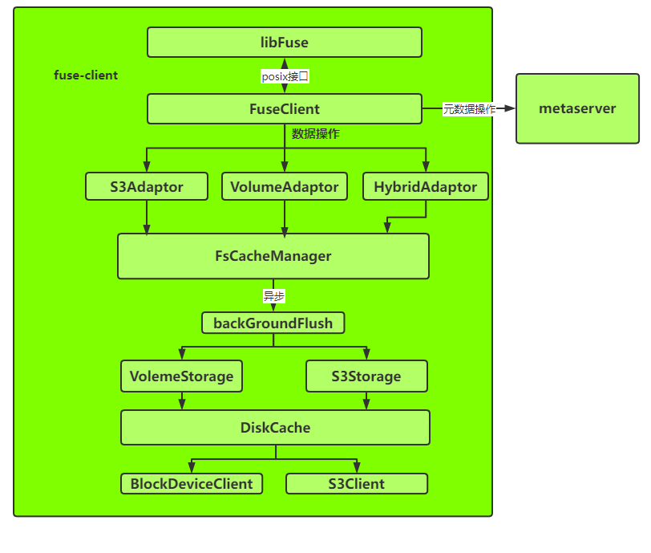
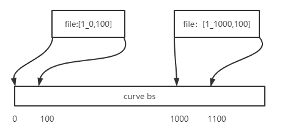
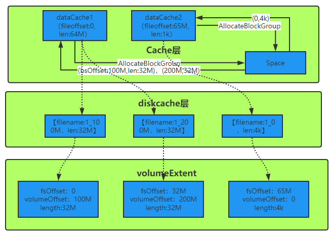

## 1 背景
在curvefs当前版本（release2.0）中已经实现了内存缓存，本地盘，s3的3层存储模式。写的缓存策略采用的是writeback，读的淘汰策略采用的是lru。本文主要设计在curveBS场景下的多级缓存实现，对于内存缓存进行统一管理。  
由于本地盘受到单节点访问问题，磁盘故障数据丢失问题，如果将curveBS作为s3的缓存，则可以有效的规避这些问题。

## 2 架构


- fuseClient负责posix接口实现，并操作数据和元数据。
- S3Adaptor负责s3相关的数据面操作，包括读，写，truncate，flush。
- VolumeAdaptor负责volume相关的数据面操作，包括读，写，truncate，flush。
- HybridAdaptor负责volume和s3混合场景相关数据面操作，包括读，写，truncate，flush。
- FsCacheManager负责数据cache缓存，并管理一个后台flush线程异步进行数据下刷到S3或者Volume。
- S3Storage负责对接s3，并更新inode中s3相关的元数据ChunkInfo。
- VolumeStorage负责对接volume，并更新inode中volume相关的元数据volemeExtent。
- diskcache负责本地缓存。

## 3 接口设计
从整体架构可以看到，对接fuse层主要是数据面接口，具体如下：
```c++
/* 底层存储适配层基类 */
class StorageAdaptor {
 public:
    virtual ~StorageAdaptor() = default;
    /**
     * @brief Initailize some options for s3 adaptor
     */
    virtual CURVEFS_ERROR Init() = 0;
    /**
     * @brief write data
     */
    virtual ssize_t Write(uint64_t ino, off_t offset, size_t len, const char* data) = 0;
    /**
     * @brief read data
     */
    virtual ssize_t Read(uint64_t ino, off_t offset, size_t len, const char* data) = 0;
    /**
     * @brief truncate data , data len can be bigger or smaller
     */
    virtual CURVEFS_ERROR Truncate(uint64_t ino, size_t size) = 0;
    /**
     * @brief flush file cache data to under storage
     */
    virtual CURVEFS_ERROR Flush(uint64_t ino) = 0;
    /**
     * @brief release file write and read cache. eg file is deleted should is used
     */
    virtual void ReleaseCache(uint64_t inodeId) = 0;
    /**
     * @brief flush write cache and release read cache. eg The cto scene file is closed
     */
    virtual CURVEFS_ERROR FlushAllCache(uint64_t inodeId) = 0;
    /**
     * @brief flush all files in fs flush write cache
     */
    virtual CURVEFS_ERROR FsSync() = 0;
    /**
     * @brief stop service eg umount scene
     */
    virtual int Stop() = 0;
};
```
## 4 详细设计
- 根据上述接口，我们对于文件系统场景主要分为3类：数据只存储在s3，数据只存储volume，数据部分存储在s3，部分存储在volume。因此关键数据结构如下：
```c++
/* 卷场景适配层 */
class VolumeAdaptor : public AdaptorStorage{
 public:
    VolumeAdaptor(std::shared_ptr<VolumeStorage> volumeStorage,
                  std::shared_ptr<FsCacheManager> fsCacheManager);
    virtual ~VolumeAdaptor() {}
    CURVEFS_ERROR Init();
    ssize_t Write(uint64_t ino, off_t offset, size_t len, const char* data);
    ssize_t Read(uint64_t ino, off_t offset, size_t len, const char* data);     
    CURVEFS_ERROR Truncate(uint64_t ino, size_t size);
    CURVEFS_ERROR Flush(uint64_t ino);
    void ReleaseCache(uint64_t inodeId);
    CURVEFS_ERROR FlushAllCache(uint64_t inodeId);
    CURVEFS_ERROR FsSync();
    int Stop();
 private:
    std::shared_ptr<FsCacheManager> fsCacheManager_;
    std::shared_ptr<VolumeStorage> volumeStorage_;     
};

/* 对象存储适配层 */
class S3Adaptor : public AdaptorStorage {
 public:
    S3Adaptor(std::shared_ptr<S3Storage> S3Storage,
              std::shared_ptr<FsCacheManager> fsCacheManager) {}
    virtual ~S3Adaptor() {}
    ssize_t Write(uint64_t ino, off_t offset, size_t len, const char* data);
    ssize_t Read(uint64_t ino, off_t offset, size_t len, const char* data);
    CURVEFS_ERROR Truncate(uint64_t ino, size_t size);
    CURVEFS_ERROR Flush(uint64_t ino);
    void ReleaseCache(uint64_t inodeId);
    CURVEFS_ERROR FlushAllCache(uint64_t inodeId);
    CURVEFS_ERROR FsSync();
    int Stop();
 private:
    std::shared_ptr<FsCacheManager> fsCacheManager_;
    std::shared_ptr<S3Storage> s3Storage_; 
};

/* 卷和s3混合场景适配层 */
class HybridAdaptor : public AdaptorStorage {
 public:
    HybridAdaptor(std::shared_ptr<S3Client> s3Client,
                     std::shared_ptr<InodeCacheManager> inodeManager,
                     std::shared_ptr<MdsClient> mdsClient，
                     std::shared_ptr<FsCacheManager> fsCacheManager_,
                     std::shared_ptr<VolumeStorage> volumeStorage) {}
    virtual ~MixAdaptor() {}
    ssize_t Write(uint64_t ino, off_t offset, size_t len, const char* data);
    ssize_t Read(uint64_t ino, off_t offset, size_t len, const char* data);
    CURVEFS_ERROR Truncate(uint64_t ino, size_t size);
    CURVEFS_ERROR Flush(uint64_t ino);
    void ReleaseCache(uint64_t inodeId);
    CURVEFS_ERROR FlushAllCache(uint64_t inodeId);
    CURVEFS_ERROR FsSync();
    int Stop();
 private:
    std::shared_ptr<FsCacheManager> fsCacheManager_;
    std::shared_ptr<S3Storage> s3Storage_;
    std::shared_ptr<VolumeStorage> volumeStorage_;  
};
```
- 其中S3Adaptor相关接口已经实现，不在详细设计中讨论；HybridAdaptor目前由于没有后台lifecycl把volume数据迁移到s3，该接口设计实现可以做，当前无法进行测试验收。
- 详细设计还会包含整个初始化流程，以及volume写diskcache的设计
### 4.1 创建文件系统和初始化流程
- 现有数据修改
```C++
enum FSType {
    TYPE_VOLUME = 1;
    TYPE_S3 = 2;
    TYPE_HYBRID = 3;
 }
message FsDetail {
    optional common.Volume volume = 1;
    optional common.S3Info s3Info = 2;
}
```
- FSType新增HYBRID，FsDetail的成员由oneof FsDetailOneOf变为optional，由server端代码保证至少存在1个。
- tools工具支持创建hybrid类型文件系统，需要将common.Volume和common.S3Info信息在createfs请求中都传递给mds。
- mds端MdsServiceImpl::CreateFs支持创建hybrid类型文件系统，并将文件系统信息持久化到etcd
- client端初始化，根据文件系统类型，new S3Adaptor，VolumeAdaptor或者建HybridAdaptor。
### 4.2 write流程
#### 4.2.1 VolumeAdaptor
- 调用FsCacheManager::FindFileCacheManager接口（已实现）获取FileCacheManagerPtr。
- 调用FileCacheManager::Write接口（已实现）将数据写到缓存中
- 返回成功或失败
#### 4.2.2 HybridAdaptor
- 和VolumeAdaptor实现一样
### 4.3 read流程
- 新增数据结构：
```c++
struct ReadPart {
    off_t offset = 0;
    size_t length = 0;
    char* data = nullptr;

    ReadPart() = default;

    ReadPart(off_t offset, size_t length, char* data)
        : offset(offset), length(length), data(data) {}
};

class UnderStorage {
 public:
    virtual ~UnderStorage() = default;
    /**
     * @brief write data from under storage
     */
    ssize_t Write(uint64_t ino, off_t offset, size_t len, const char* data) = 0;
    /**
     * @brief read data from under storage and return nonexistent read part
     */
    ssize_t Read(uint64_t ino, off_t offset, size_t len, const char* data, std::vector<ReadPart> *miss) = 0; 
     /**
     * @brief truncate data from under storage
     */
    CURVEFS_ERROR Truncate(uint64_t ino, size_t size) = 0;               
};

class S3Storage : public UnderStorage {
 public:
    S3Storage(std::shared_ptr<S3Client> s3Client, 
    std::shared_ptr<InodeCacheManager> inodeManager,
    std::shared_ptr<MdsClient> mdsClient) {}
    virtual ~S3Storage() {}
    ssize_t Write(uint64_t ino, off_t offset, size_t len, const char* data);
    ssize_t Read(uint64_t ino, off_t offset, size_t len, const char* data, std::vector<ReadPart> *miss);   
    CURVEFS_ERROR Truncate(uint64_t ino, size_t size);    
 private:
    std::shared_ptr<S3Client> s3Client_; 
    std::shared_ptr<InodeCacheManager> inodeManager_;
    std::shared_ptr<MdsClient> mdsClient_;
};

class VolumeStorage : public UnderStorage {
public:
    VolumeStorage(SpaceManager* spaceManager, 
    BlockDeviceClient* blockDeviceClient,
    InodeCacheManager* inodeCacheManager) {}
    virtual ~VolumeStorage() {}
    ssize_t Write(uint64_t ino, off_t offset, size_t len, const char* data);
    ssize_t Read(uint64_t ino, off_t offset, size_t len, const char* data, std::vector<ReadPart> *miss);   
    CURVEFS_ERROR Truncate(uint64_t ino, size_t size);    
 private:
    SpaceManager* spaceManager_;
    BlockDeviceClient* blockDeviceClient_;
    InodeCacheManager* inodeCacheManager_;
    VolumeStorageMetric metric_;     
};
```
#### 4.2.1 VolumeAdaptor
- 调用FsCacheManager::FindFileCacheManager接口（已实现）获取FileCacheManagerPtr。
- 调用FileCacheManager::Read接口（已实现）将数据读到缓存中
- 缓存中未命中的miss ReadPart则调用VolumeStorage::read接口进行数据读取
- volume上不存在的miss ReadPart则进行补0
#### 4.2.2 HybridAdaptor
- 调用FsCacheManager::FindFileCacheManager接口（已实现）获取FileCacheManagerPtr。
- 调用FileCacheManager::Read接口（已实现）将数据读到缓存中
- 缓存中未命中的miss ReadPart则调用VolumeStorage::read接口进行数据读取
- volume上不存在的miss ReadPart则调用S3Storage::read接口进行数据读取
- s3上不存在的miss ReadPart则进行补0
### 4.4 truncate流程
这个和volume的回收方案有关系 todo
#### 4.2.1 VolumeAdaptor
todo
#### 4.2.2 HybridAdaptor
todo
### 4.5 Flush流程
文件的整个flush流程和当前s3场景保持一致，主要变动流程在DataCache::Flush的流程，下面具体描述该流程的实现
#### 4.2.1 VolumeAdaptor
- 根据Datacache时间判断当前DataCache是否需要flush。
- 调用VolumeStorage::Write接口
#### 4.2.2 HybridAdaptor
- 根据Datacache时间判断当前DataCache是否需要flush。
- 调用VolumeStorage::Write接口
- 如果接口返回空间不足，则调用S3Storage::Write接口
### 4.6 ReleaseCache
使用的统一缓存，和当前S3Adaptor::ReleaseCache实现一致
```c++
void S3Adaptor::ReleaseCache(uint64_t inodeId) {
    FileCacheManagerPtr fileCacheManager =
        fsCacheManager_->FindFileCacheManager(inodeId);
    if (!fileCacheManager) {
        return;
    }
    VLOG(9) << "ReleaseCache inode:" << inodeId;
    fileCacheManager->ReleaseCache();
    fsCacheManager_->ReleaseFileCacheManager(inodeId);
    return;
}
```
### 4.7 FlushAllCache流程
使用的统一缓存，和当前S3Adaptor::FlushAllCache实现一致

### 4.8 FsSync流程
使用的统一缓存，和当前S3Adaptor::FsSync实现一致

### 4.8 volume场景diskCache设计
s3场景在diskcache上的每个文件的filename就是对应的s3上桶的objectname。对于volume场景，由于没有object的概念，只有volume的逻辑offset和len。所以diskcache上的一个文件对应卷上的[offset，len],并且每个文件对应卷上不同的[offset，len]，之间必须没有重叠。 当diskcache达到水位的时候还是通过lru进行淘汰。  
diskcache上file的命名为：fsid_volumeOffset。可以保证文件名不重复

根据以上思路整个数据结构设计为：
```c++
class VolumeDiskCacheManager : public DiskCacheManager {
 public:
    VolumeDiskCacheManager(std::shared_ptr<PosixWrapper> posixWrapper,
    std::shared_ptr<DiskCacheWrite> cacheWrite,
    std::shared_ptr<DiskCacheRead> cacheRead);
   ......
 private:
    // first is volume offset,second first filename,second fileLen 
    std::map<uint64_t, std::pair<string, uint64_t>> cachedObj_;
    std::shared_ptr<LRUCache<std::string, bool>> trimObj_;
};
```
#### 4.8.1 写流程 
需要对现有VolumeStorage::Write进行修改。

- 调用PrepareWriteRequest会发送(AllocateBlockGroup)从space分配到curveBS的空间一组WritePart【offset，len】。
- 遍历每个WritePart去VolumeDiskCacheManager::cachedObj_匹配，如果命中则根据second找到对应的文件和offset进行write操作。这里注意的本次写的WritePart和cachedObj_的文件可能存在3种场景：
    - WritePart的范围在某个cachedObj的file范围内部，直接write数据到second对应的文件偏移上
    - WritePart的范围和某个cachedObj_部分重叠，这个时候需要将未重叠的部分继续和下一个cachedObj_进行匹配，如果没有匹配到则追加写上一个file，同时更新cachedObj_上对应的元数据，如果匹配到，则考虑2个file的合并。
    - WritePart和cachedObj_没有重叠，则生成一个新的cachedObj，first为WritePart的offset，filename为inode+offset生成一个文件名，插入到cachedObj_中。
    - 这里要注意对于新写如果未按分配最小单元（默认4k）对齐，则需要补0
- 当diskcache写成功后，更新inode中的extent的信息
#### 4.8.2 读流程
需要现有的VolumeStorage::Read接口进行修改。
- 调用DivideForRead获取到std::vector<ReadPart>。
- 遍历std::vector<ReadPart>，每个ReadPart去VolumeDiskCacheManager::cachedObj_匹配，如果匹配到，则读对应的second中对应的file的offset数据。否则直接调用blockDeviceClient_::Readv。