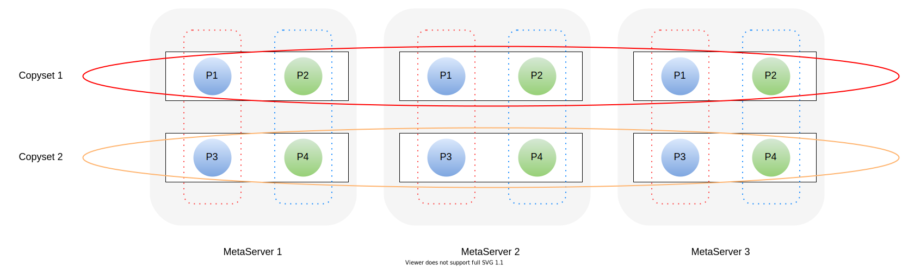

# CurveFS MetaServer

## 概述

MetaServer 在 CurveFS 集群中提供高可用、高可靠的元数据服务，并保证文件系统元数据的一致性。同时，在设计之初就以高性能和扩展性作为目标。

MetaServer 在整体设计上参考了 CurveBS 的 ChunkServer，单个 MetaServer 以用户态进程的形式运行在宿主机上，在 CPU/RAM 等资源充足的情况下，一台宿主机可以运行多个 MetaServer 进程。同时，也引入了 ChunkServer 中 Copyset 的设计，利用 Raft 保证数据的一致性和服务的高可用。

在元数据管理层面，对文件系统元数据进行分片管理，避免单个 Raft Group 维护一个文件系统元数据是带来的性能瓶颈。元数据的每个分片称为 Partition。Copyset 与 Partition 的对应关系可以是一对一，也可以是一对多。一对多的情况下表示，一个 Copyset 可以维护多个 Partition。在一对多的情况下，文件系统的元数据管理如下图所示：

图中共有两个 Copyset，三个副本放置在三台机器上。P1/P2/P3/P4 表示文件系统的元数据分片，其中 P1/P3 属于一个文件系统，P2/P4 属于一个文件系统。

## 整体架构

MetaServer 的整体架构如下所示，大致可分为三个部分：Service Layer、Core Business Layer 和 MetaStore。三者之间相互协作，高效处理外部组件的各种请求和任务。下面将对各个模块进行详细的介绍。

### Service Layer

对外提供 RPC 接口，供系统中的其他服务（Curve-Fuse、MDS、MetaServer 等）调用。同时提供 RESTful 接口，可以把当前进程中各组件的状态（Metric）同步给 Prometheus。

#### MetaService

提供元数据服务，是 MetaServer 的核心服务，提供文件系统元数据查询、创建、更新、删除操作的必要接口，例如 CreateInode、CreateDentry、ListDentry，并支持 Partition 的动态创建和删除。

#### CopysetService

提供动态创建Copyset、查询Copyset状态接口。在创建文件系统时，MDS会根据当前集群的负载情况，决定是否创建新的Copyset。

#### RaftService

由 [braft](https://github.com/baidu/braft) 提供，用于 Raft 一致性协议的交互。

#### CliService (Command Line Service)

提供 Raft 配置变更接口，包括 AddPeer、RemovePeer、ChangePeer、TransferLeader。同时提供了一个额外的 GetLeader 接口，用于获取当前复制组最新的 Leader 信息。

#### MetricService

提供 RESTful 接口，可以获取进程各组件的状态，Prometheus 会调用该接口采集数据，并利用 Grafana 可视化展示。

### Core Business Layer

MetaServer 核心处理逻辑，包括元数据请求的处理，并保证元数据的一致性、高可用、高可靠；心跳上报及配置变更任务的执行处理；以及注册模块等。

#### CopysetNode

表示 Raft Group 中的一个副本，是 braft raft node 的简单封装，同时实现了 Raft 状态机。

#### ApplyQueue

用于隔离 braft apply 线程，可以 apply 的请求会放入 ApplyQueue 中，同时 ApplyQueue 保证请求的有序执行，在请求执行完成后，返回给客户端响应。

#### MetaOperator

元数据请求到达后，会生成一个对应的 operator，operator 会将请求封装成 task，然后交给元数据请求对应的 CopysetNode 进行处理，完成副本间的数据同步。

#### Register

正常集群的启动流程是，先启动MDS，然后创建逻辑池，最后启动 MetaServer。在创建逻辑池时，需要指定逻辑池的拓扑结构，以及各个 MetaServer 进程的 IP 和 Port。这样做的目的是，阻止非法的 MetaServer 加入集群。

所以，在 MetaServer 的启动阶段，需要先向 MDS 进行注册，MDS 验证后会返回唯一标识 MetaServerID 及 Token。在后续 MetaServer 与 MDS 通讯时，需要提供此 ID 和 Token 作为身份标识和合法性认证信息。

#### Heartbeat

MDS 需要实时的信息来确认 MetaServer 的在线状态，并获取 MetaServer 和 Copyset 的状态和统计数据，并根据所有 MetaServer 的信息计算当前集群是否需要动态调度以及相应的调度命令。

MetaServer 以心跳的方式来完成上述功能，通过周期性的心跳，上报 MetaServer 和 Copyset 的信息，同时执行心跳响应中的调度任务。

#### Metric

利用 [bvar](https://github.com/apache/incubator-brpc/blob/master/docs/en/bvar.md) 导出系统中核心模块的统计信息。

### MetaStore

高效组织和管理内存元数据，同时配合 Raft 对元数据进行定期 dump，加速重启过程。

#### MetaPartition

文件系统的元数据进行分片管理，每个分片称为 Partition，Partition 通过聚合 InodeStorage 和 DentryStorage，提供了对 Dentry 和 Inode 的增删改查接口，同时 Partition 管理的元数据全部缓存在内存中。

Inode 对应文件系统中的一个文件或目录，记录相应的元数据信息，比如 atime/ctime/mtime 等。当 Inode 表示一个文件时，还会记录文件的数据寻址信息。每个 Partition 管理固定范围内的 Inode，根据 InodeId 进行划分，比如 InodeId [1-200] 由 Partition 1管理，InodeId [201-400] 由 Partition 2 管理，依次类推。

Dentry 是文件系统中的目录项，记录文件名到 inode 的映射关系。一个父目录下所有文件/目录的 Dentry 信息由父目录 Inode 所在的 Partition 进行管理。

#### MetaSnapshot

配合 CopysetNode 实现 Raft 快照，定期将 MetaPartition 中记录的元数据信息 dump 到本地磁盘上，起到了启动加速以及元数据去重的功能。

当 Raft 快照触发时，MetaStore 会 fork 出一个子进程，子进程会把当前 MetaPartition 中记录的所有元数据进行序列化并持久化到本地磁盘上。在进程重启时，会首先加载上次的 Raft 快照到 MetaPartition 中，然后再从 Raft 日志中回放元数据操作记录。

#### S3Compaction

在对接 S3 文件系统（文件系统数据存放到 S3）时，由于大多数 S3 服务不支持对象的覆盖写/追加写，所以在对文件进行上述写入时，Curve-Fuse 会把新写入的数据上传到一个新的 S3 对象，并向 Inode 的 extent 字段中中插入一条相应的记录。

以下图为例，用户在第一次写入文件后，进行了三次覆盖写，所以 extent 中会记录 4 条记录。在没有 Compaction 的情况下，后续的读操作需要计算出每个范围的最新数据，然后分别从 S3 下载、合并，最终返回给上层应用。这里的性能开销、空间浪费是显而易见的，但是上层应用的写入模式是无法限制的。

Compaction 的主要作用就是将 extent 中有重叠或连续的写入进行合并，生成一个新的 S3 对象，以加快后续的读取速度，减少存储空间浪费。

#### Trash

在当前的设计中，Inode 的 nlink 计数减到 0 时，并没有立即对该 Inode 进行清理，而是将 Inode 标记为待清理状态，由 Trash 模块进行定期扫描，当超过预设的阈值时间后，才将 Inode 从 MetaPartition 中删除。
