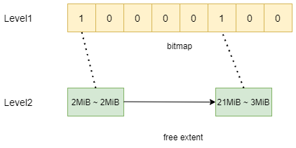
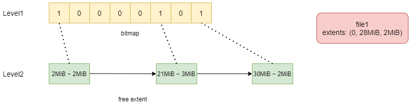
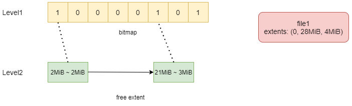
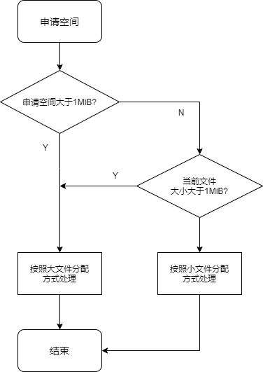

# CurveFS 空间分配 POC 版本设计方案

## 背景

根据CurveFS总体方案设计，文件系统基于当前的块进行实现，所以需要设计基于块的空间分配器，用于分配并存储文件数据。

## 本地文件系统空间分配相关特性

### 局部性

尽量分配连续的磁盘空间，存储文件的数据。这一特性主要是针对 HDD 进行的优化，降低磁盘寻道时间。

### 延迟分配/Allocate-on-flush

在 sync/flush 之前，尽可能多的积累更多的文件数据块才进行空间分配，一方面可以提高局部性，另一方面可以降低磁盘碎片。

### Inline file/data

几百字节的小文件不单独分配磁盘空间，直接把数据存放到文件的元数据中。

针对上述的本地文件系统特性，Curve 文件系统分配需要着重考虑**局部性**。

虽然 Curve 是一个分布式文件系统，但是单个文件系统的容量可能会比较大，如果在空间分配时，不考虑局部性，inode 中记录的 extent 数量很多，导致文件系统元数据量很大。

假如文件系统大小为 1PiB，空间分配粒度为 1MiB，inode 中存储的 extent为三元组（fileoffset，blockoffset，length），当空间完全分配之后，extent 的元数据量为 24GiB（1PiB / 1MiB * 24，24 为每个 extent 所占用的字节大小）。

如果同一文件在多次申请空间时，能分配连续的地址空间，则 extent 可以进行合并。例如，文件先后写入两次，每次写入 1MiB 数据，分别申请的地址空间为（100MiB，1MiB）和（101MiB，1MiB），则只需要一个 extent 进行记录即可，（0，100MiB，2MiB）。

所以，如果能对文件的多次空间申请分配连续的地址空间，则 inode 中记录的 extent 数量可以大大减少，能够降低整个文件系统的元数据量。

对于延迟分配和 Inline file 这两个特性，需要 Curve Fuse 端配合完成。

## 空间分配

### 整体设计



分配器包括两层结构：

第一层用 bitmap 进行表示，每个 bit 标识其所对应的一块空间（以 4MiB 为例，具体大小可配置）是否分配出去。

第二层为 free extent list，表示每个已分配的块，哪些仍然是空闲的（offset, length），以 offset 为 key 进行排序（这里可以用 map 或者 btree 对所有的 free extent 进行管理）。

当前设计不考虑持久化问题，空间分配器只作为内存结构，负责空间的分配与回收。在初始化时，扫描文件系统所有 inode 中已使用的空间。

### 空间分配流程

在新文件进行空间分配时，随机选择 level1 中标记为 0 的块，**先预分配给这个文件，但是并不表示这个块被该文件独占**。

以下图为例：file1 新申请了 2MiB 的空间。首先从 level1 中随机选一个标记为 0 的块分配出去，然后将这一个块中的前 2MiB 空间分配给这个文件，剩余部分加入到 level2 中的 list 中。



后续，file1 再次追加写入 2MiB 数据，此时申请空间时，需要附带上 file1 最后一个字节数据在底层存储的位置，再加 1（期望申请的地址空间起始 offset）。以图中为例，则附带的值为 30MiB。

这次的空间申请，直接从 level2 中以 30MiB 作为 key 进行查找，找到后，进行空间分配。分配之后，相关信息如下图所示：



之前剩余的 30MiB ~ 2MiB 的 extent 完全分配出去，所以从 level2 中的 list 中删除。

文件 inode 中的 extent 可以将两次的申请结果进行合并，得到（0，28MiB，4MiB）。

#### 特殊情况

1. 新文件申请空间时，level1 中的所有 bit 都标记为 1，即所有的块都已经预分配出去。在文件系统空间比较满的情况下，有可能会造成这个问题。此时，申请空间时，需要从 level2 中，随机或者选择可用空间最大的 extent 分配出去。

2. 文件申请空间时，之前预分配块的剩余空间被其他文件占用。此时，首先从 level1 查找一个可用的块，不满足要求时，按情况 1 进行处理。

3. file1 再次追加写入数据时，会附带 32MiB 来申请空间。此时，从 level1 中查找 32MiB 对应的块标记是否为 0，如果为 0，则将这个块继续分配给 file1。否则，可以从 level1 中随机选择一个可用的块进行分配。尽可能合并多个块分配给同一个文件。

### 空间回收

空间回收主要是一个extent合并的过程，有以下几种情况：

1. 文件释放了一个完整的块，则直接将level1中对应的bit置为0。
   
2. 文件释放了一小段空间，则尝试与level2中的extent进行合并。
   
    a. 如果合并之后是一个完整的块，则重新将level1中对应的bit置为0，同时删除该extent。

    b. 如果不能合并，则向level2中插入一个新的extent。


### 小文件处理

大量小文件的情况下，按照上述的分配策略，会导致 level1 的 bitmap 标记全为 1，同时 level2 中也会有很多 extent。

所以可以参考 [chubaofs](https://github.com/chubaofs/chubaofs)，对大小文件区分不同的分配逻辑。同时，将文件系统的空间划分成两个部分，一部分用于小文件的空间分配，另一部分用于大文件分配。两部分空间是相对的，一部分用完后，可以申请另一部分的空间。比如，大文件部分的空间完全分配出去，则可以继续从小文件空间进行分配。

用于小文件空间分配的部分，空闲空间可以用 extent 来表示。


小文件在空间分配时，也需要考虑尽量分配连续的地址空间。

文件在第一次申请空间时，选择一个能满足要求的 extent 分配出去。后续的空间申请，同样要带上文件最后一个字节所在的地址空间，用于尽量分配连续的地址空间。

文件空间的申请，具体由大文件，还是由小文件处理，可以参考如下策略，大小文件阈值为 1MiB：



### 并发问题

如果所有的空间分配和回收全部由一个分配器来进行管理，那么这里的分配很有可能成为一个瓶颈。

为了避免整个问题，可以将整个空间，由多个分配器来进行管理，每个分配器管理不同的地址空间。比如，将整个空间划分为 10 组，每组空间都有一个空间分配器进行管理。

在申请空间时，如果没有附带期望地址空间的 offset，则随机选取一个分配器进行空间分配。如果附带了期望的 offset，则由对应的分配器进行处理。

空间回收时，根据回收的 offset，交给对应的分配器去回收。

### 文件系统扩容

在线扩容时，直接在新扩容的空间上，创建新的空间分配器进行空间管理。

文件系统重新加载时，再将所有的空间，按照上述的策略，进行分组管理。

### 接口设计

#### RPC 接口

当前设计是把空间分配器作为内置服务放在元数据节点，所以请求的发起方是 Curve Fuse，元数据服务器接收到请求后，根据 fsId 查找到对应的文件系统的空间分配器后，将空间分配/回收的任务交给这个分配器进行处理，处理完成后，返回 RPC。

空间分配器相关的 RPC 接口，及 request/response 定义如下。

```protobuf
syntax="proto2";
option cc_generic_services = true;
 
enum StatusCode {
    UNKNOWN_ERROR = 0;  // 未知错误
    OK = 1;             // 成功
    NOSPACE = 2;        // 空间不足
}
message Extent {
    required uint64 offset = 1;  // 块设备地址空间起始地址
    required uint32 length = 2;  // 长度
}
enum AllocateType {
    NONE = 0;
    SMALL = 1;     // 小文件分配
    BIG = 2;       // 大文件分配
}
 
message AllocateHint {
    optional AllocateType allocType = 1;   // 申请类型
    optional uint64 leftOffset = 2;        // 期望申请到的地址空间的起始位置
    optional uint64 rightOffset = 3;       // 期望申请到的地址空间的结束位置
}
 
message AllocateSpaceRequest {
    required uint64 fsId = 1;         // 文件系统ID
    required uint32 size = 2;         // 申请空间的大小
    optional AllocateHint allocHint = 3;
}
 
message AllocateSpaceResponse {
    required StatusCode status = 1;  // 状态码
    repeated Extent extents = 2;     // 申请到的地址空间，可能不连续，所以以repeated表示
}
 
message DeallocateSpaceRequest {
    required uint64 fsId = 1;
    repeated Extent extents = 2;     // 释放的空间
}
 
message DeallocateSpaceResponse {
    required StatusCode status = 1;
}
 
service MetaServerService {
    rpc AllocateSpace(AllocateSpaceRequest) returns (AllocateSpaceResponse);
    rpc DeallocateSpace(DeallocateSpaceRequest) returns (DeallocateSpaceResponse);
}
```

#### 空间分配器接口

空间分配器相关接口及部分数据结构定义如下：

```cpp
#include <cstdint>
#include <vector>
 
enum class AllocateType {
    NONE = 0,
    SMALL = 1,
    BIG = 2
};
 
struct AllocateHint {
    AllocateType allocType = AllocateType::NONE;
    uint64_t leftOffset = 0;
    uint64_t rightOffset = 0;
};
 
struct Extent {
    uint64_t offset = 0;
    uint32_t len = 0;
};
 
using Extents = std::vector<Extent>;
 
class Allocator {
 public:
    Allocator(...) {}
    virtual ~Allocator() = default;
 
    /**
     * @brief 申请空间
     *
     * @param size 申请空间大小
     * @param allocateHint 空间申请提示信息
     * @param extents 空间分配结果
     * @return uint64_t 已分配空间大小
     */
    virtual uint64_t Allocate(uint32_t size, const AllocateHint& allocateHint,
                              Extents* extents) = 0;
 
    /**
     * @brief 释放空间
     */
    virtual void Deallocate(const Extents& extents) = 0;
 
    /**
     * @brief 标记对应空间已使用，初始化时使用
     */
    virtual bool MarkUsed(const Extents& extents) = 0;
  
    /**
     * @brief 标记对应空间可以使用，初始化时使用
     */
    virtual bool MarkUsable(const Extents& extents) = 0;
 
    /**
     * @brief 当前剩余空间
     */
    virtual uint64_t TotalFree() const = 0;
};
```

MarkUsed 和 MarkFree 是持久化层调用，对分配器进行初始化。

## 后续版本需要解决的问题

- [ ] 空间分配信息如何重建
- [ ] 高可用
- [ ] 幂等请求处理
- [ ] PB 级别情况下的性能
