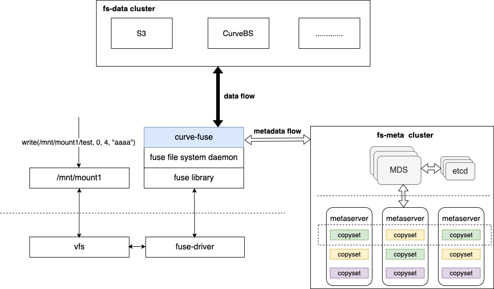
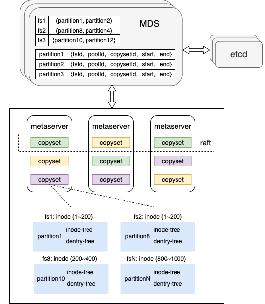
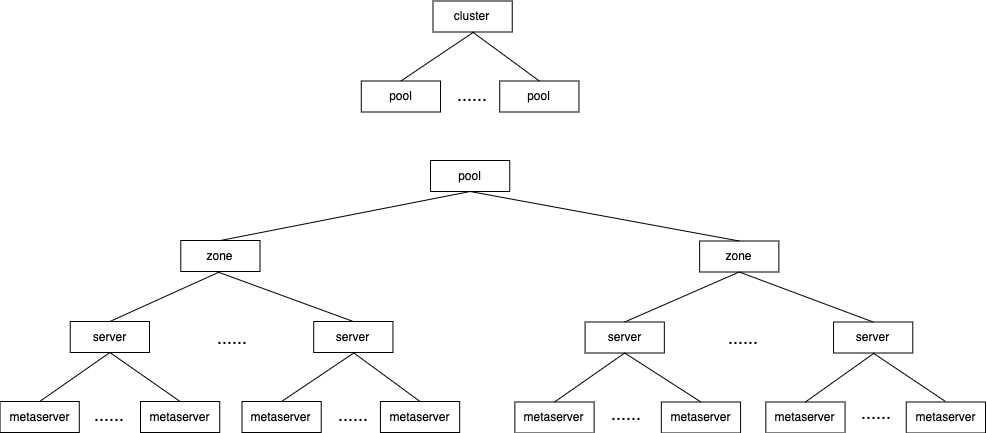
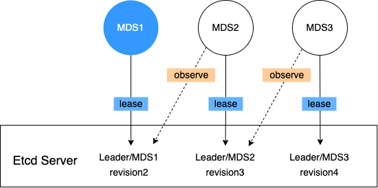
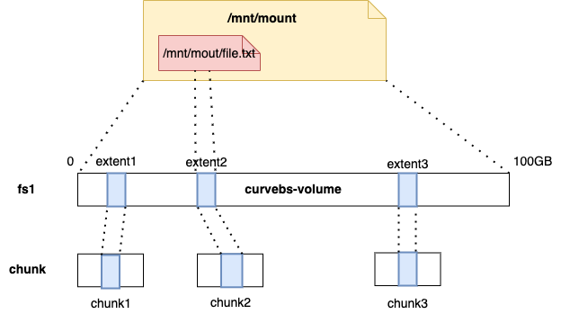
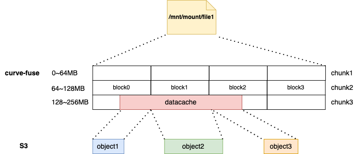

# CurveFS 设计要点

CurveFS 是 POSIX 兼容的分布式文件存储系统，用于更好的支持云原生场景。

## 整体架构

CurveFS由三个部分组成：
1. `curve-fuse` 是基于 fuse 的文件系统客户端。
    - 接收并处理 fuse 的请求，与`fs-meta cluster` 交互实现对元数据的增删改查，与 `fs-data cluster` 交互实现对数据的增删改查；
    - 提供元数据缓存和数据缓存以提高性能；
    - 用户可以通过客户端访问不同的文件系统实例。
2. `fs-meta cluster` 是 CurveFS 的元数据服务集群。
    - 它的架构类似 CurveBS，由 MDS 和 Metaserver 两个部分组成，高可扩、高可用；
    - mds 用于管理集群拓扑、集群调度、文件系统实例、文件元数据分片管理；基于 etcd 存储集群拓扑、用户和文件系统信息；基于 etcd 实现 mds 的高可用。
    - metaserver 用于存储文件的元数据( inode 和 dentry )，通过 multi-raft 实现高可用和高可靠。每个 raft 复制组管理多组元数据分片。
3. `fs-data cluster` 是 CurveFS 的数据服务集群。
    - 当前支持S3标准接口的对象存储以及 CurveBS；
    - 用户可以根据性能场景灵活配置；
    - 也因为支持多种存储集群，CurveFS 的元数据使用独立的集群统一管理。

## 元数据集群

元数据集群`fs-meta cluster`如下：

**1. 管理拓扑结构**

MDS 管理元数据集群的拓扑结构，如下图：

- `pool` 物理池，对机器资源进行物理隔离。`server`不能跨`pool`交互；

- `zone` 故障隔离的基本单元，属于不同`zone`的机器部署在不同机架，`server`归属于一个 `zone`；

- `server` 物理服务器，`metaserver`归属于`zone`；

- `metaserver` 最小服务单元，管理一块物理磁盘。

**2. 管理文件系统实例**

MDS 管理文件系统实例及文件系统的元数据的分布。
- 一个文件系统实例由多个元数据分片 `partition`组成
- 每个`partition`管理指定范围的 inode，文件系统根目录的 inode 固定为1
    - dentry 存放在父目录所在的元数据分片上;
    - 对于文件 /A/B
        - 首先找到根目录所在的元数据分片，在该元数据分片上查询 dentry(/A)；
        - 从 dentry(/A) 中获得 /A 的 inodeid，根据 inodeid 获取对应的元数据分片查询 dentry(/A/B)；
        - 从 dentry(/A/B) 中获得 /A/B 的 inodeid，从而定位到元数据分片，获取 /A/B 的 inode 信息。
- `partition`由`copyset`管理，`copyset`是raft复制组
    - `copyset`和`partition`是一对多的关系；
    - `copyset`和`partition`都是动态创建的，可以弹性扩容。当前的创建策略比较简单：在满足`copyset`的多个副本在不同的`server`的前提下，按照`metaserver`的管理磁盘的剩余容量进行选择；`partition`同样按照`copyset`所在`metaserver`的剩余容量进行选择；

**3. MDS 高可用**

MDS 的高可用基于 etcd 实现，允许部分实例异常，如下图所示：

MDS 向 etcd 注册，同时只有一个 MDS 提供服务，备 MDS 监听。主 MDS 挂掉后，备 MDS 启动提供服务。

**4. Metaserver 高可用**

Metaserver高可用基于 raft 实现，2N+1 个副本允许 N 个副本异常。

## 数据组织形式
`fs-data cluster`存放文件的实际数据，可以是支持S3标准协议的对象存储集群，也可以是CurveBS，后续根据场景需求，我们还会对接更多的集群。

### 对接 CurveBS
一个文件系统对应 CurveBS 上的一个卷`volume`, 但这里的块设备只用于存储文件的数据。文件系统中的一个文件，地址空间和卷中 `chunk` 的对应关系如下图：

- CurveBS 中卷和 chunk 的关系请参考：[Curve设计要点](https://github.com/opencurve/curve-meetup-slides/blob/main/2020/1030-Curve%E8%AE%BE%E8%AE%A1%E8%A6%81%E7%82%B9-%E7%BD%91%E6%98%93%E6%95%B0%E5%B8%86-%E6%9D%8E%E5%B0%8F%E7%BF%A0.pdf)
- 在`curve-fuse`中，一个文件的地址空间由多个非固定大小的 `extent` 组成；
- `extent` 在 inode 中由{ fsOffset, volumOffset, length} 组成;
- CurveBS 中卷的空间如何分配给文件系统中的文件，请参考：[CurveFS基于块的空间分配方案](https://github.com/opencurve/curve-meetup-slides/blob/main/CurveFS/Curve%E6%96%87%E4%BB%B6%E7%B3%BB%E7%BB%9F%E7%A9%BA%E9%97%B4%E5%88%86%E9%85%8D%E6%96%B9%E6%A1%88.pdf)

### 对接 S3
对于文件系统中的一个文件，地址空间和 S3 对象的对应关系如下图所示：

- 在`curve-fuse`端，一个文件的地址空间由多个固定大小的`chunk`组成，每个`chunk`由多个长度不固定的`datacache`组成；
- `datacache`按照`block`的粒度拆分后上传到 S3 中；
- 每个数据块在 inode 中由{ chunkid, offset, len, size } 表示，每个数据块在 S3 中的 key 由 { fsid, inodeid, chunkid, blockindex } 表示。根据 inode 中数据位置的记录，可以通过`chunk`和`block`的大小，计算出这部分数据对应的 S3 中数据块的数量以及每个数据块的 key。

## 系统特性
1. 多存储系统支持。数据既支持存储到公有云，又支持存储到本地存储系统；支持数据在不同存储系统之家自由流转，支持主动/被动数据生命周期管理；
2. 元数据集群和数据集群高可用、高可扩、高可靠；
3. 支持高速缓存，客户端有内存和磁盘两级缓存加速；支持多级缓存，BS集群可作为持久化缓存层;
4. POSIX兼容，像本地文件系统一样使用，业务可以无缝接入；
5. 易运维，常见的异常可以自愈。