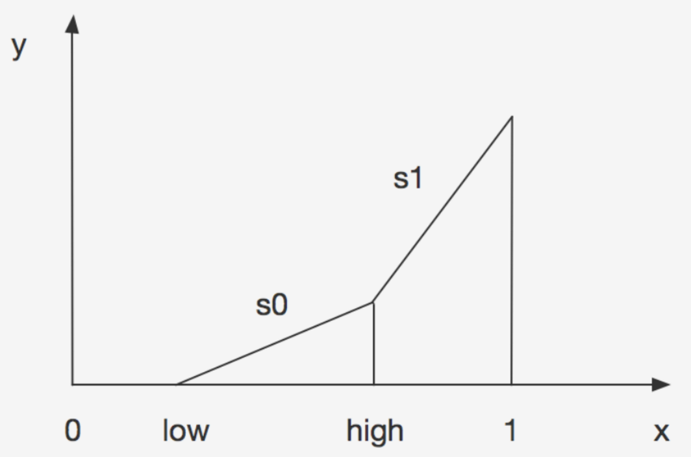
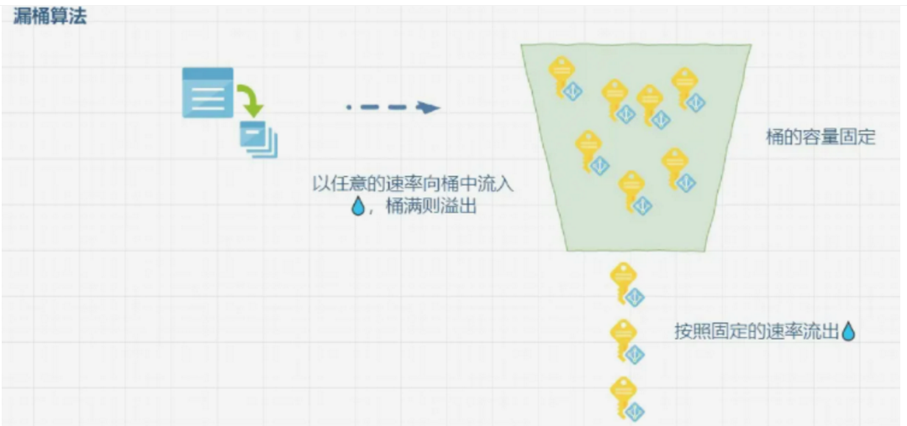
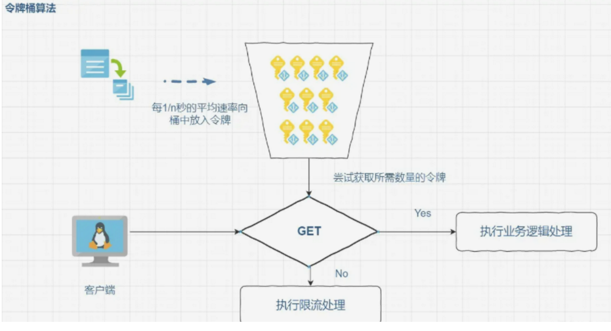
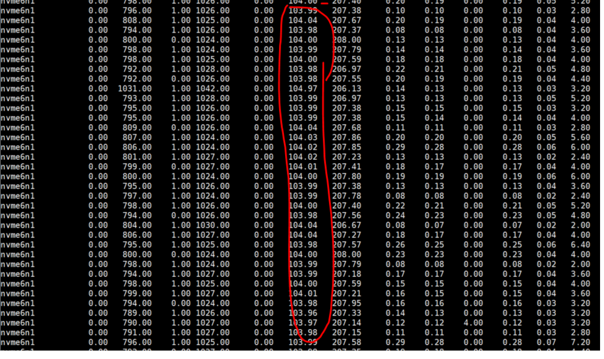

# 背景

如果Curvefs client在写底层存储的时候是直接写入远端对象存储，那么由于写远端时延相对会较高，所以为了提升性能，引入了写本地缓存盘方案。也即要写底层存储时，先把数据写到本地缓存硬盘，然后再把本地缓存硬盘中的数据异步上传到远端对象存储。

但是被当作缓存盘的盘有可能是机器的系统盘(如果系统盘io打满了，会影响整个服务器的服务)或者其他一些原因需要对缓存盘的写入或者读取进行限速，因此需要对缓存盘进行限速。

同时，希望把该限速方案设计为一个可供curve其他模块使用的通用模块。

# 业界方案调研

一般来说，限速的话有throttle和qos两种，qos的话就是严格控制每秒钟的iops和带宽，throttle的话就是根据后端处理能力调节前端的调用，每秒钟的iops和带宽是不固定的。显然，对于curvefs本地盘限速来说，qos的设计是更符合要求的。

在这里先简单介绍下throttle，throttle有两种：一种是严格的throttle，也就是达到限流水位后，只有释放一个后端的能力，才能有一个前端的调用。另外一种是自适应throttle，，也即根据当前的水位来调节，有低水位阈值和高水位阈值。如果当前值处于低水位阈值之下，那么无需调节，如果当前的水位处于低水位和高水位之间，轻微调节，让进程等待少量的时间后再处理请求，如果当前的水位比高水位阈值还高，那么就让进程程多等待一些时间。Ceph中的BackoffThrottle算法就是这样一种自适应throttle算法。其限流思路如下图：


y轴是延时时间，x轴代表当前水位。

low代表低水位阈值，high代表高水位阈值

QoS是Quality of Service的缩写，它起源于网络技术，用以解决网络延迟和阻塞等问题，能够为指定的网络通信提供更好的服务能力。有两种主流的QOS算法，漏桶算法和令牌桶算法。

漏桶算法就是将请求放入桶中，然后始终以一个固定的速率从桶中取出请求来处理，当桶中等待的请求数超过上限后（桶的容量固定），后续的请求就不再加入桶中，而是执行拒绝策略（比如降级)。漏桶算法如下图。漏桶算法适用于需要以固定速率的场景，而在多数业务场景中，我们并不需要严格的速率，并且需要有一定的应对突发流量的能力，所以会使用令牌桶算法限流。漏桶算法如下图:


令牌桶算法就是以固定速率生成令牌放入桶中，每个请求都需要从桶中获取令牌，没有获取到令牌的请求会被阻塞限流（桶中的令牌不够的时候），当令牌消耗速度小于生成的速度时，令牌桶内就会预存这些未消耗的令牌（直到桶的上限），当有突发流量进来时，可以直接从桶中取出令牌，而不会被限流，令牌桶算法如下图：


对于curvefs缓存盘的限速，我们这里采用令牌桶算法。

# 设计方案

令牌桶的设计以及工作过程如下：

- 令牌根据时间匀速的产生令牌数量(这里假设是putTokens_)，存入到令牌桶中，同时保证令牌桶中的令牌最大数量为maxTokens_。并且要保证putTokens_<=maxTokens_。另外令牌桶在初始化的时候，会分配一定数量的令牌数(putTokens_)。


- 当线程要获取令牌消费时，这里假设消费者需要m个令牌，如果能获取得到足够的令牌，那么消费者获取成功;如果获取不到足够的令牌，那么就触发保护策略，消费者线程等待。

-  定时匀速向令牌桶丢putTokens_个令牌，如果有消费者在等待令牌，那么则唤醒消费者(当然，消费者要等到令牌桶中有足够的令牌个数了才会被唤醒)

关键数据结构如下:
```
// 令牌桶管理模块
class TokenBucketControl { 
public:
  TokenBucketControl(const std::string& n, uint64_t maxToken, uint64_t putTokens) : name_(n),
    putTokens_(putTokens), tokenthrottle_(maxToken) {
      if (maxToken < putTokens) {
          tokenthrottle_.SetMaxTokens(putTokens);
      }
    }
  ~TokenBucketControl() {}
  // 添加令牌
  void AddTokens();
  // 消费者线程获取令牌
  void GetTokens(uint64_t reqToken);
private:  
  // 调用模块的名称(该限流模块是通用模块，可以被curve中不同模块服务)
  const std::string name_;  

  // 向令牌桶中丢令牌的线程
  curve::common::Thread backEndThread_;
  curve::common::Atomic<bool> isRunning_;
  curve::common::InterruptibleSleeper sleeper_;
  uint32_t PutTokensIntervalMs_;
  // 单位时间
  uint32_t splitWindowsSec_;
  // 单位之间被分拆成splitWindowsNums_个窗口单元
  uint32_t splitWindowsNums_;
  int PutTokensRun();
  int PutTokensStop();
  virtual int PutTokensFun();

  // 令牌桶
  class TokenBucket {
   private:
    // 令牌桶中可以存放的最大令牌数
    uint64_t maxTokens_; 
    // 令牌桶中当前令牌个数
    uint64_t remainTokens_; 
   public:
    TokenBucket(uint64_t m)
      : remainTokens_(m), maxTokens_(m) {
    }
    ~TokenBucket() {}
    // 获取令牌
    bool Get(uint64_t tokens);
    // 放置令牌
    void Put(uint64_t tokens);
    void SetMaxTokens(uint64_t tokens) { maxTokens_ = tokens;}
  };
  TokenBucket tokenthrottle_;

  // 每次放置令牌的数量
  uint64_t putTokens_;
  curve::common::Mutex mtx_;

  // 消费者线程等待 && 唤醒消费者
  std::mutex limitMtx_;
  std::condition_variable limitCond_;
  void WaitTokenLimit() {
    std::unique_lock<std::mutex> lk(limitMtx_);
    limitCond_.wait(lk);
  }
  void SignalTokenLimit() {
    std::lock_guard<std::mutex> lk(limitMtx_);
    limitCond_.notify_all();
  }

};
```
## 要点说明

- 流量不均匀(突然爆发)问题

比如我们每秒限定的iops是1000，那么有可能在前零点几秒一下就把这1000个iops对应的令牌全部用完了，造成流量突然爆发，但是该一秒钟内其余时间段就获取不到令牌了。

那么解决这个问题的办法就是把这一秒的时间分成splitWindowsNums_个时间窗口，每个时间窗口投放1000/splitWindowsNums_个令牌。

- 峰值流量不能持续(1秒)问题

比如我们设置的令牌的每秒放置量是putTokens_，然后设置的最大令牌数量是maxTokens_，那么这maxTokens_有可能在1秒钟就全部被拿完了。

那么想解决这个问题(比如我们期望峰值流量持续burst_length 秒)可以根据如下的思路：

1. 使用两个桶
2. 大桶的令牌个数最多为`maxTokens_*burst_length`,小桶的令牌个数最多为maxTokens_。
3. 放置令牌：每秒向大桶放putTokens_个令牌；向小桶放`burst_ratio*putTokens`个令牌，也即maxTokens_个令牌(`burst_ratio=maxTokens_/putTokens`,burst_ratio表示峰值是平均值的几倍)。另外，小桶的令牌个数不大于maxTokens_，同时要保证小桶的令牌个数不超过大桶中的令牌个数(这一点很关键，因为大桶中令牌个数最多为`maxTokens_*burst_length`，当峰值流量来时，由于小桶每秒都能获得峰值个令牌，那么可以认为小桶是不受限的，并且由于小桶中的令牌个数不能超过大桶中的令牌个数，这样就保证了峰值流量的持续时间是burst_length----其实这里还会有误差，因为取令牌的同时，还在向里面放令牌，所以峰值时间比实际的时间要长，如果峰值跟均值差距不大，那么这个误差值可能很大，这个解决办法见下面的措施)。
4. 取令牌：若峰值来了，要取maxTokens_个令牌，那么每次分别从小桶和大桶中取maxTokens_个令牌。那么也就是每秒可取maxTokens_个令牌(也即峰值)。

- 峰值流量时间超出预期的问题

举个例子，比如putTokens_是80，maxTokens是100，我们期望的峰值时间burst_length是60s。那么根据上述所说大桶可放置的最大令牌个数便是maxTokens*burst_length。当由于峰值来临的时候，每秒拿的令牌个数是maxTokens，但与此同时每秒钟又向大桶放入了putTokens_个令牌。所以如果大桶可放的最大令牌个数是`maxTokens*burst_lengt`h。那么他实际可保持的峰值时间是：`(maxTokens * burst_length)/(maxTokens-putTokens_)=(100 * 60)/(100-80) = 300`。故而实际的峰值时间远超期待的峰值时间。

那么要想控制峰值时间的准确性，可以通过修改大桶可放的最大令牌个数来优化。假设大桶可放置的最大令牌个数为max。那么可以通过如下公式计算得到: `max/(maxTokens-putTokens_)=burst_length`, 所以`max=burst_length*(maxTokens-putTokens_)`。那么再进行一些小调整(来源于https://github.com/ceph/ceph/pull/35138)：`max = maxTokens + (maxTokens - putTokens_)* (burst_length - 1)`

- 瞬时流量可能超过期望峰值的问题

如果一段时间没有io请求过来，那么由于每秒都会向小令牌桶放maxTokens个令牌，但是又没有进程取令牌，所以此时令牌桶便有可能被装满了。因此当流量来时，第一秒中的有效令牌个数便是令牌桶里当前所有的令牌再加上这一秒放进去的令牌，也即最大可能时2*maxTokens，也即导致瞬时流量极大。

假设maxTokens是500。那么如果一段时间没有io请求过来，当突然有io过来时，此时小令牌桶可能已经满了，有maxTokens个令牌，那么第一秒的瞬时流量有可能达到500+500。

这个问题的解决方案同下面漏桶一小节描述。

## 使用

这里以磁盘缓存管理类`DiskCacheManager`中的使用为例

- 初始化
```
class DiskCacheManager {
    // 分别定义写带宽和iops限流管理类
    std::shared_ptr<TokenBucketControl> writeBwControl_;
    std::shared_ptr<TokenBucketControl> writeIopsControl_;
}

DiskCacheManager::DiskCacheManager(...) {
    // 初始化，设定相应限流参数
    writeBwControl_ =
        std::make_shared<TokenBucketControl>("diskcache_wb", diskCache.avgPutFlushBytes, diskCache.maxFlushBytes);
    writeIopsControl_ =
        std::make_shared<TokenBucketControl>("diskcache_wi", diskCache.avgPutFlushIops, diskCache.maxFlushIops);
    // 启动限流
    writeBwControl_->PutTokensRun();
    writeIopsControl_->PutTokensRun();
}

```

- 使用
```
void DiskCacheManager::GetTokens(bool isWrite, uint64_t len) {
    if (isWrite) {
        writeBwControl_->GetTokens(len);
        writeIopsControl_->GetTokens(1);
    } else {
        readBwControl_->GetTokens(len);
        readIopsControl_->GetTokens(1);
    }
    return;
}

int DiskCacheManager::WriteDiskFile(const std::string fileName, const char *buf,uint64_t length, bool force) {
    // 获取限流指标，若未达到限流值，则继续运行；反之，则wait等待唤醒
    GetTokens(length);

    // do other things
}
```

# poc测试结果
poc测试中对缓存盘进行限流，限流带宽为100MB(104857600)



# 漏桶
## 设计方案

漏桶的设计以及工作过程如下：

- 漏桶匀速漏水(这里假设漏水速率是avg)，也即每秒可以处理数量为avg的任务。另外桶的容量也为avg


- 当任务来临时，往桶内加对应的水，桶内水的总量不能超过桶的容量。桶内还可以添加的容量就是桶的容量减去桶的当前水位。

- 如果桶内可用容量小于本次任务请求的数量，那么便等待漏水。如果请求的数量为N*avg(且此时桶已满)，那么就需要漏N次水才能唤醒本次任务

## 要点说明

这里的几个要点其实跟令牌桶算法那里描述的是差不多的

- 流量不均匀(突然爆发)问题

也是把每秒拆分成N个窗口，每个窗口的漏水量为avg/N

- 峰值流量不能持续(1秒)问题

其解决思路与上述令牌桶中的思路也类似。想解决这个问题(比如我们期望峰值流量持续burst_length 秒)可以根据如下的思路：

1. 使用两个桶
2. 大桶的容量为burst(峰值)*burst_length,小桶的容量为burst。
3. 如果漏桶内有水，那么漏桶匀速漏水。大桶每秒漏水量为avg；小桶每秒漏水量为burst，由于小桶每秒漏水量就是峰值burst，所以小桶每秒后都是空的(所以可用容量一直是burst)。我们可以通过取有效容量为大桶和小桶中的可用容量小者，由于大桶的容量是burst(峰值)*burst_length，所以大桶在burst_length秒的时间会被装满(当然，与令牌桶中描述的类似，这里还会有误差，因为添水的同时，大桶也一直在漏水)

- 峰值流量时间超出预期的问题

同令牌同一小节描述类似，也是通过控制大桶的容量来解决这个问题

- 瞬时流量可能超过期望峰值的问题

如果一段时间没有io请求过来，那么由于小桶每秒都在漏水，但是又没有进程添水，所以此时小桶便有可能已经彻底为空了，其有效容量为burst。因此当流量来时，第一秒中的有效容量便是小桶当前的可用容量加第一秒漏水两，也即最大可能是2*burst，也即导致瞬时流量极大。假设burst是500，那么瞬时流量有可能达到500+500。

解决思路可以是当小桶中有连续两个时间周期都没有水，那么便初始化小桶的容量为一个时间周期的漏水量, 大体如下:

```
class LeakyBucket {
    struct Bucket {
        bool initial = true;
        uint32_t noBurstLevelTimes = 0;
        bthread::Mutex mtx_;
    }
}

void LeakyBucket::Bucket::Leak(uint64_t intervalUs) {
    double leak = static_cast<double>(avg) * intervalUs /
                  TimeUtility::MicroSecondsPerSecond;
    level = std::max(level - leak, 0.0);
    if (burst > 0) {
        if (burstLevel == 0) {
            ++noBurstLevelTimes;
            if (noBurstLevelTimes > 2) {
                std::lock_guard<bthread::Mutex> lk(mtx_);
                // init
                burstLevel = burst - (static_cast<double>(burst) * FLAGS_bucketLeakIntervalMs /
                TimeUtility::MicroSecondsPerSecond);;
                noBurstLevelTimes = 0;
                initial = true;
            }
        } else {
            noBurstLevelTimes = 0;
        }
        // if initial is true, return direct
        if (initial) {
            return;
        }
        leak = static_cast<double>(burst) * intervalUs /
               TimeUtility::MicroSecondsPerSecond;
        burstLevel = std::max(burstLevel - leak, 0.0);
    }
}
void LeakyBucket::Bucket::Reset(uint64_t avg, uint64_t burst,
                                uint64_t burstLength) {
    // init burstLevel
    this->burstLevel = burst - (static_cast<double>(burst) * FLAGS_bucketLeakIntervalMs /
               TimeUtility::MicroSecondsPerSecond);
}
```

## 使用

这里依然以这里以磁盘缓存管理类DiskCacheManager中的使用为例：

- 初始化
```
class DiskCacheManager {
    Throttle diskCacheThrottle_;
}
int DiskCacheManager::Init(...) {
    ReadWriteThrottleParams params;
    params.iopsWrite = ThrottleParams(option.diskCacheOpt.maxFlushNums, 0, 0);
    params.bpsWrite = ThrottleParams(option.diskCacheOpt.maxFlushBytes, 0, 0);
    params.iopsRead = ThrottleParams(option.diskCacheOpt.maxReadFileNums, 0, 0);
    params.bpsRead = ThrottleParams(option.diskCacheOpt.maxReadFileBytes, 0, 0);

    diskCacheThrottle_.UpdateThrottleParams(params);
}
```
- 使用

```
int DiskCacheManager::WriteDiskFile(const std::string fileName, const char *buf,
                                    uint64_t length, bool force) {
    // write bps throttle
    diskCacheThrottle_.Add(false, length);
    // write iops throttle
    diskCacheThrottle_.Add(false, 1);
    int ret = cacheWrite_->WriteDiskFile(fileName, buf, length, force);
    if (ret > 0)
        AddDiskUsedBytes(ret);
    return ret;
}
```

# 参考
[漏桶算法和令牌桶算法](https://juejin.cn/post/6961815018488725541)

[ceph qos设计](https://github.com/ceph/ceph/pull/17032)


