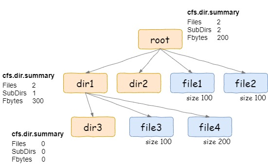

# CurveFS Summary Xattr

## 一、背景

当CurveFS文件系统上目录深度、目录数量和文件数量较大时，调用系统命令du获取文件系统所占空间时就会消耗巨大时间，性能无法接收。

原因是CurveFS是实现了fuse接口的分布式文件系统，所使用的du命令是系统库提供的函数，见[du](https://man7.org/linux/man-pages/man1/du.1.html)，当du统计目录的使用空间时，使用的是递归的方式，实际上调用fuse的lookup、opendir、readdir、getattr接口。也就是说，每次对于目录的du，都会转换为若干次对子目录和子文件的readdir、getattr调用，每次readdir和getattr都将对应于底层文件系统至少一次对元数据的rpc请求。如果是对包含大量的子目录和子文件的目录进行du操作，那么将需要发送大量的rpc请求，对于CurveFS这样的分布式文件系统来说，rpc请求的时延会远大于本地文件系统访问磁盘的时延，造成了du的总体时延变得不可接受。类似的情况，还有ls -R, rm -r等依赖递归去完成的功能，在面对大量的子目录的和子文件的情况下，都将会有类似的问题。

实际上，本地文件系统对于大量文件的du操作，时延也会显著增加，这是由于du本身递归统计的方式决定的，而像CurveFS这样依赖网络rpc的分布式文件系统来说，如果仍然采用du这种方式去统计磁盘使用量，那么无论怎么优化都不可能达到本地文件系统那样的时延。因此，解决的方案只有绕过du操作，采取其他的接口去获取磁盘的使用量。

## 二、调研

### 2.1 [CephFS](https://github.com/ceph/ceph)

CephFS使用xattr去实现上述需求，将目录包含的子文件和子目录的使用空间等统计信息保存在xattr中，当需要获取某个目录的空间使用情况时，只需要通过[getfattr](https://man7.org/linux/man-pages/man1/getfattr.1.html)获取这个目录的xattr就可以了。

```shell
root@node-3:/# getfattr -d -m ceph.dir.* .
# file: .
ceph.dir.entries="1"
ceph.dir.files="0"
ceph.dir.rbytes="708822611968"
ceph.dir.rctime="1457535283.09430737000"
ceph.dir.rentries="3633611"
ceph.dir.rfiles="3608532"
ceph.dir.rsubdirs="25079"
ceph.dir.subdirs="1"
```

各字段含义见:


### 2.2 [CubeFS](https://github.com/cubeFS/cubefs)

CubeFS同样利用了目录的扩展属性来实现上述需求，但是做了一个折中，其目录的扩展属性记录其子文件的容量信息，也就是只记录了一层。那么意味着，其在获取某个目录的容量时，还是需要遍历子目录，但不需要再计算子文件的容量，优化了统计容量的时间。当然，CubeFS也支持不记录子文件的容量信息，而全部通过递归遍历来计算，通过mount时的flag决定，具体实现可见[PR](https://github.com/cubeFS/cubefs/pull/1203)。



## 三、方案设计

目前来看，无论是CephFS还是CubeFS都是避开了du本身，而使用目录的扩展属性的方式，来快速地获取磁盘的使用量信息。要获取一个目录下大量子目录和子文件的总容量，一般通过两种方式：

- 在写文件时将容量的变化量记录下来，获取的时候直接去拿；
- 在获取总容量时，通过遍历的方式再合并起来。

CubeFS将子文件的容量记录在父目录的方式实际上是对两种方式的一个折中。由于目前CurveFS的元数据管理方式是类似于CubeFS的方式，即文件的元数据inode存储在父目录的inode所在的同一个partition中，那么像CubeFS那样记录子文件的容量在父目录中的xattr中是可行的。因此，实现方案可以参考chubaofs来实现。

### 3.1 实现xattr接口

#### 3.1.1 需要增加的扩展属性

```shell
字段含义：
记录该层信息：
curve.dir.files：该层文件数
curve.dir.subdirs：该层目录数
curve.dir.entries：该层文件和目录数
curve.dir.filebytes：该层所有文件容量（单位字节，目录大小4096）

记录本层及其所有子目录和文件：
curve.dir.rfiles：所有文件数
curve.dir.rsubdirs：所有子目录数
curve.dir.rentries：所有文件和子目录数
curve.dir.rfilebytes：所有文件容量（单位字节，目录大小4096）
```

#### 3.1.2 扩展属性持久化

上面需要增加的扩展属性中需要持久化的只有记录一层信息的curve.dir.files、curve.dir.subdirs、curve.dir.entries和curve.dir.filebytes。其余记录所有统计信息的扩展属性curve.dir.r*都可以通过计算得到。计划将xattr保存在inode中，getInode时可以不返回xattr，新增getXattr接口获取扩展属性。

### 3.2 功能的开启

提供一个配置项enableSumInDir，表示是否开启上述xattr。如果开启，需要在create、link、unlink、write或truncate等会改变上述值的接口中，调用UpdateInodeXAttr将变化的值更新到parentDir的xattr中，这里采用异步更新，避免统计信息的更新影响正常io的性能。

另外enableSumInDir设置在哪里？

1、是作为mount时的参数，但这样mount时如果enableSumInDir=true，需要先更新文件系统中所有目录的summary xattr（因为上次mount可能enableSumInDir=false），可能需要较长时间；

2、作为和文件系统绑定的flag，创建文件系统时设置该flag，保存在fsInfo中，以后不可修改；目前采用第二种方案。

### 3.3 实现batch接口来加速获取

无论是否开启summary xattr自动更新，batch接口的实现都可以加速获取inodeAttr或inodeXattr，来加速统计信息的汇集。

- BatchGetInodeAttr: 根据若干inode批量获取inode属性（排除inode中数据部分s3Info/volumeInfo），该接口可以在enableSumInDir=false的情况下加速获取统计信息。
- BatchGetXattr: 该接口根据若干inode获取其xattr，可用于enableSumInDir=true时获取目录xattr，需要配合修改ListDentry接口实现list dir only（需要在dentry中新增type字段）

由于inode可能保存在不同的metaserver，可能需要多次rpc，这里在rpc client层还需要根据partition拆分，（如果再优化一些，可以根据所在copyset，甚至所在metaserver进行拆分）。由于目前metaserver端处理请求以partirion为单位，所以暂以partition做请求的拆分。

### 3.4 主要流程图示

- getfattr enableSumInDir = false


- getfattr enableSumInDir = true


- getfattr enableSumInDir = true update parent inode asynchronously


## 四、重点问题

### 4.1 inode父子关系

该功能依赖从当前inode找到parentInode，目前Inode & dentry结构中没有从inode到dentry，inode到parentInode的反向查找逻辑。有如下两种方案，目前采取方案二，原因见4.2 硬链接的处理。

- 在client端利用map进行缓存，在createNode & lookup时存入父子关系，在forget和delete时删除父子关系。
- 将parent记录在inode中做持久化。

### 4.2 硬链接的处理

当存在硬链接时，一个inode会有多个parent，那么对该inode的操作带来的summary info的变更更新到哪个parent？

在介绍方案前先说明下4.1节选择方案二的原因，在存在硬链接的情况下，如果将父子关系缓存在client端，依赖create和lookup恢复，当umount一个文件系统后重新挂载时，硬链接inode的parent的恢复只能依靠lookup，但这完全取决于应用层的行为，大概率无法恢复完全，后果就是会导致summary info的不准确（例如：inode → p1,p2;  假设inode size是5，此时p1的fbytes 和 p2的fbytes 都是5，此时umount掉client，重新挂载上，从p1路径上lookup恢复了父子关系inode → p1，写入数据到size=10，再次重新挂载，这次从p2路径loopup得到父子关系inode → p2，此时inode size=10 p2的fbytes=5，此时删除该inode就会导致p2 fbytes减到负数）。当然，这里也可以在减到负数时向用户返回可接受的值（类似cubefs）。选择方案二的原因有如下几点：

- 将parent添加到inode中，不会带来多大的开销
- 相对方案一可以得到相对准确的统计信息
- 将parent持久化后便于后续可能的功能使用

回到硬链接处理方案上来，有如下几种：

- 硬链接的产生不计入summary info中，对该inode的操作只会反应到原parent上。可能导致容量小于真实容量（如果删除source hardlink真实容量不变，但是会导致从source parent的summary xattr中减去相应值）。
- 将硬链接视为普通文件，对该inode操作带来的修改更新到所有parent，会导致容量大于真实容量，容量差和硬链接数相关。
- 对硬链接inode的操作带来的修改更新到所有parent，但在获取summary info时将所求子树中因硬链接都计算的信息减去，这取决于一种能快速从父子关系中确定硬链接的多个parent中的多个存在在当前统计子树中，但随着一个inode硬链接多次，和硬链接数量的增加，要得出这样的结论都需要耗费巨大时间。

综上，目前实现采取方案二，将硬链接视为普通文件，存在硬链接时容量会偏大。

### 4.3 多挂载开启

目前为保证多挂载下数据cto（close-to-open）一致性，当getInode时，如果该inode处于close状态，就不能从client 端inode cache中直接拿inode信息，需要去metaserver获取。因为parent dir summary xattr的更新是异步更新，当前一个更新请求异步发出后还未更新到metaserver，这时新的更新请求获取inode信息时，从metaserver获取到的信息可能是旧数据，导致summary info更新混乱。在多挂载情况下，目前采取功能降级，采用普通batch接口获取，不自动更新summary info。


### 4.4 异步更新失败

在summary info 异步更新失败时，记录的统计信息就会不准确，目前暂未做出了，后续可以考虑后台定期扫描更新等方式来处理。
