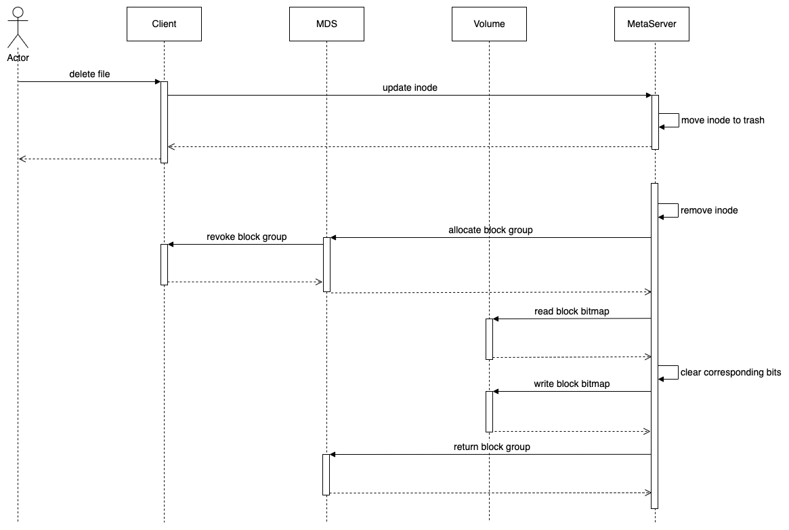

# CurveFS对接volume的空间回收方案

## 1 方案背景

CurveFS对接volume，实现方案见：[CurveFS 空间分配方案](curvefs_volume_space_design.md)。

CurveFS已经实现了从CurveBS分配空间，并把写入file的数据持久化到volume上。但是空间回收部分功能还没有实现，在删除文件，或者对文件truncate的时候，没有释放volume分配的空间，最终会造成volume上有大量的垃圾数据，导致volume空间耗尽。

当CurveFS存储后端接入CurveBS时，一个CurveBS卷对应着一个CurveFS，CurveFS的文件的inode和dentry信息保存在metaserver中，数据信息保存在volume中，数据在volume的存放地址保存在metaserver中。这部分数据存在在volume的地址信息以kv的方式存放，key是**fsId:InodeId:SliceOffset**，value是**VolumeExtentSlice**。

对应的数据结构：

```protobuf
message VolumeExtent {
    required uint64 fsOffset = 1;
    required uint64 volumeOffset = 2;
    required uint64 length = 3;
    required bool isused = 4;
}

message VolumeExtentSlice {
    required uint64 offset = 1;
    repeated VolumeExtent extents = 2;
}

message VolumeExtentList {
    repeated VolumeExtentSlice slices = 1;
}
```

理论上，通过metaserver的volume extent信息，可以推算出volume的空间分配情况，但是当集群规模太大，通过这些信息恢复volume空间分配情况开销太大。所以实际实现的时候，把volume的空间分配情况记录下来，加快空间的分配。把volume的空间分配，按照4KB为粒度，每个4KB使用1bit表示。用bitmap来表示volume的空间分配情况，并且把这个bitmap也持久化到对应的volume中。

这样，volume的空间分配问题，就转化为对的volume上的bitmap的修改。

- 分配空间，就是对bitmap的对应的bit置1；
- 释放空间，就是对bitmap的对应的bit置0。

## 2 方案设计

### block group的权限管理

空间分配信息是记录在volume上面的，client会有分配信息的缓存。空间的释放是在metaserver做的。client和metaserver可能会同时修改空间分配的bitmap。这会带来一些问题。

如果metaserver释放了空间，client那边会感知不到。所以设计中，要想办法避免的client和metaserver同时修改的bitmap。

在之前的设计中，采用把volume切分成一段段的block group，每个block group有自己的分配bitmap，对bitmap进行修改，必须要先获取block group的权限。

block group在fs第一次mount的时候，全部初始化。由mds负责block group的分配。

每个client需要申请空间的时候，都提前去mds申请若干个block group。每个block group只能是一个client独占的。

当block group用满了，无法申请空间之后，释放这个block group，还给mds。

当fs umount的时候，释放这个挂载点的block group，归还给mds。

此外，还需要额外的机制处理client的block group的权限，当client 持有一block group的时间超过一段时间之后，如果能够成功申请到一个新的block group，就释放持有超时的block group的权限。

每个metaserver删除inode的时候，释放空间时，先去mds申请对应block group的使用权限。如果申请不到，跳过这个inode，等下一轮清理的时候再处理。如果申请到了，释放空间，修改bitmap。

## CurveFS的有3个地方涉及到空间的回收：

1. **inode的删除**，当TYPE_FILE类型的nlink减到0的时候，需要把这个inode对应file申请的volume的空间释放。这个删除在metaserver处理，而且是在后台线程处理。inode的删除在client只是修改inode的nlink的元数据，所以这个后台空间的释放，不影响client 的inode的删除时延。
2. **truncate**，当一个TYPE_FILE类型的文件，进行truncate的时候，如果truncate的length小于file length，需要把多出的volume空间释放。这个truncate需要在client进行，而且是尽力而为的空间回收，空间清理的开销和truncate的空间的碎片程度正相关。
3. **delete fs**，当删除一个fs的时候，不需为对这个文件的每个inode释放空间，由于一个fs对应于一个volume，只需要删除fs在metaserver的元数据和mds的fsinfo即可。为了数据的安全性，删除fs的时候，最好同时删除对应的volume，或者把这个volume全盘写0一遍。删除volume或者全盘写0操作不是本方案讨论的重点，也不是空间回收的必须功能，在这里就不展开讨论。

接下来会从上面的3个方面，详细说明各个场景的空间回收的设计。

### 2.2 删除文件的空间回收

当删除文件的时候，文件的nlink会–-，当nlink减到0的时候，就应该对inode进行删除。现在CurveFS有实现延迟删除，将来还会实现回收站功能。无论是否有这些高级特性，inode的删除的判断条件，都只有一个，那就是nlink减到0。

在CurveFS对接S3的实现中，删除inode的时候，会先遍历inode中的S3记录，调用S3接口删除S3对象，然后再删除inode。由于S3不会重用，所有删除S3的过程是幂等的，即一条记录即使删除多次也没有关系。当inode的S3删除到一半的时候，如果发生了leader切换，那么新的leader，重新删除一遍S3对象，不会有什么副作用。

但是在使用volume作为存储后端时，如果采用一样的删除逻辑，可能会出现下面的问题。

> 删除文件包括两个操作：清理空间和删除文件对应的 inode。如果在清理空间之后，删除 inode 之前，metaserver 进程挂掉。

>在重启或 leader 切换后，会继续执行删除文件的操作，因此，会再次清理空间、删除 inode。

>所以，这里的问题是，第一次回收之后的空间，可能已经分配给了其他 inode，再次清理时，会导致其他文件的数据丢失。

如何解决这个问题？

#### 2.2.1 删除文件方案1

如果记录的是申请空间的inodeid而不是一个bit，就可以解决这个重复释放的问题。释放空间的时候，带上inodeid，如果inodeid和记录下来的inodeid匹配，就可以释放空间成功。如果inodeid不匹配，不释放空间，直接返回成功。由于curvefs的inodeid是从1开始的，记录的是0的时候，表示没有分配空间。

> 假如文件A删除了，metaserver清理了文件A的空间，在删除inode之前，metaserver进程挂掉。

> 文件B分配了文件A释放出来的空间。

> metaserver切换leader，重新执行删除清理操作。此时对应空间的inode已经是B，和请求的A的inode不匹配，直接返回清理成功。

这样就解决的前面的空间重复释放导致的数据丢失的问题。

原来的设计中一个block group是128MB，每4K空间用1个bit表示，总共需要128MB/4KB*1bit=32Kbit=4KB空间，每128MB的空间，只占用4KB的空间保存bitmap。

如果改为记录inodeid，每128MB需要128MB/4KB*64bit=256KB的空间保存空间分配信息，空间开销为2‰，即每GB需要2MB的额外空间保存空间分配信息。

#### 2.2.2 删除文件方案2

还是使用1个bit表示bitmap，但是在清理文件的空间时，先把inode标记未deleting，然后再修改bitmap，bitmap清理之后，删除对应的volume extent，最后删除inode。

如果清理空间到一半的时候，metaserver重启或者发生了leader切换，重放日志的时候，如果发现是个deleting的inode，就不清理空间，跳过这个inode。

这种状态的inode，可以等到的将来delete partition或者delete inode的时候进行清理；或者等到将来实现了类似fscheck功能的时候，进行清理。

这种方式，可能会有造成空间浪费。

#### 2.2.3 删除文件多个block group的问题

和分配逻辑一样，释放也需要独占一个block group。在inode的nlink减到0之后，清理数据之前，需要先向mds申请空间对应的block group的权限。申请到权限之后，才能进行清理，清理之后，及时释放block group权限。

如果一个文件的数据分布在好几个block group，又不能同时获取block group的权限，这个时候怎么办？

只释放能获取到权限的部分空间，还是等到能获取所有的block group的权限之后再清理空间？

原来的CurveFS空间分配设计中，有一个revoke block group的设计，当metaserver清理inode的空间的时候，如果没有办法从mds获取block group的权限，mds向client回收block group的权限，交给metaserver。



这里有个问题，怎么判断client的block group能否被收回。client的block group会不会被一直被不断的revoke/alloc。所以在考虑volume的空间回收方案时，倾向于mds不要向client revoke block group的权限。

当一个文件的删除涉及到多个block group的时候，metaserver可以先清理能获取到权限的block group，删除对应的volume extent，暂时申请不到权限的block group，可以先不清理，等到将来能获取到权限的时候，再清理。完成了部分清理的文件，把deleting状态再标记为normal。

### 2.3 truncate的空间回收

truncate会修改文件的长度，如果truncate的length小于文件原有的length，释放出来的空间需要归还给volume，有两种情况。

case1：需要归还空间的block group的使用权正好在这个挂载点。这种情况直接在这个挂载点，进行修改。先修改inode的元数据，再修改volume上的分配信息。

case2：需要归还空间的block group的使用权不在当前这个挂载点，mds未把这个block group分配给任何一个的挂载点，client可以去mds申请这个block group，释放空间之后再归还给mds。

case3：需要归还空间的block gruop的使用权不在当前这个挂载点，而是被其他的client申请走了。此时，无法修改volume的bitmap，需要特殊处理。可在inode中增加个标记位，用来区分truncate之后还未释放空间得inode。在metaserver增加一个后台扫描线程，定期扫描特殊标记的inode，检查inode是否有空间需要释放，检查需要释放的空间所在的block group是否空闲，如果可以释放空间，申请block group权限，释放空间。

**truncate的删除操作比较复杂，这里只是一个思路，还需要进一步的考虑。感兴趣的小伙伴，可以一起参与truncate时空间回收的设计开发。**

### 2.4 删除一整个文件系统的空间回收

1. 在mds标记fsinfo的状态为deleting；
2. 在metaserver删除partition下的inode、dentry、volume extent；
3. 删除partition；
4. 删除对应的bs卷；
5. 删除fsinfo；

第2步删除volume extent的时候，不需要去删除的volume上对应的bitmap，最终统一在第四步处理。

## 3 代码结构

**curvefs/src/volume:** client和metaserver使用这个目录下的代码。主要是空间分配和释放相关。
| 组件 | 功能 |
| --- | --- |
block group| 128M
extent| 0~4M （不持久，内存，从4k算出来的）
bitmap | 每4M用1bit表示，每个block group 使用4K空间表示bitmap
space manager |一个client的所有的block group的空间管理

**curvefs/mds/space:** mds使用这个目录下的代码。主要是block group的权限控制相关。
| 组件 | 功能 |
| --- | --- |
manager | mds管理所有fs、bs的空间管理
block group storage |持久化到etcd
mds proxy |用户mds给curvebs集群的mds发送请求
service | mds提供给client的申请释放block group的接口
volume space |管一个bs上的所有block group的空间管理，mount的时候初始化，调用block group storage持久化到etcd

## 4 遗留问题

1. truncate 的时候空间回收的方案；
2. bitmap删除不幂等的问题，见2.2.1和2.2.2；
