# 目的

前期的[空间分配方案]()是单节点、内存版本的 POC 版本，现在需要完善基于块的文件系统空间分配，包括持久化、高可用等功能。

需要考虑一下几点:

- [ ] 空间分配、释放流程
- [ ] 高可用（可能）
- [ ] 空间重建 or 持久化
- [ ] 扩容
- [ ] 性能
- [ ] 空间使用统计

# 设计方案

## 方案一

空间分配以单独的服务运行，需要考虑高可用、幂等、空间分配信息持久化等。

### 高可用

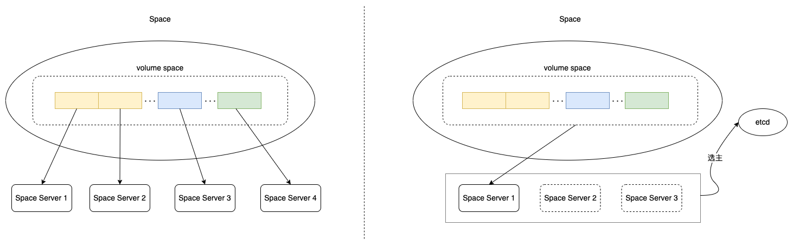

第一种方式：整个卷的空间划分为多个部分，每个部分对应一个单独的 server 用于分配空间，在其中一个 server 异常退出、宕机后，client 端可以切换到其他的 server 继续分配空间。每个 server 可以使用 daemon 或 service 监控，在进程退出后，立刻拉起。

第二种方式：类似于现在的 MDS + etcd 的方式，MDS 通过 etcd 进行选主对外提供服务。主 MDS 退出、宕机后，其余的备 MDS 选主成功，对外提供服务。

### 空间信息分配持久化 or 重建

#### 重建

第一个版本的空间分配模块，采用重建的方式，在启动时，遍历当前文件系统下所有的 inode，根据 inode 中记录的空间使用信息，重建可用空间。

但是这里主要存在两个问题：

1. 重建时间无法预期，在文件数量较多时，重建的时间可能会很长。
   - 这个问题可以通过在 MetaServer 端的 Partition 中汇总当前 Partition 下所有 inode 使用的空间进行规避。在 Partition 中以内存状态保存当前 Partition 使用的空间，在 UpdateInode 中，根据空间的分配、释放情况，更新内存即可。
2. 重建过程会遗漏部分空间
   - client 写入数据时，会先申请空间，再写入数据，最后更新 inode 到 MetaServer 上。
   - 如果 space 进程在 client 申请到一段空间后，更新 metaserver 之前，重启恢复，会导致 space 认为这段空间是可用空间，会把空间分配给其他 inode，导致数据不一致。

#### 持久化

对于卷的每一个 4K 块，用一个 bit 表示是否可用，连续的一段块，组成一个 bitmap。

BlueStore 将这一段 bitmap 以 k/v 的方式存储到 RocksDB 中，key 为 start offset，value 是 bitmap。

我们也可以考虑持持久化到 k/v，或者直接写到盘上。即，单独使用盘上的一块区域记录 bitmap，或者进行分块，每个块单独进行记录。一个 4K 的块就可以表示 128MiB 的空间使用情况（4K * 8 * 4k）。

#### 幂等请求

space 以单独的服务运行，其他模块通过 RPC 进行交互。

RPC 交互的过程中，可能会由于网络异常、对端宕机、处理较慢等情况，导致 RPC 失败。

在 RPC 异常后，目前大部分的处理逻辑就是重试，重试前会进行一些处理操作，比如睡眠、get leader 等。

但同时，RPC 失败，并不代表对端没有收到 RPC 请求、没有处理 RPC 请求，因为 RPC 可能在返回响应的时候由于超时被丢弃，或者在返回响应的时候机器宕机。

因此，需要在 space 一侧保证请求的幂等性。

> 如果不保证请求的幂等，对于分配操作来说，会导致空间浪费；对于释放操作来说，可能会出现数据丢失的问题，比如，第一次的释放请求在 space 端处理完成，但是处理超时。client 端会在一定时间后重试，在这个时间间隔内，已经释放的空间有可能已经分配给了其他文件，所以重试的请求会删除其他文件的数据。

##### 分配请求幂等

第一个版本的空间分配请求包括如下信息：

```cpp
enum AllocateType {
    NONE = 0;
    SMALL = 1;     // 小文件分配
    BIG = 2;       // 大文件分配
}
  
message AllocateHint {
    optional AllocateType allocType = 1;   // 申请类型
    optional uint64 leftOffset = 2;        // 期望申请到的地址空间的起始位置
    optional uint64 rightOffset = 3;       // 期望申请到的地址空间的结束位置
}
  
message AllocateSpaceRequest {
    required uint64 fsId = 1;         // 文件系统ID
    required uint32 size = 2;         // 申请空间的大小
    optional AllocateHint allocHint = 3;
}
```

从现有的请求中，无法识别出是否为重试请求。所以需要额外的信息用于标识重试的请求，比如 client id，request id（递增，重试请求复用 id），inode id 等。

在 client 端申请空间时，需要附带这些信息。

在 space server 端，完成空间分配后，需要对这次的分配结果进行持久化，比如以 client id、request id、inode id 等信息作为 key，这次请求分配的空间信息作为 value 持久化到 k/v 中。

重试的请求会查询到之前的分配记录，直接返回上次的分配结果即可。(持久化的记录何时清理？)

##### 释放请求幂等

前面说了释放请求不幂等会导致的问题。

1. 释放的空间进行特殊标记，等待一段时间后标记为可用？
   - 每个 4K block 需要加入第三种状态，0 可用 1 已分配 2 xxx，只有标记为 0 时才可分配空间。释放空间时，先标记为 2，等待一段时间后，再标记为 1。
   - 但是这种方式依赖于 client 端的重试策略，只能覆盖部分异常场景。
2. 空间信息加入版本号？
   - 每次分配时，分配一个版本号，释放空间时，带上版本号，space server 对版本号进行校验。

## 方案二

类似于 GPFS 和当前块分配 Segment 的方式。

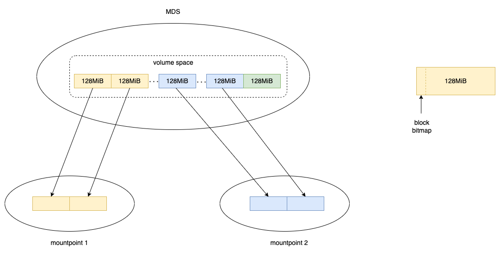

块空间管理放到 MDS，将块空间按照固定大小进行划分，比如 128MiB，称为 block group。

空间分配信息以 bitmap 的方式放置到每个 block group 的开头或结尾，每个 bit 标识对应的 4K 块是否分配。

每个 client 在需要申请空间时，以 block group 为粒度向 MDS 进行申请，申请后获得 block group 的所有权，在获取一个 block group 后，可以自行分配，分配空间后更新 bitmap。

MDS 负责卷的所有 block group 的分配与管理。对于每一个 block group，需要保存如下状态：

- 分配状态（是否已分配）
- 可用空间（已分配情况下，client 通过 session 或其他方式定期上报）
- 持有的节点（已分配，记录 client ip:port）
- 其他必要信息

block group 的状态需要持久化到 etcd 中。（对于未分配的block group，不需要记录状态，额外记录所有未分配的 block group 就可以了）。

MDS 分配 block group 时需要保证每个 block group 不能被分配多次。正常情况下，client 申请的 block group，在进程正常退出时（umount），需要释放 block group 的权限。

> 可以把 block group 视为一种资源。目前的设计是，资源是互斥的，不能被共享。
> 
>> 在使用资源时，需要先进行申请。
>> 
>> 正常使用完成后释放资源。
>>
>> 资源在被持有的情况下，不允许其他节点再次申请。

### 分配流程

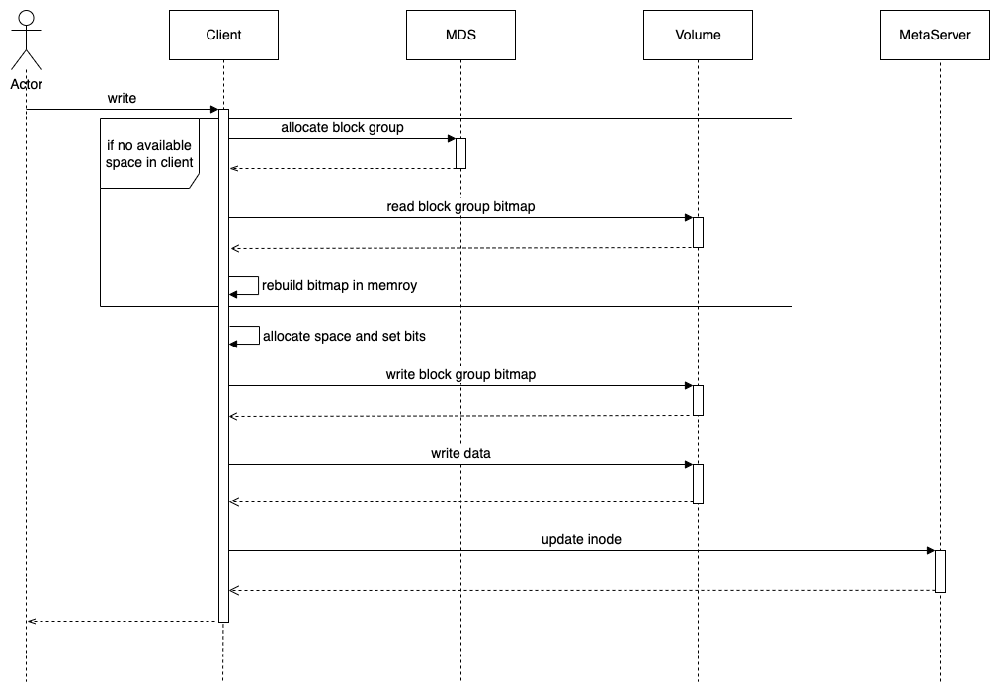

文件写入时，涉及到的空间分配流程如上图所示。

在从 MDS 获取到一个 block group 后，正常情况下会一直持有。

在 client 空间足够时，不需要再次申请，即省略了前 3 个步骤：allocate block group、read block group bitmap 和 rebuild bitmap in memory。

空间用完后，再次申请新的 block group。

> 这里触发分配 block group 的策略可以特殊考虑一下，不一定是空间不足时。比如以 128MiB 为粒度分配，在大量文件并发写入的情况下，局部性可能不会很好。

#### 特殊场景

1. 向 MDS 申请 block group 时，MDS 发现所有的 block group 都已分配出去。
   
   比如，一个文件系统包含 10 个 block group，被挂载 10 次，每个 client 分配了一个 block group。

   当其中一个 client 用完空间后，再次申请空间时，MDS 会发现所有的 block group 都已经分配出去。

   a. 不特殊处理，向上层应用返回 NoSpace。这种情况下会导致卷的空间利用率不高。

   b. MDS 向其他 client 回收一个 block group，然后再分配出去。这种情况下，多个 client 并发写入的情况下，性能会有下降。

2. client 为 inode 分配写入空间时，在设置 bitmap 并写入到 volume 后，空间信息添加到 inode 前，进程异常退出。
   
   *这段空间如何快速找回？（s3 文件系统也没处理，上传数据到 s3 后，client 进程异常退出）*
   
   空间分配过程未记录具体分配给哪个 inode，在用 fsck 修复时，如何快速找回空间？(根据当前 client 写入了哪些 inode，分配了哪些 block group？)

### 释放流程

在将文件 truncate 变小、删除文件时触发空间的回收操作。

#### s3 文件系统的实现

在 truncate 后，空间的回收操作未进行处理，是利用 compaction 来处理，目前还有些场景无法处理，比如 100MiB 的文件 truncate 后，只新写入了 50MiB，那么后续的旧数据不会被清理。整体处理逻辑还是根据覆盖写 compaction 的逻辑来的。(https://github.com/opencurve/curve/issues/1049)

删除文件的操作会在 metaserver 进行处理，其中删除对象的操作会在 3 副本上都执行。*这个逻辑需要修改，否则空间会被回收三次，如果其中一次回收后，又被分配出去，后两次的回收会导致其他文件的数据丢失。*

#### 删除文件处理流程

在 MetaServer 端删除文件、清理文件的使用空间。

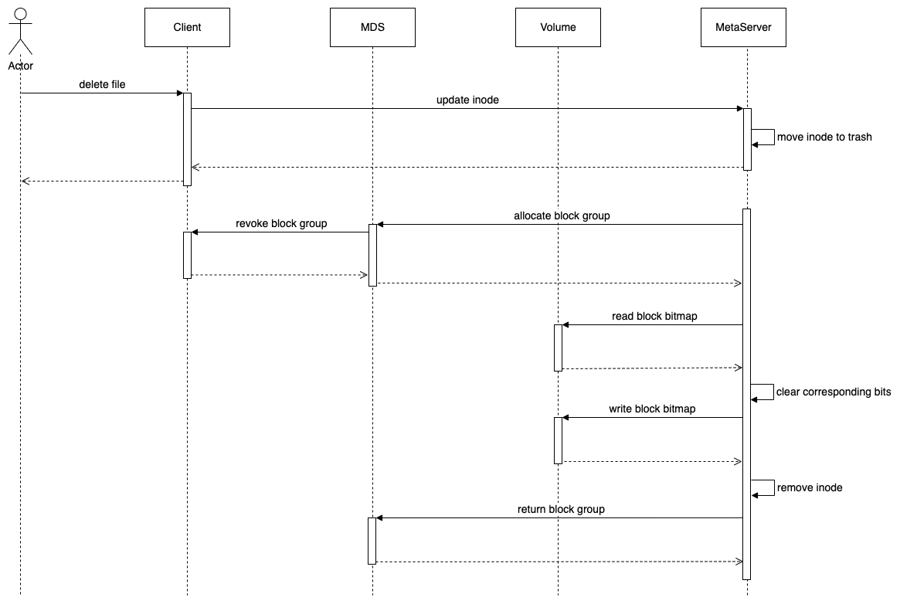

整体流程如上所示。

在清理文件占用的空间时，可以先计算出占用空间属于哪些 block group，对于同一个 block group 的空间，进行合并回收，避免多次回收的开销。

在确认需要释放 inode 占用的空间时，需要先获取到对应的 block group，然后再对 bitmap 进行清零操作，表示空间可用。

#### 特殊场景

1. 上述的流程中，假设需要回收空间所在的 block group 被其他 client 持有。其余可能存在的情况是
   
   a. block group 未被持有，所以不需要与 client 交互，回收 block group 的权限
   
   b. block group 被其他的 metaserver 持有。这种情况下，需要等待其他 metaserver 释放权限，而不是主动回收。

2. 删除文件包括两个操作：清理空间和删除文件对应的 inode，如果在清理空间之后，删除 inode 之前，metaserver 进程挂掉。

   在重启或 leader 切换后，会继续执行删除文件的操作，因此，会再次清理空间、删除 inode。所以，这里的问题是，第一次回收之后的空间，可能已经分配给了其他 inode，再次清理时，会导致其他文件的数据丢失。

#### truncate 处理流程

流程应该跟文件删除类似，只是操作的发起和执行是在 client 端，client 端需要获取对应 block group 的权限，然后执行空间释放操作。

## 方案对比

### 性能对比

方案一中，Space Server 端负责细粒度的空间分配及持久化，所以当 client 端每次需要申请空间时，都需要发送 RPC 请求。

方案二中，空间分配分为两个层级：粗粒度的空间分配由 MDS 进行，后续细粒度的空间分配在 client 内部处理，无需 RPC 交互。

除 RPC 外，直观来看，持久化、幂等问题处理带来的开销应该是一致的。

### 服务端异常情况下的影响

方案一中，Space Server 在 IO 的核心路径上，所以服务异常会对 IO 产生影响，需要高可用来降低服务异常带来的影响。

方案二中，空间分配的核心流程在 client 端内部处理，只有粗粒度的空间分配需要与 MDS 交互。整体来看，MDS 异常的情况下对 IO 影响较小。

# 结论

空间分配基于方案二进行。

相较于方案一，方案二有以下几点优势:

1. 不需要为空间分配服务重新设计高可用，只需要 MDS 提供高可用的服务即可（目前已实现）。
2. 空间分配的核心流程在 client 端内部完成，在服务异常的情况下，影响较小。
3. 空间分配信息直接持久化到卷上。

方案中的遗留问题如下：

1. 空间分配/回收过程中，更新 bitmap 和更新 inode 不是原子操作，再此过程中进程异常退出，会导致文件系统不一致。
2. fuse-client 申请 block group 时可能会出现已完全分配的情况。

## 第一阶段开发计划

1. 完成基本的空间分配、回收功能
2. 遗留问题先进行规避
   1. 空间分配过程中进程异常退出后，先更新 bitmap，后更新 inode 会造成空间浪费的问题。**第一阶段先不处理**。
   2. 空间回收过程中进程异常退出后，通过先更新 inode，再清理 bitmap 的方式，规避反向操作可能带来的不一致问题，造成的空间浪费问题，**第一阶段先不处理**。按照这种方式处理的时序图如下：


   3. fuse-client 申请 block group 时，如果 block group 完全分配，进行主动的 extend 卷。
   
   
### 相关 RPC 接口

```cpp
syntax="proto2";
package curvefs.mds.space;
option cc_generic_services=true;

enum SpaceStatusCode {
    SpaceOk = 0;
    SpaceUnknownError = 1;
    SpaceNoSpace = 2;
    SpaceNotFound = 3;
}

enum BitmapLocation {
    AtStart = 1;
    AtEnd = 2;
}

message BlockGroup {
    // start offset on volume
    required uint64 offset = 1;
    // total bytes of each block group
    // this must be fixed when create fs or mkfs, so, this field maybe not needed
    required uint32 size = 2;
    // used bytes
    required uint32 used = 3;
    // available bytes
    required uint32 available = 4;
    // block size
    // this must be fixed when create fs or mkfs, so, this field maybe not needed
    required uint32 blocksize = 5;
    // bitmap locaiton
    required BitmapLocation bitmap = 6;
    // owner, who owns this block group
    optional string owner = 7;
}

message AcquireBlockGroupRequest {
    required uint32 fsId = 1;
    required string owner = 2;    // or just ip:port
    required uint64 size = 3;     // or number of block groups
}

message AcquireBlockGroupResponse {
    required SpaceStatusCode status = 1;
    optional uint64 size = 2;
    repeated BlockGroup blockGroups = 3;
}

message ReleaseBlockGroupRequest {
    required uint32 fsId = 1;
    repeated BlockGroup blockGroups = 2;
}

message ReleaseBlockGroupResponse {
    required SpaceStatusCode status = 1;
}

message StatSpaceRequest {
    required uint32 fsId = 1;
}

message SpaceInfo {
    required uint64 size = 1;
    required uint64 used = 2;
    required uint64 avilable = 3;
}

message StatSpaceResponse {
    required SpaceStatusCode status = 1;
    optional SpaceInfo spaceInfo = 2;
}

message UpdateUsageRequest {
    required uint32 fsId = 1;
    repeated BlockGroup blockGroups = 2;
}

message UpdateUsageResponse {
    required SpaceStatusCode status = 1;
}

service SpaceService {
    rpc AcquireBlockGroup(AcquireBlockGroupRequest) returns(AcquireBlockGroupResponse);
    rpc ReleaseBlockGroup(ReleaseBlockGroupRequest) returns(ReleaseBlockGroupResponse);
    rpc StatSpace(StatSpaceRequest) returns(StatSpaceResponse);
    rpc UpdateUsage(UpdateUsageRequest) returns(UpdateUsageResponse);

    // we don't need init space or deinit space because this can be done when create fs and delete fs
}

```

# 相关调研

## GPFS

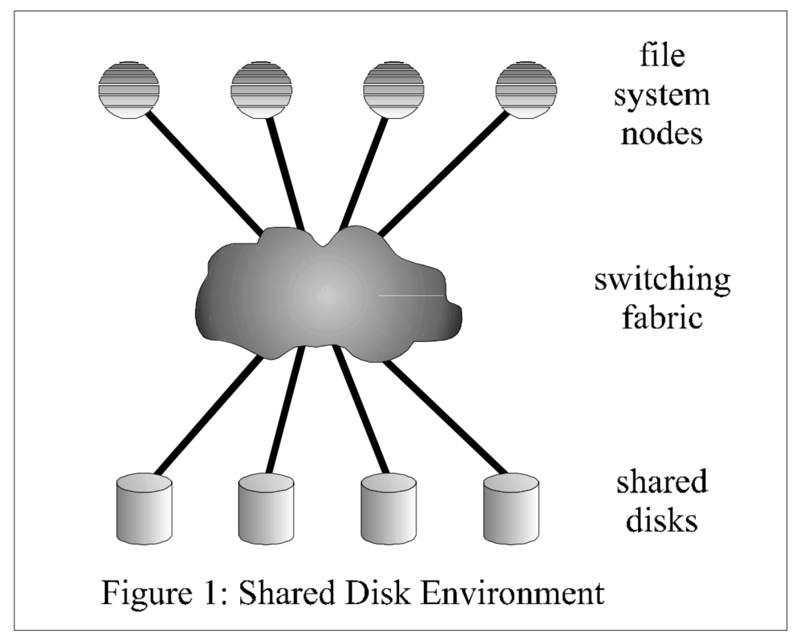

### Allocation Maps

- Allocation Maps 被等分为 N 个固定长度的 regions，每个 region 记录每个磁盘的 1/N 个 blocks 的空间使用情况。
  
  N 的大小在创建文件系统时设置为期望的共享挂载数量。

- 文件系统的其中一个挂载点记录空间的使用情况。Allocation Manager 在文件系统挂载时，通过读取 Allocation Maps 初始化空间统计。

  其余挂载点定期上报在这个时间段内的空间使用、回收情况。

- 当其中一个挂载点使用完空间后，向 Allocation Manager 申请新的 region。

- 一个挂载点删除文件时，不负责回收空间。而是，转交给使用对应 region 的挂载点去处理。
  
  Allocation Manager 会定期下发 region 的使用者。

## Frangipani

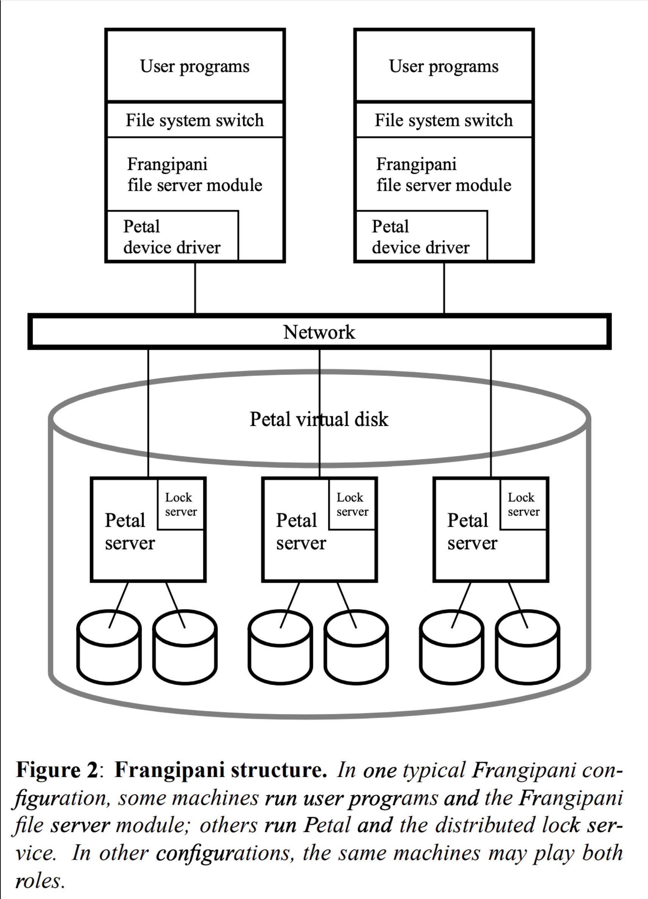

一个 Petal 虚拟盘有 2^64 字节的地址空间。提供了 thin provisioning 语义，写入数据时才会分配物理存储空间，删除数据时可以回收物理空间。

### Disk Layout

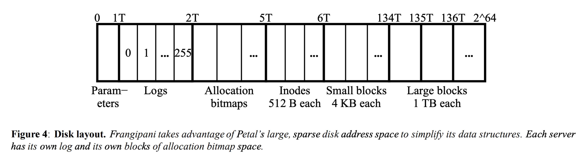

- 第一个区域存放一些共享的配置参数，大小为 1TB，但是通常只使用几 KB 的空间。

- 第二个区域存放日志 logs，大小为 1TB，分为 256 份，每个 Frangipani server 独占一份。

- 第三个区域存放 allocation maps 用于其余空间的使用情况。每个 Frangipani server 独占其中的一部分。当其中一个 server 的空间使用完，会查找其他未使用的部分。这块区域大小为 3TB。

- 第四个区域存放 inode，每个 inode 大小为 512 字节。这块区域大小为 1TB，可以存放 2^31 个 inode。allocation bitmap 和 inode 的映射关系是固定的。
  
  The mapping between bits in the allocation bitmap and inodesis fixed, so each Frangipani server allocates inodes to new files only from the portions of the inode space that corresponds to its portions of the allocation bitmap. But any Frangipani server may read, write, or free any existing file’s inode.

- 第五个区域存放 small data blocks，每个大小为 4KB，共 128TB。每个文件的初始 64KB 数据存放在这里，超过 64KB 后，新的数据存放到 large block 中。

- 后续的区域存放 large blocks，每个大小为 1TB。

### 限制

1. 单个文件最大为 64KiB + 1TiB
2. 大文件的个数为 2^24

## Orion

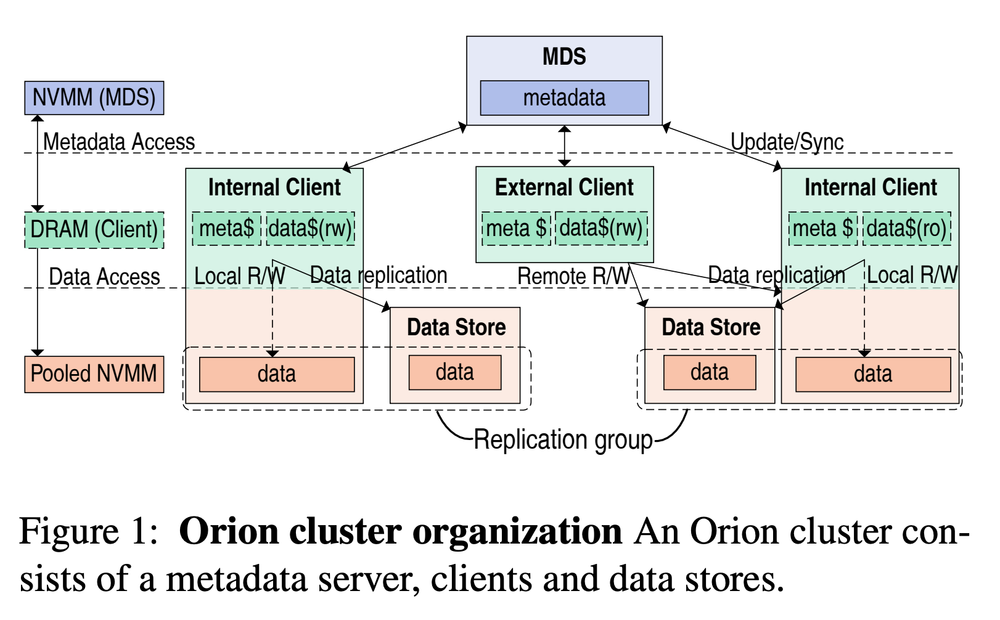

数据都存放到 NVMM（傲腾盘），通信使用 RDMA

internal client : 和存储节点混部的计算节点

为了避免在关键路径是上分配空间，采用了两阶段的分布式空间分配策略。

1. MDS 记录了所有 page 的使用情况
2. client 端通过 RPC 一次申请一块大的空间
3. 后续细粒度的空间分配由 client 自己完成

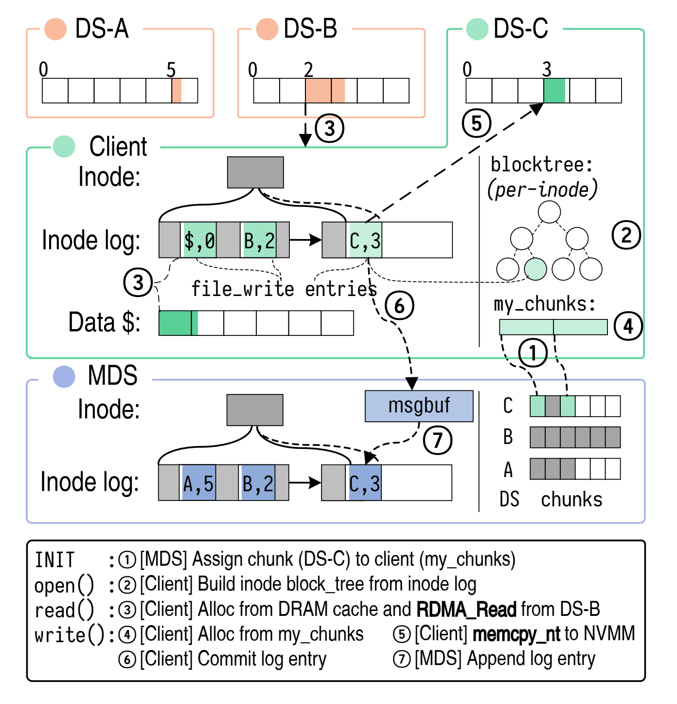

## 本地文件系统异常场景处理

比如本地文件夹系统在追加写一个文件时，在写入完成后，磁盘结构会有如下变化：

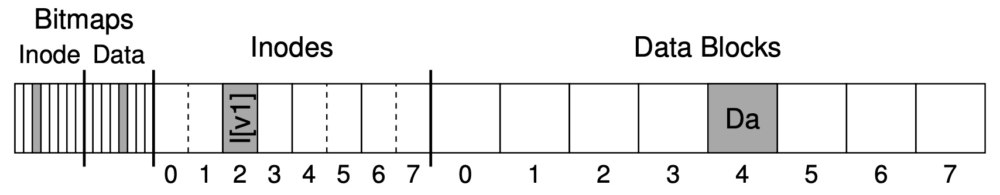

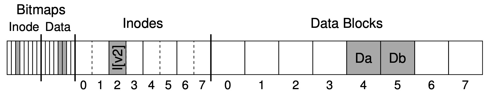

可以看到，写入前后有 3 处发生了变化,

- data bitmap: 将 data block 5 分配出去
- inode: inode 大小及数据块索引发生变化
- data block: data block 5 保存写入数据

对于磁盘来说，由于写入不连续、磁盘调度策略等，会导致不可能同时处理并完成这个 3 个 I/O 请求。那么，在 3 个 I/O 请求写入完成前的任意时刻，系统发生崩溃、掉电就会导致文件系统的不一致。这个不一致称为 Crash Consistency。

比如：

- inode 更新成功，其余两个更新失败：inode 数据块包含 data block 5，但是对应的 data block 中保存的是脏数据。
- data bitmap 更新成功，其余两个更新失败：data block 5 标记为已分配，但并没有 inode 包括这个块，导致空间泄露。

### Solution 1: The Filesystem Checker (fsck)

fsck 对整个文件系统进行一致性校验。大致流程如下：

1. 校验超级块 SuperBlock。
2. 校验可用块 FreeBlock，扫描所有 inode 中的数据块索引，从而记录哪些数据块正在被使用，然后与 data bitmaps 的进行对比。不一致的情况下，以 inode 中的记录为准。
3. 校验 inode 的状态。
4. 校验 inode 的链接。
5. 校验数据库是否被重复索引，比如，两个 inode 都包含了同一个数据块。
6. 校验坏块，比如，数据块索引指向了一个非法的位置。
7. 校验目录。

存在的问题：

- 随着文件系统大小增加，耗时会比较长。
- 不感知系统崩溃、掉电前的文件系统行为，导致修复开销比较大。比如上面的例子，虽然只改了 3 个块，但是在 fsck 的时候，需要扫描整个文件系统。

### Solution 2: Journal or Write-Ahead Logging

在原地更新磁盘结构之前，在盘上的其他地方记录准备要做的事情。

#### Data Journaling


日志中包含了 5 个块：

- TxB：事务开始标记，包括当前事务的信息，以及 TID
- I[v2]、B[v2]、DB：
- TxE：事务结束标记，同样包含 TID

在日志写入完成后，执行 checkpoint 操作，将更新写入磁盘。

日志写入及文件系统执行的顺序如下所示：

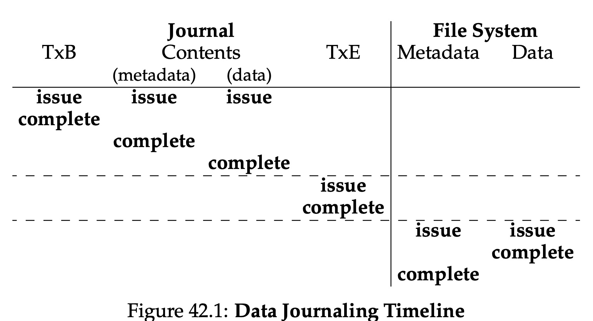

从这里可以看到，整个事务是分两次写入的。

- 先写入 TxB、元数据（I[v2]、B[v2]）、数据
- 完成后，写入 TxE

这是因为整个事务可能比较大，导致一个写入操作被拆分成多个请求下发到磁盘上。在系统崩溃、掉电的情况下，有可能会出现 TxB、TxE 写入完成，其余部分未完成写入的情况。在重启后恢复时，事务看起来是完整的，但其实不然。

> 另一种方式是，在 TxB、TxE 中都加入本次事务的 checksum，这样事务可以作为一个请求写入。在恢复过程中，对 checksum 进行校验，如果不一致的情况下，认为事务记录不完整，直接丢弃。ext4 采用这种方式。

存在的问题：

- 数据写两遍

#### Metadata Journaling or (Ordered Journaling)

在 Data Journaling 的过程中，数据会被写两次：一次是在日志中，一次是在 checkpoint 中写入到指定的数据块。

Metadata Journaling 只把元数据的更改写入日志中。


其中，数据的写入要在 TxE（Journaling Commit）之前完成。整个顺序如下：

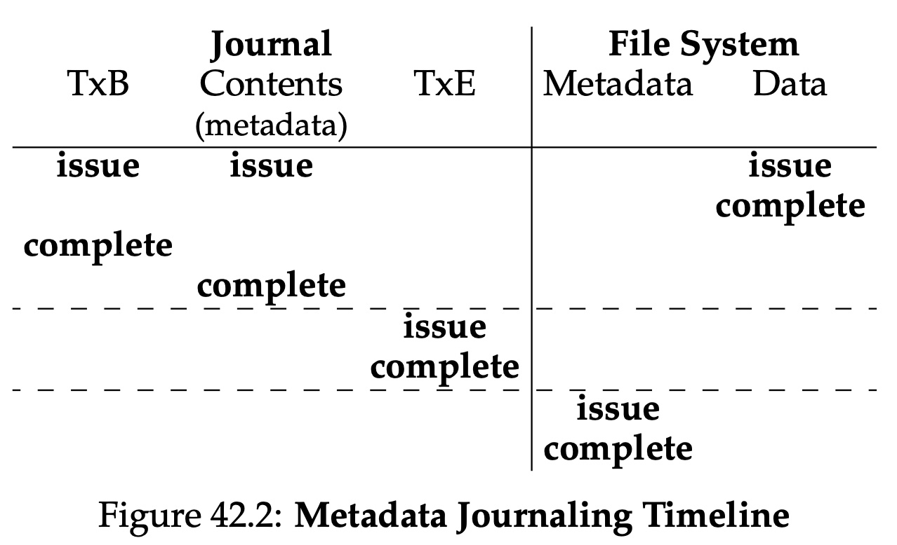

### 方案二分配/回收事务处理

#### 分配

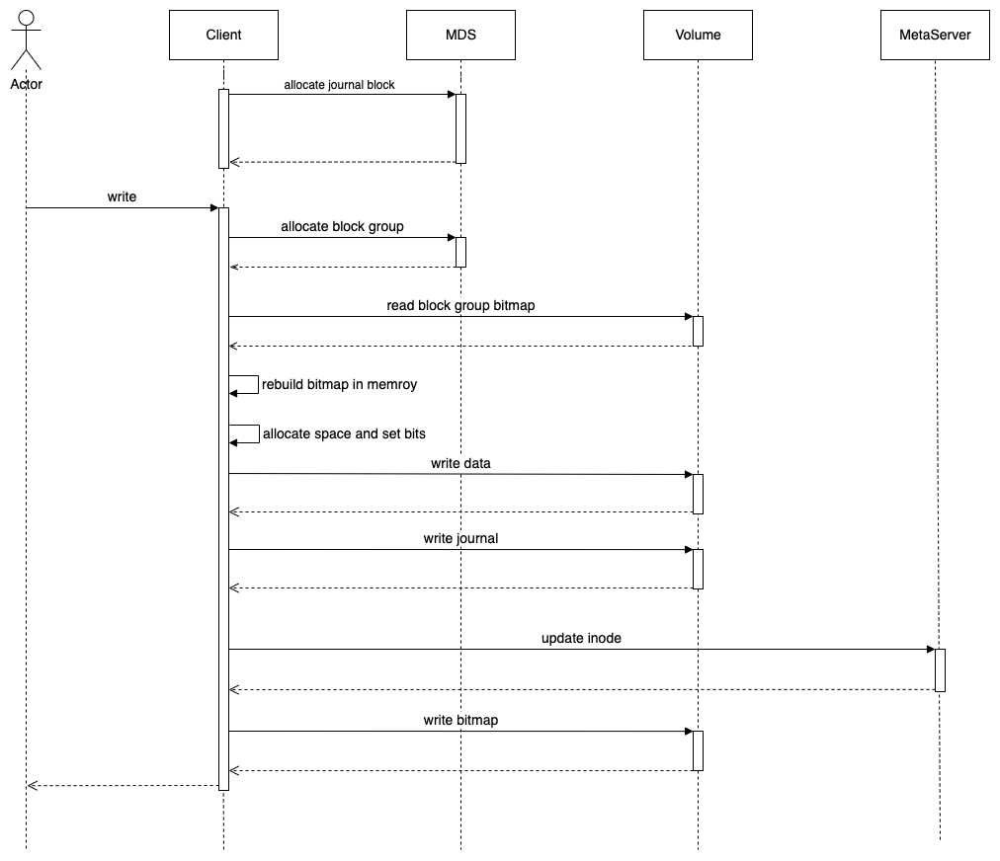

为每个 fuse-client 分配一个 journal 区域，记录当前 client 的元数据操作，同时只对元数据记日志。

- 空间分配只进行内存操作，分配出一块或多块保存可以保存写入数据的卷空间。
- 记录元数据更新日志，语义化的描述为 "分配了哪些 extents 给某个 inode"。
  - 写数据和写事务可以并行处理
- 等待事务、数据写入完成后，更新文件系统元数据。
  - 更新 inode 和更新 bitmap 可以并行处理

#### 回收

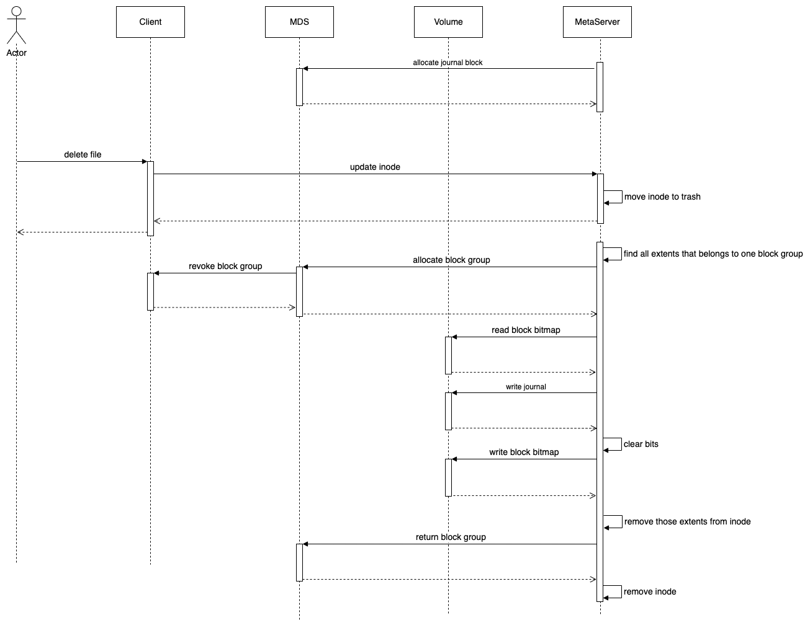

回收过程与分配过程一样，在操作元数据和 bitmap 前先写操作日志。

#### Recovery

client 进程异常退出或节点宕机后，MDS 可以发现这个问题，在检测到之后，进行恢复过程。

1. 扫描该 client 节点对应的 journal 块
2. 对于完整的日志，进行日志回访操作
3. 对于不完整的日志，进行丢弃

恢复过程中，默认持有相关资源的所有权，比如：journal block、block group。待恢复过程完成后，释放资源。资源释放后可被其他节点使用。

恢复过程中，也会出现重复操作的问题。比如，在分配过程中，inode 更新完成、bitmap 未更新；或者 bitmap 更新完成、inode 未更新。这种情况下，重复操作的幂等问题是比较好处理的：

- inode 更新 extents 是进行一次判断即可，如果新加入的 extents 已存在，就不需要重复执行。
- bitmap 可以将对应 bit 置位，然后持久化即刻。因为，在 Recovery 执行之前，异常退出的 client 所持有的 block groups 不会重新分配给其他 client 使用。

# 参考

1. GPFS https://www.usenix.org/legacy/events/fast02/full_papers/schmuck/schmuck_html/
2. Frangipani https://www.read.seas.harvard.edu/~kohler/class/08w-aos/ref/thekkath97frangipani.pdf
3. Orion https://www.usenix.org/conference/fast19/presentation/yang
4. Crash Consistency: FSCK and Journaling https://pages.cs.wisc.edu/~remzi/OSTEP/file-journaling.pdf
5. 持久化（7）：日志文件系统 https://zhuanlan.zhihu.com/p/56681845
6. Consistency Without Ordering https://www.usenix.org/legacy/event/fast/tech/full_papers/Chidambaram.pdf