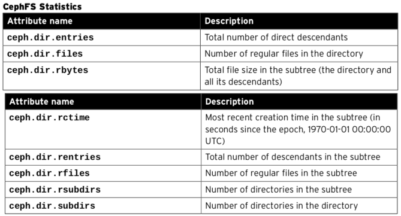
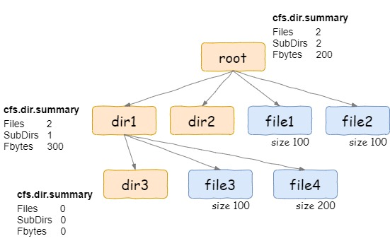
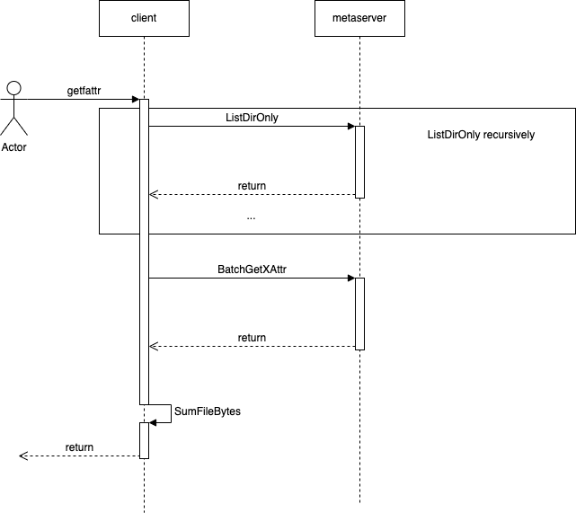
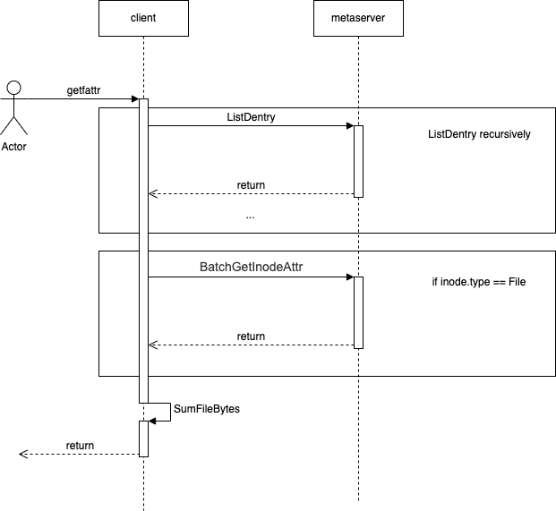
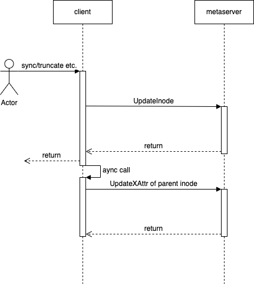

# 快速获取磁盘使用量功能方案

## 背景：

业务反馈使用curve-fuse，创建大量文件和目录场景下，使用du命令统计当前磁盘使用量时，存在性能问题。

原因分析：

由于使用的是fuse用户态文件系统，所使用的du命令是系统库提供的函数，见https://man7.org/linux/man-pages/man1/du.1.html
当du统计目录的使用空间时，使用的是递归的方式，实际上调用fuse的接口是readdir 和getAttr接口，也就是说，每次对于目录的du，都会转换为若干次对子目录的readdir和若干次读子文件的getAttr接口。而每次readdir和getAttr都将对应于底层至少一次rpc请求。如果是对包含大量的子文件和子目录的目录进行du，那么将需要发送大量的rpc请求，对于curvefs这样的分布式文件系统来说，rpc请求的时延会远大于本地文件系统访问磁盘的时延，造成了du的总体时延变得不可接受。类似的情况，还有ls -R, rm -r等依赖递归去完成的功能，在面对大量的子目录的和子文件的情况下，都将会有类似的问题。
实际上，本地文件系统对于大量文件的du操作，时延也会显著增加，这是由于du本身递归统计的方式决定的，而像curvefs这样依赖的网络rpc的文件系统来说，如果仍然采用du这种方式去统计磁盘使用量，那么无论怎么优化都不可能达到本地文件系统那样的时延。

因此，解决的方案只有绕过du操作，而采取其他的接口去获取磁盘的使用量。

## 相关调研：
### ceph：
一个显而易见的例子，就是ceph：

ceph使用xattr去实现上述需求，将目录包含的子文件和目录的使用空间，保存在xattr中，当需要获取某个目录的空间使用情况时，只需要get这个目录的xattr就可以了。getfattr接口见：https://man7.org/linux/man-pages/man1/getfattr.1.html

```
root@node-3:/# getfattr -d -m ceph.dir.* .
file: .
ceph.dir.entries="1"
ceph.dir.files="0"
ceph.dir.rbytes="708822611968"
ceph.dir.rctime="1457535283.09430737000"
ceph.dir.rentries="3633611"
ceph.dir.rfiles="3608532"
ceph.dir.rsubdirs="25079"
ceph.dir.subdirs="1"
```


### chubaofs:

另一个例子是chubaofs，chubaofs同样利用了目录的扩展属性来实现上述需求，但是做了一个折中，其目录的扩展属性可以记录其子文件的容量信息，也就是只记录了一层。
那么意味着，其在获取某个目录的容量时，还是需要遍历子目录，但不需要再计算子文件的容量，优化了统计容量的时间。
当然，chubaofs也支持不记录子文件的容量信息，而全部通过递归遍历来计算。

其实现方案简述如下：



mount时添加一个enableSummary开关，记录到superblock中，使用开关控制是否需要enableSummary，enableSummary时，目录的扩展属性中记录了下一级子文件的合并容量，只需要遍历子目录将目录的容量合并上述子文件的容量计算出来最终容量。（这其中涉及到了batch get xattr的方式，来加速递归遍历目录的容量合并计算）
如果没有开启enableSummary开关，那么获取summary的xattr时，将会遍历全部子目录和子文件，递归合并计算目录的容量（同样用到了batch来加速）。
如果开启了enableSummary开关，那么write，truncate等接口调用时，将需要异步的更新所在父目录的xattr。

## 方案设计：
### 方案概述：

目前来看，无论是chubaofs还是cephfs都是避开了du本身，而使用目录的扩展属性的方式，来快速地获取磁盘的使用量信息。
要获取一个目录下大量子目录和子文件的总容量，只有两种方式，
（1）要么在写文件时将容量的变化量记录下来，获取的时候直接去拿，
（2）要么就在获取总容量时，通过遍历的方式再合并起来。chubaofs将子文件的容量记录在父目录的方式实际上是对两种方式的一个折中。

具体方案细节考虑如下：

1. 首先需要实现xattr接口，在目录的xattr中，实现以下几种xattr，
 - curve.dir.files，  表示该层目录下有多少子文件
 - curve.dir.subdirs, 表示该层目录下有多少子目录
 - curve.dir.entries, 表示该层目录下有多少子文件或子目录
 - curve.dir.filebytes, 表示该层目录下的文件的总容量，

这里提供一个配置项enableSumInDir，表示是否开启上述xattr 。如果开启，需要在create、remove、write或truncate等会改变上述值的接口中，异步调用UpdateXAttr的更新到metaserver中

另外还需要实现如下几种：

 - curve.dir.rfiles， 表示该目录及其子目录下总共有多少文件
 - curve.dir.rsubdirs，表示该目录及其子目录下总共有多少目录
 - curve.dir.rentries，表示该目录及其子目录下下有多少子文件或子目录        
 - curve.dir.rbytes,  表示该目录及其子目录总共的容量

这几种xattr，不持久化在metaserver中，而是在获取时，递归的合并计算出来。

2. 提供一个开关enableSumInDir，如果开启enableSumInDir，则在create、remove、write或truncate等会改变相应字段的接口中，异步的更新curve.dir.files，curve.dir.subdirs， curve.dir.filebytes等字段；否则，如果不开启，则需要在获取该xattr时遍历子文件，统计这些值。

3. 上述计算过程中为了加速，那么需要实现batch的获取信息的接口，上述功能至少需要涉及到的接口如下：

 - ListDirOnly：获取当前目录的子目录，与ListDentry不同，只获取目录，这部分可能需要在Dentry结构中加入type，以区分dentry是目录还是文件。
 - BatchGetInodeAttr ：根据若干个inodeid，batch获取inode信息（这里可以不获取s3Info/volumeInfo信息，不然数据量太大了，本来后续可能也需要将s3Info/volumeInfo拆分出去）
 - BatchGetXAttr： 根据若干个inodeid， batch获取xattr信息

这两个接口由于inode可能在不同的server，可能需要多次rpc，这里在rpc client层还需要根据partition拆分，（如果再优化一些，可以根据所在copyset，甚至所在metaserver进行拆分）。

4. xattr保存在哪里？有两种方式，一种直接保存在inode中，一种是单独保存在inode所在的partition中，倾向于使用第二种方式，考虑到通常getinode的调用不太需要xattr信息，那么分开存是合适，缺点是代码修改量会增加。 当然也可以将xattr保存在inode中，但是getinode时不返回xattr，getxattr时单独返回xattr信息，这部分可以在metaserver端灵活实现，目前rpc message中的inode与持久化的inode是共用的，可以考虑分开。

5. 需要增加的XAttr相关接口如下：

 - UpdateXAttr
 - GetXAttr
 - SetXAttr (如先不实现完整的XAttr功能，可先不实现)

### 流程图：

(1) getfattr with enableSumInDir



(2) getfattr without enableSumInDir



(3) sync/truncate should UpdateXAttr of parent inode



### 接口设计：
需要新增的rpc接口参考设计如下：

```
message Dentry {
    required uint32 fsId = 1;
    required uint64 inodeId = 2;
    required uint64 parentInodeId = 3;
    required string name = 4;
    required uint64 txId = 5;
    optional uint32 flag = 6;
    optional FsFileType type = 7; // add
}

message ListDirOnlyRequest {
    required uint32 poolId = 1;
    required uint32 copysetId = 2;
    required uint32 partitionId = 3;
    required uint32 fsId = 4;
    required uint64 dirInodeId = 5;
    required uint64 txId = 6;
    optional string last = 7;     // the name of last entry
    optional uint32 count = 8;    // the number of entry required
}

message ListDirOnlyResponse {
    required MetaStatusCode statusCode = 1;
    repeated Dentry dentrys = 2;
    optional uint64 appliedIndex = 3;
}

message BatchGetInodeAttrRequest {
    required uint32 poolId = 1;
    required uint32 copysetId = 2;
    required uint32 partitionId = 3;
    required uint32 fsId = 4;
    repeated uint64 inodeId = 5;
    optional uint64 appliedIndex = 7;
}

message InodeAttr {
    required uint64 inodeId = 1;
    required uint32 fsId = 2;
    required uint64 length = 3;
    required uint64 ctime = 4;
    required uint32 ctime_ns = 5;
    required uint64 mtime = 6;
    required uint32 mtime_ns = 7;
    required uint64 atime = 8;
    required uint32 atime_ns = 9;
    required uint32 uid = 10;
    required uint32 gid = 11;
    required uint32 mode = 12;
    required uint32 nlink = 13;
    required FsFileType type = 14;
    optional string symlink = 15;   // TYPE_SYM_LINK only
    optional uint64 rdev = 16;
    optional uint32 dtime = 17;
    optional bool openflag = 18;
}

message BatchGetInodeAttrResponse {
    required MetaStatusCode statusCode = 1;
    repeated InodeAttr attr = 2;
    optional uint64 appliedIndex = 3;
}

message BatchGetXAttrRequest {
    required uint32 poolId = 1;
    required uint32 copysetId = 2;
    required uint32 partitionId = 3;
    required uint32 fsId = 4;
    repeated uint64 inodeId = 5;
    optional uint64 appliedIndex = 7;
}

message XAttr {
    required uint64 inodeId = 1;
    required uint32 fsId = 2;
    map<string, string> xAttrInfos = 3;
}

message BatchGetXAttrResponse {
    required MetaStatusCode statusCode = 1;
    repeated XAttr xattr = 2;
    optional uint64 appliedIndex = 3;
}

service MetaServerService {
    rpc ListDirOnly(ListDirOnlyRequest) returns (ListDirOnlyResponse);
    rpc BatchGetInodeAttr(BatchGetInodeAttrRequest) returns (BatchGetInodeAttrResponse);
    rpc BatchGetXAttr(BatchGetXAttrRequest) returns (BatchGetXAttrResponse)
}

```

