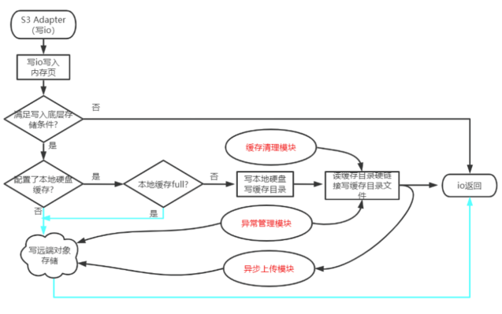

# 背景

当前，s3客户端在写底层存储的时候是直接写入远端对象存储，由于写远端时延相对会较高，所以为了提升性能，引入了写本地缓存盘方案。也即要写底层存储时，先把数据写到本地缓存硬盘，然后再把本地缓存硬盘中的数据异步上传到远端对象存储。

# 方案设计

S3模块接收到写入后先写入写内存缓存页，如果满足持久化的条件后，那么则准备持久化。

如果未配置本地硬盘作为写缓存，那么直接持久化到远端的对象存储；如果配置了本地硬盘作为写缓存，那么则尝试先写入本地硬盘写缓存目录。

写本地硬盘缓存目录之前先判断缓存目录容量是否已达到阈值，如果已经达到阈值，那么则直接写入到远端对象存储；否则，则写入到本地硬盘写缓存目录中。文件写入本地硬盘写缓存目录后，从本地硬盘读目录做一个硬链接链接到该文件。

本次io在本地硬盘写入好之后，异步上传模块会适时把本地硬盘写缓存目录中的文件上传到远端对象存储集群，上传成功后，删除本地写缓存目录中的对应文件。

同时，缓存清理模块会定时检查本地硬盘缓存目录容量情况，如果容量已经达到阈值了，则进行文件的清理工作。

另外，异常管理模块处理客户端挂掉后的文件重新上传问题。

# 方案设计思考

- 本地硬盘如何管理

借用linux本地文件系统进行管理，存储进本地硬盘的内容以文件的形式来表现。

配置一个目录用于本地硬盘的文件管理，对作为缓存盘的本地硬盘进行格式化并挂载到该目录(如果没有缓存盘，那一般而言就是系统盘本身了)。

- 本地缓存盘的文件内容表示

本地缓存盘存放的文件即是存储到对象存储中的对象。

- 写缓存如何作为读缓存利用

除了写缓存目录，另外引入读缓存目录；当写缓存目录中有新文件加入时，则对该文件做硬链接到读缓存目录。

这样，写缓存目录中的文件上传完之后就可以直接删除了，那么该文件的读缓存还是存在的。

- 缓存盘空间管理

当缓存文件内容达到阈值时，停止向本地缓存盘写入。

同时，缓存清理模块会定时检查本地硬盘缓存目录容量情况，如果容量已经达到阈值了，则进行文件的清理工作。

- 本地缓存盘的异步上传

工作队列: 该队列中保存缓存盘中的待上传文件名

工作线程: 遍历工作队列(队列swap)，从缓存盘目录读取到文件内容并上传到对象存储。文件上传到对象存储后，直接删除。

工作队列做好互斥管理

- 异常管理

如果客户端挂掉，那么写缓存盘中可能会有残留文件没有上传到对象存储；如果忘记处理，那么这些数据也就相当于是丢失了。

所以在客户端初始化建立的时候，可以先遍历写缓存目录，如果里面有文件，那么则上传到远端对象存储