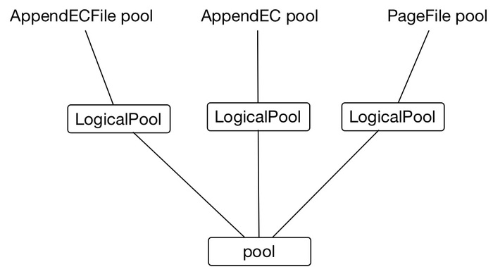

<head><meta charset="UTF-8"></head>

# MDS

## 概要

MDS是中心节点，负责元数据管理、集群状态收集与调度。MDS包含以下几个部分：

- Topoloy: 管理集群的 **topo 元数据**信息。
- Nameserver: 管理**文件的元数据**信息。
- Copyset: 副本放置策略。

- Heartbeat: 心跳模块。跟chunkserver进行交互，收集chunkserver上的负载信息，copyset信息等。
- Schedule: 调度模块。用于自动容错和负载均衡。

## Topoloy

 topology用于管理和组织机器，利用底层机器的放置、网络的规划以面向业务提供如下功能和非功能需求。

1. **故障域的隔离**：比如副本的方式分布在不同机器，不同机架，或是不同的交换机下面。
2. **隔离和共享**：不同用户的数据可以实现固定物理资源的隔离和共享。

curve整体的拓扑结构如下图：

**chunkserver**：用于抽象描述物理服务器上的一块物理磁盘(SSD)，chunkserver以一块磁盘作为最小的服务单元。

**server:** 用于抽象描述一台物理服务器，chunkserver必须归属于server。

**zone:** 故障隔离的基本单元，一般来说属于不同zone的机器至少是部署在不同的机架，再要求严格一点的话，属于不同zone的机器可以部署在不同机架组下面（一个机架组共享一组堆叠 leaf switch），一个server必须归属于一个zone。

**pool:** 用于实现对机器资源进行物理隔离，pool中server之间的交互仅限于pool之内的server。运维上，可以在上架一批新的机器的时候，规划一个全新的pool，以pool为单元进行物理资源的扩容（pool内扩容也可以支持，但是不建议pool内扩容，因为会影响每个chunkserver上的copyset的数量）。

借鉴ceph的设计，curve在如上物理pool之上又引入逻辑pool的概念，以实现统一存储系统的需求，即在单个存储系统中多副本PageFile支持块设备、三副本AppendFile（待开发）支持在线对象存储、AppendECFile（待开发）支持近线对象存储可以共存。

如上所示LogicalPool与pool为多对一的关系，一个物理pool可以存放各种类型的file。当然由于curve支持多个pool，可以选择一个logicalPool独享一个pool。

通过结合curve的用户系统，LogicalPool可以通过配置限定特定user使用的方式，实现多个租户数据物理隔离（待开发）。

**logicalPool**：用于在逻辑层面建立不同特性的pool，比如如上AppendECFile pool、AppendEC pool 、PageFile pool；实现user级别的数据隔离和共享。

## NameServer

NameServer管理namespace元数据信息，包括（更具体的信息可以查看curve/proto/nameserver2.proto）：

``FileInfo:`` 文件的信息。 

``PageFileSegment:`` segment是给文件分配空间的最小单位 。

``PageFileChunkInfo:`` chunk是数据分片的最小单元。

segment 和 chunk的关系如下图:

namespace信息较为直观，即文件的目录层次关系:

如上所示。在KV中，Key是`ParentID + "/"+ BaseName`，Value是自身的文件ID；这种方式可以很好地平衡几个需求：

1. 文件列目录：列出目录下的所有文件和目录
2. 文件查找：查找一个具体的文件
3. 目录重命名：对一个目录/文件进行重命名

当前元数据信息编码之后存储在 etcd 中。

## CopySet

Curve系统中数据分片的最小单位称之为Chunk，默认的Chunk大小是16MB。在大规模的存储容量下，会产生大量的Chunk，如此众多的Chunk，会对元数据的存储、管理产生一定压力。因此引入CopySet的概念。CopySet可以理解为一组复制组，这组复制组的成员关系完全一样。CopySet的概念在文献「Copysets: Reducing the Frequency of Data Loss in Cloud Storage」提出，本意是为了提高分布式存储系统中的数据持久性，降低数据丢失的概率。

在 Curve 系统引入 CopySet 有几个目的：

1. 减少元数据量：如果为每个Chunk去保存复制组成员关系，需要至少 ChunkID+3×NodeID=20 个byte，在1PB的逻辑数据量，4MB的Chunk的场景下，需要5GB的数据量；而如果在Chunk到复制组之间引入一个CopySet，每个Chunk可以用ChunkID+CopySetID=12个byte，数据量减少到3GB
2. 减少复制组数量：如果一个数据节点存在 256K个复制组，复制组的内存资源占用将会非常恐怖；复制组之间的通信将会非常复杂，例如复制组内Primary给Secondary定期发送心跳进行探活，在256K个复制组的情况下，心跳的流量将会非常大；而引入CopySet的概念之后，可以以CopySet的粒度进行探活、配置变更，降低开销
3. 提高数据可靠性：在数据复制组过度打散的情况下，在发生多个节点同时故障的情况下，数据的可靠性会受到影响

ChunkServer，Copyset和Chunk三者之间的关系如下图：

## Heartbeat

心跳用于中心节点和数据节点的数据交互，详细功能如下：

​	1.	通过chunkserver的定期心跳，检测chunkserver的在线状态（online，offline）

​	2.	记录chunkserver定期上报的状态信息（磁盘容量，磁盘负载，copyset负载等），以提供运维工具查看上述状态信息。

​	3.	通过上述信息的定期更新，作为schedule 模块进行均衡及配置变更的依据

​	4.	通过chunkserver定期上报copyset的copyset的epoch， 检测chunkserver的copyset与mds差异，同步两者的copyset信息

​	5.	支持配置变更功能，在心跳回复报文中下发mds发起的配置变更命令，并在后续心跳中获取配置变更进度。

心跳模块的结构如下：

##### MDS端

mds 端的心跳主要由三个部分组成：

*TopoUpdater:*  根据 chunkserver 上报的 copyset 信息更新拓扑中的信息。

*ConfGenerator:* 将当前上报的 copyset 信息提交给调度模块，获取该 copyset 上可能需要执行的任务。

*HealthyChecker:* 检查集群中的 chunkserver 在当前时间点距离上一次心跳的时间，根据这个时间差更新chunkserver状态。

##### Chunkserver端

chunkserver 端的心跳由两个部分组成：

*ChunkServerInfo/CopySetInfo：* 获取当前 chunkserver 上的 copyset 信息上报给 MDS。

*Order ConfigChange:* 将 MDS 下发的任务提交给对应的 copyset 复制组。

## Schedule

系统调度是为了实现系统的自动容错和负载均衡，这两个功能是分布式存储系统的核心问题，也是 curve 是否能上生产环境的决定因素之一。自动容错保证常见异常（如坏盘、机器宕机）导致的数据丢失不依赖人工处理，可以自动修复。负载均衡和资源均衡保证集群中的磁盘、cpu、内存等资源的利用率最大化。

调度模块的结构如下：

**Coordinator:** 调度模块的对外接口。心跳会将chunkserver上报上来的copyset信息提交给Coordinator，内部根据该信息判断当前copyset是否有配置变更任务执行，如果有任务则下发。

**任务计算：** 任务计算模块包含了多个*定时任务* 和 *触发任务*。*定时任务* 中，``CopySetScheduler`` 是copyset均衡调度器，根据集群中copyset的分布情况生成copyset迁移任务；``LeaderScheduler`` 是leader均衡调度器，根据集群中leader的分布情况生成leader变更任务；``ReplicaScheduler`` 是副本数量调度器，根据当前copyset的副本数生成副本增删任务；``RecoverScheduler`` 是恢复调度器，根据当前copyset副本的存活状态生成迁移任务。*触发任务* 中，``RapidLeaderScheduler`` 是快速leader均衡器，由外部触发，一次生成多个leader变更任务，使得集群的leader尽快大达到均衡状态。``TopoAdapter`` 用于获取Topology中调度需要使用的数据。``Common Strategy`` 中是通用的副本添加和移除策略。

**任务管理：** 任务管理模块用于管理计算模块产生的任务。``operatorController`` 是任务集合，用于存放和获取任务；``operatorStateUpdate`` 根据上报的copyset信息更新状态；``Metric``用于统计不同任务个数。 

