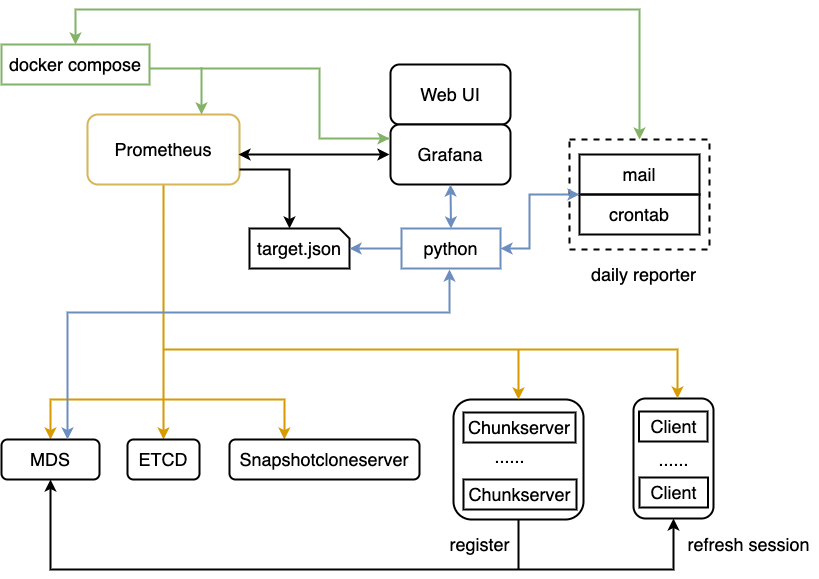
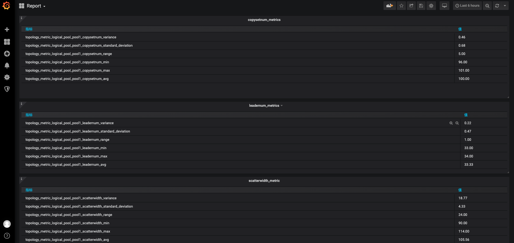
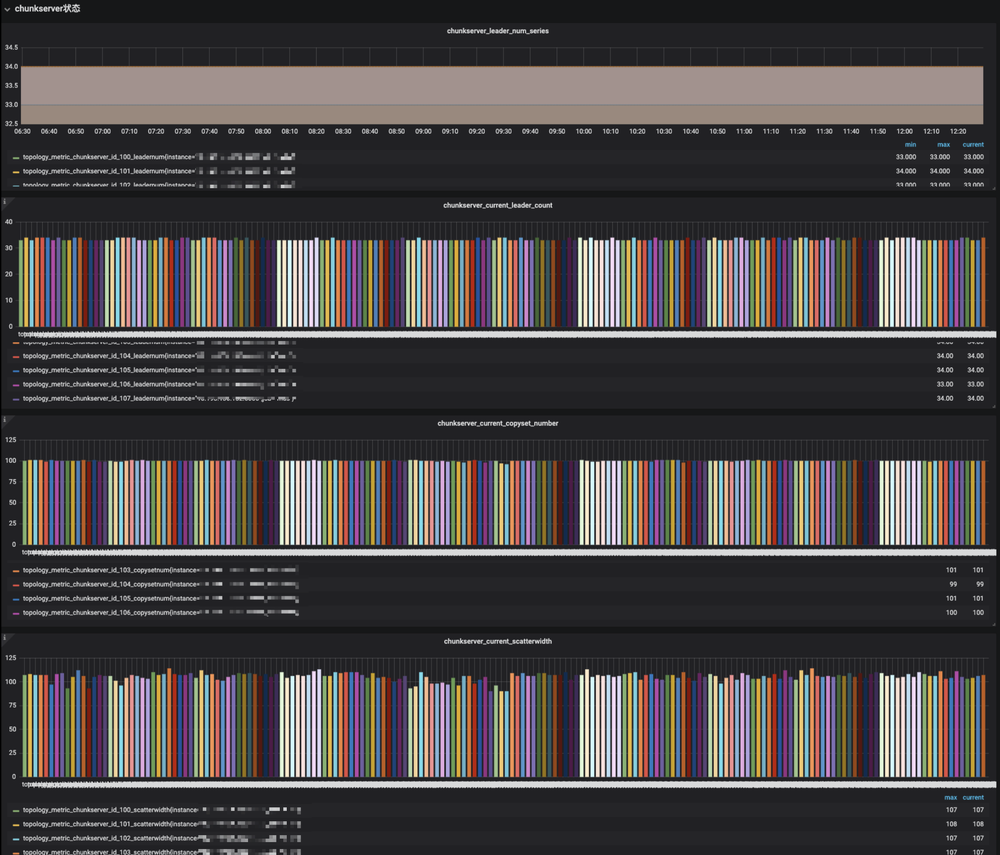
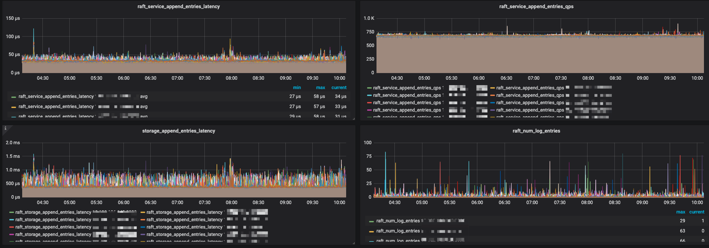
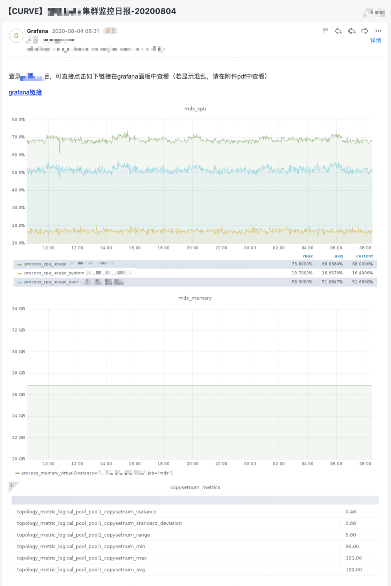

# 监控体系

## 概述

CURVE 监控体系包括三个方面：指标收集，指标存储，指标展示。指标收集使用 [brpc](https://github.com/apache/incubator-brpc) 内置的 [bvar](https://github.com/apache/incubator-brpc/blob/master/docs/cn/bvar.md)；指标存储使用开源监控系统 [prometheus](https://prometheus.io/docs/introduction/overview/)；指标展示使用 [grafana](https://github.com/grafana/grafana)。

## bvar

[bvar](https://github.com/apache/incubator-brpc/blob/master/docs/cn/bvar.md) 是多线程环境下的计数器类库，方便记录和查看用户程序中的各类数值。bvar 数据支持在 brpc server 服务的端口上以web portal的方式导出和查询，查看历史趋势，统计和查看分位值；bvar 同时也内置了 prometheus 转换模块，将采集指标转换为 prometheus 支持的格式。

CURVE 中使用到的 bvar 数据模型有：

`bvar::Adder<T>` : 计数器，默认0，varname << N相当于varname += N。

`bvar::Maxer<T>` : 求最大值，默认std::numeric_limits::min()，varname << N相当于varname = max(varname, N)。

`bvar::Miner<T>` : 求最小值，默认std::numeric_limits::max()，varname << N相当于varname = min(varname, N)。

`bvar::IntRecorder` : 求自使用以来的平均值。注意这里的定语不是“一段时间内”。一般要通过Window衍生出时间窗口内的平均值。

`bvar::Window<VAR>` : 获得某个bvar在一段时间内的累加值。Window衍生于已存在的bvar，会自动更新。

`bvar::PerSecond<VAR>` : 获得某个bvar在一段时间内平均每秒的累加值。PerSecond也是会自动更新的衍生变量。

`bvar::LatencyRecorder` : 专用于记录延时和qps的变量。输入延时，平均延时/最大延时/qps/总次数 都有了。

CURVE 中 bvar 的具体使用方式可以查看:

[client metric](../../src/client/client_metric.h) 

[chunkserver metric](../../src/chunkserver/chunkserver_metrics.h)   

[mds topoloy metric](../../src/mds/topology/topology_metric.h)

[mds shedule metric](../../src/mds/schedule/scheduleMetrics.h)

## prometheus + grafana

CURVE 集群监控使用 Prometheus 采集数据，并使用 Grafana 作为前端页面展示。

监控内容包括：Client、Mds、Chunkserver、Etcd、机器节点。

监控目标的配置使用 prometheus 基于文件的服务自动发现功能；监控组件使用docker来部署，用docker-compose来进行编排；部署相关脚本在[ CURVE 仓库中](../../monitor)。



1. ```Promethethus``` 定时从 MDS、ETCD、Snapshotcloneserver、ChunkServer、Client 中的 Brpc Server 拉取相应的数据

2. ```docker compose``` 用于编排docker组件的配置，包括 Promethues、Grafana、Repoter

3. ```python``` 脚本有多个。[target_json.py ](../../monitor/target_json.py)用于生成 prometheus 服务发现依赖的监控目标配置，生成的文件为 json 格式；该脚本依赖 [target.ini](../../monitor/target.ini.example) 中的配置，从配置中获取 mds、etcd 的信息。[grafana-report.py](../../monitor/grafana-report.py) 用于从 Grafana 导出 daily reporter中所需要的数据信息。


## 效果图展示

##### Grafana 效果图







##### Daily Report 效果图



