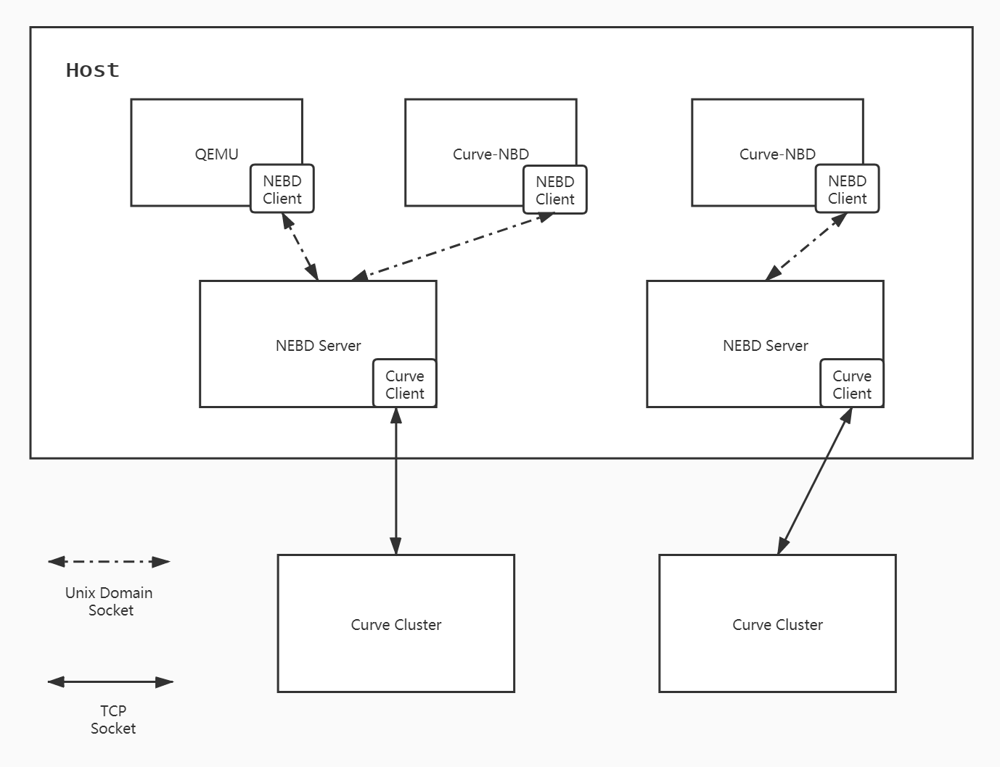
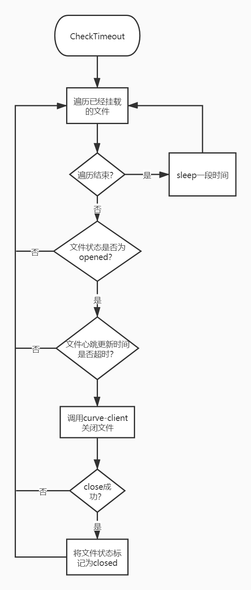

#### 概要

Curve Client作为Curve集群的入口，是以链接库的形式提供给Qemu/Curve-NBD等上层使用，所以在Curve Client需要升级的时候，需要对Qemu/Curve-NBD进行重启。

为了减少升级对上层业务的影响，我们对上层应用与Curve Client的耦合关系进行拆分，在两者之间加入了热升级模块：**NEBD**。

#### 整体架构

上图是当前系统的部署架构。

- NEBD Client：即**part1**，对应上层业务，包括Qemu/Curve-NBD；通过Unix Domain Socket的方式连接到指定的NEBD Server。
- NEBD Server：即**part2**，负责接收part1的请求，并调用Curve Client进行相应处理；part2可以接受多个不同NEBD Client的连接请求。

从图中可以看到，part1取代了Curve Client直接与上层业务对接。这种情况下，part1的升级也会影响上层业务，所以在设计中，尽量减少了part1的处理逻辑，只进行请求转发，以及有限的重试逻辑。

升级part2/Curve Client时，只需要执行以下操作：

1. 安装新版part2/Curve Client
2. 停止当前part2进程
3. 重新启动part2进程

在实践中，我们使用daemon监控part2进程，如果进程不存在，则会主动拉起。

在测试及生产环境中，从停止part2进程，到新版part2启动，耗时在1~5s之间。

##### 模块架构图

###### part1

- libnebd：提供给上层业务的API接口，包括open/close、读写等接口。
- File Client：主要是对libnebd接口的具体实现，向part2发送用户请求。
- MetaCache Manager: 主要记录当前已经open文件的信息。
- Heartbeat Client：定期向part2发送心跳，心跳中携带已经open文件的信息。

###### part2

- File Service：接受并处理part1发送过来的文件请求。
- Heartbeat Service：接受并处理part1发送过来的心跳请求。
- File Manager：负责part2上open文件的管理。
- IO Executor：请求具体的执行层，调用curve-client的接口将请求交给后端存储集群处理。
- Metafile Manager：负责元数据文件的管理，将元数据持久化到文件，或从文件中读取持久化信息。

#### 关键点

1. part1重试逻辑

   前面说到，part1只进行了有限的重试逻辑，具体体现在两方面：

   1. RPC请求不设置超时时间
   2. 只针对RPC请求本身的错误进行重试，RPC Response中返回的错误码直接返回给上层。

   以Write请求为例，其他请求也类似：

   - 将请求通过rpc转发给part2，并不设置超时时间，进入等待
     - 如果rpc返回成功，则根据rpc response成功与否，向上层返回。
     - 如果连接断开或无法连接，则等待一段时间后重试

   

2. part2心跳管理模块

   为了避免上层业务退出时没有close文件，part2会定期检查文件的心跳状态，如果上次心跳时间已经超时，则会主动close文件。

   心跳超时close文件与上层业务主动close的区别在于，前者不会把文件信息从metafile中删除。

   

   但是当上层业务出现假死，后续又恢复的情况下，也有可能导致心跳超时，造成文件被close。

   所以，part2在收到part1请求时，会先检测metafile是否有当前文件记录，如果存在，且处于closed状态，则会先主动open，然后执行后续请求。
