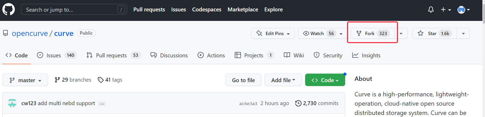
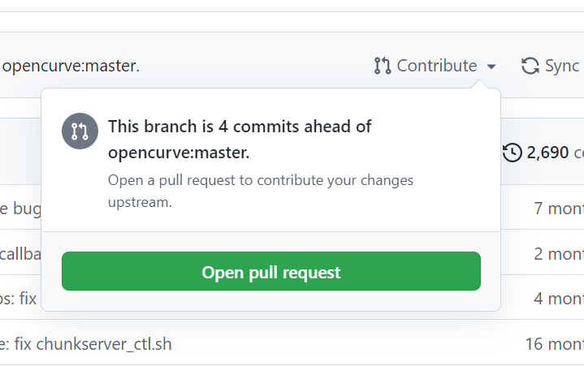
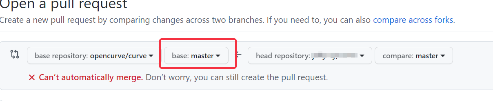
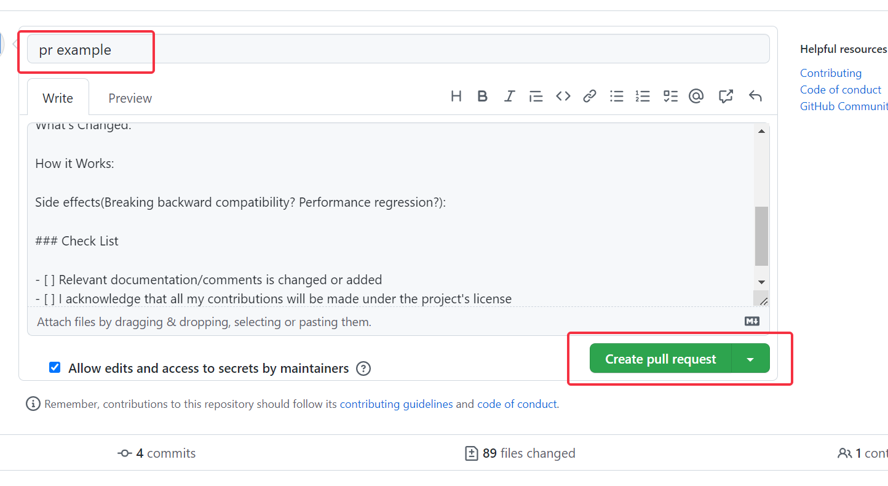
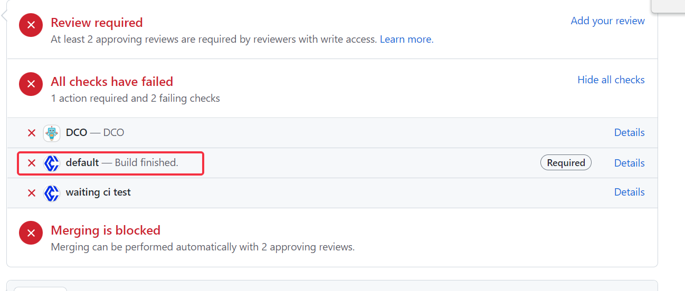
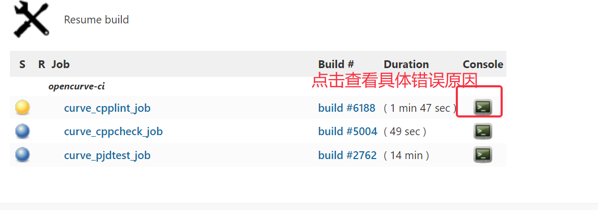
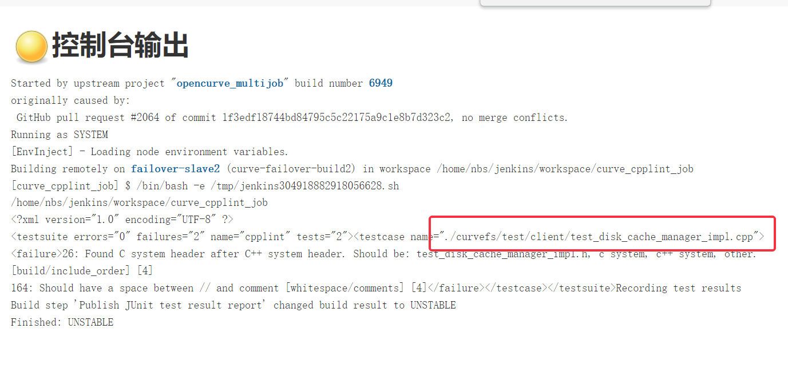

# 如何给curve提交你的第一条pr

导读：本文是针对新手curver的一篇提pr的简要指南，不仅仅是给curve提pr的教程，还包含了对提交pr前后一些常见问题的说明，比如功能开发完成后如何编译、如何编写单元测试以及提交pr之后常见ci问题的查看和解决。

----------------------------------------------------------以下是正文分割线---------------------------------------------------------------

## pre:开发前准备工作

首先，从curve的github中fork一份代码到你自己的仓库中，

然后**从你自己的仓库中将curve代码clone到本地**，接着添加curve的官方仓库为你自己的远程仓库（执行git remote add upstream https://github.com/opencurve/curve.git 命令），git remote -v查看是否添加成功。开发之前同步curve官方仓库的代码：get fetch upstream 、git rebase upstream/master

## part1 编译

功能需求开发完成后要进行的第一步是编译，curve采用的是bazel编译，举个例子来说明bazel编译的使用：比如你修改了~/curve/src/mds/topology文件夹下的一个或多个文件，现在要对这些文件进行编译，那么直接执行bazel build //src/mds/... 这条命令即可。

p.s.简单说明一下，`//`开头的目标模式都相对于当前工作空间（~/curve根目录）进行解析，mds/...表示对mds目录下所有的target进行构建。其他文件夹下的编译以此类推。

## part2 单元测试编写

功能开发完并且编译通过之后要编写相应的单元测试进行验证，curve的test文件夹下存放的是各模块的单元测试代码，并且子目录名都与开发模块的子目录名一致，可以很容易找到各个开发文件对应的测试文件，比如src/mds/topology/topology_service_manager.cpp文件对应的单元测试文件就是 test/topology/test_topology_service_manager.cpp。

单元测试的定义格式是TEST_F(test_suit，test_name），如TEST_F(TestTopologyServiceManager,test_RegistChunkServer_ServerNotFound) 

编写好单元测试代码之后也要进行编译，执行bazel build //test/mds/topology/... 这是构建topology模块下的所有target，接下来运行单元测试。

在topology模块下的单元测试中，编译构建的target名字是"topology_utest"（在test/mds/topology/BUILD文件里查看），curvebs的bazel编译输出的二进制文件存放在~/curve/bazel-bin/test文件夹下，执行`./bazel-bin/test/mds/topology/topology_utest`命令来运行topology模块所有的单元测试，如果你只想运行某个test_suit或者某个test_case那么加上--gtest_filter选项，如 --gtest_filter=<test_suit>或者--gtest_filter= <test_suit>.<test_name>

## part3 提交pr

提pr前先进行git三部曲——add、commit、push，唯一要注意的是在**commit这步一定要加-s选项**，因为ci会有DCO检查，不加的话ci会直接不过，如果你是在push前不小心忘了这个选项，可以用git commit --amend补救，在文件里加上你的签名（Signed-off-by: Author Name <authoremail@example.com>），如果push后想补救就只能用git rebase了（具体百度），代码push到自己的仓库后就可以提pr了，如下图

创建完pr之后pr就提好了

## part4 ci报错查看和解决

1.DCO报错

commit时没加-s选项就会有DCO报错

按照前面说的用git rebase在commit信息里添加签名然后重新push可以解决（点击右边的details可以看到详细解决方法）

代码的报错在default里

代码里的错误直接点进default的details查看，有黄色和红色标记的就是有报错，蓝色标记无报错，像下图这个黄色标记的就是常见的cpplint报错

cpplint主要是对代码风格的检查，curve代码的编写必须遵循谷歌代码风格

解决方法：在IDE里对报错文件执行 cpplint 命令，以上面这个文件为例就是 cpplint --filter=-build/c++11 --quiet ./curvefs/test/client/test_disk_cache_manager_impl.cpp命令，可以提示该文件里所有的cpplint报错，修改完再执行没有提示就可以提交修改了