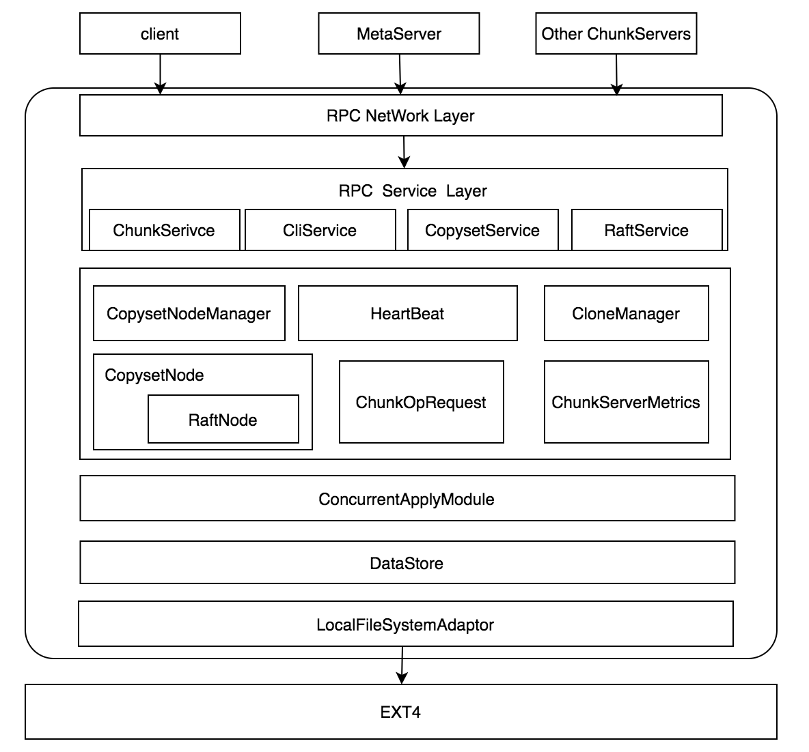
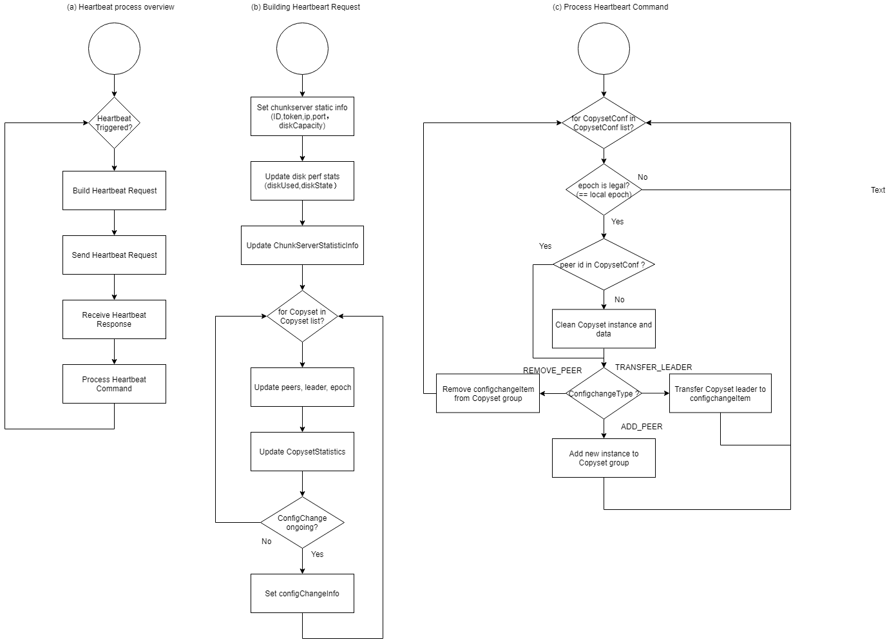
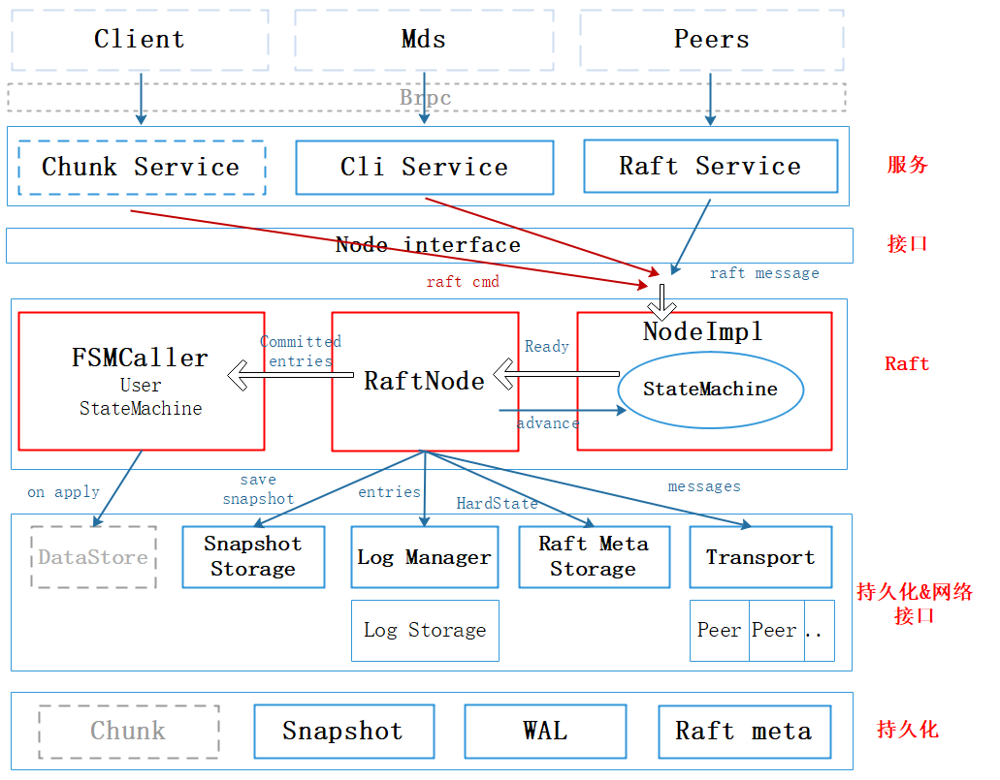

[中文版](../cn/chunkserver_design.md)

# Chunkserver

## 1. Overview

### 1.1 Design Background

The development of Curve aims at implementing a unified distributed storage system that support different scenarios. High performance block storage is our first priority, and scenarios like nearline/online object storage, file storage and big data will be supported step by step in our future works. As a crucial service provider in the I/O path, Chunkserver should provide high I/O performance, storage efficiency, availability and reliability.

### 1.2 System Overview

Chunkserver is designed referring to the structure of GFS, based on and encapsulated ext4 file system, serves as the data node of CURVE and provides interface of data I/O (read, write, snapshot etc.) and nodes management (fetching Chunkserver status, collecting metrical data, modifying runtime parameters of different modules etc.). Interacts with Client and MetaServer, Chunkserver execute I/O requests from client efficiently, and responds to the MetaServer requests like scheduling and allocation, data migration and recovering, I/O Qos and status inquiries or client controlling, and maintain data reliability and the consensus of replicas.

### 1.3 Design Goals

As a service provider in the I/O path of unified storage system, especially a high performance distributed block storage, Chunkserver is required to perform well in performance, availability, reliability and maintainability, which can be reflected in characteristics below:

- High concurrency: High IOPS requests are supported.
- Low latency: Average client I/O should be lower than 1ms.
- High fault tolerance: Executing data migration and recovering under MDS's scheduling, during which also maintaining a high I/O performance. Also, Chunkserver should tolerant disk failures and guarantee the reliability of the data in cluster.
- Snapshot: Support snapshot in chunk level.
- Hot upgrade: Cluster should be able to upgrade without aborting I/O service of Chunkserver.

## 2. Chunk Server System Design

### 2.1 General Structure

**2.1.1 Design Concepts**

Now let's focus on some important concepts in the design of Chunkserver.

Management domain: The management domain of a Chunkserver is a disk, and there are more than one disk on a server. Every disk correnponds to a Chunkserver instance, and every Chunkserver instance can be reflected as a user mode process. We have implemented a process level isolation between Chunkservers, which means the running of the server will not be affected by the failure of single Chunkserver, and the influence of the performance issue caused by single disk unstable or software defect will be limited in that single disk.

Copyset: Copyset serves as the unit of replication and consensus management of I/O data blocks. In order to balance the data recovering time and for load balancing and failure isolation, copysets are distributed evenly in every disks. For nodes in a copyset, one of them will be elected as the leader, and the others are followers. When writing data to data nodes, the client will send the data to the leader node according to the copyset info it has, and data replicas will be sent to followers by the leader. After receiving the acknowledgement from followers, leader will return the result to client.

Asynchronous I/O: On the I/O path from chunkserver receiving I/O request and returning the result, there are time consuming operations like network data receiving and dispatching, copy replication and writing transaction. For synchronous I/O, these operations will be serialized and thus takes a lot of time. By making it asynchronous, we can improve the performance of chunkserver a lot since the concurrency of the I/O is raised.

Thread pool: A huge amount of threads are required for the concurrency operations on the I/O path since there are lots of copysets and asynchronous I/O operations. By managing the life cycle of these threads using the thread pool, we can free those I/O operations from thread management, and also reuse the life cycles of these threads, offering a CPU architecture friendly environment, thus improve the performance.

Replication: Most of the replicas will replicate synchronously, but few of them will do it in an asynchronous way considering the coexistence of quick and slow disk.

### 2.1.2 Software Architecture 

Figure 1 shows the general structure of Chunkserver. The RPC network layer receive RPC message from Client, MDS and other Chunkservers, including I/O request, controlling request and event notification. Message received will be dispatched to different sub-services in RPC service layer for routing by RPC network layer, and different sub-service corresponds to different sub-systems in Chunkserver, including I/O processing, snapshot, recovering, data verification, configuration, monitoring metrics and Chunkserver controller. In each sub-system there's a set of interfaces, offering services by calling their own functions within. Sub-systems can also coordinate with each other using interfaces of each other.

<p align="center">
    <br>
    <font size=3> Figure 1: Chunkserver structure</font>
</p>

### 2.1.3 Sub-systems 

+ RPC Service Layer

  Provide RPC service of Chunkserver, including:

  - ChunkService

    ChunkService is the core service of Chunkserver that process I/O relative tasks, including the reading/writing(create when writing)/deletion of chunks, reading/deleting chunk snapshot, fetching chunk info and the creation and cloning of chunks.

  - CliService

    Provides some Raft configuration changing RPC services, including AddPeer，RemovePeer，ChangePeer、GetLeader、ChangeLeader and ResetPeer. CliService is implemented by calling Braft configuration changing interface.

  - CopySetService

    Creates CopysetNode (Raft node) by calling CopySetNodeManager. During the initialization of Chunkserver, CopySetService is called by MDS to create Raft nodes on each Chunkserver and run Raft node services.

  - RaftService

    Raft services built in Braft, providing RPC services and will be started during the initialization of Chunkserver.

+ Internal Service Layer
  
    - CopysetNodeManager

      Managing the creation and deletion of CopysetNode (RaftNode).

    - HeartBeat

      Heartbeat module reports Chunkserver status to MDS regularly for liveness probing and error detection. Also, status like disk utilization are included.

    - CloneManager

      CloneManage is for the cloning service, with a thread pool inside. This module is mainly for completing the data of cloned chunks asynchronously. For more details about cloning, please refer to [snapshotcloneserver](snapshotcloneserver_en.md).

    - CopysetNode

      An encapsulation of Raft state machine, served as a core component of Chunkserver.

    - ChunkOpRequest

      ChunkOpRequest encapsulates the process procedures of Chunkserver to arriving I/O requests.

    - ChunkServerMetric

      ChunkServerMetric is an encapsulation of every metrics of Chunkserver. This module collects internal metrics of Chunkserver for Prometheus and Graphna to display, which help monitoring and diagnosing issues of Chunkserver.

+ ConcurrentApplyModule

    Concurrency control layer for I/O requests of Chunkserver. This module will do hashing by chunks to requests from upper layer for the concurrent execution of requests from different chunks.

+ DataStore

  DataStore is the encapsulation of the process for data writing, including chunk file creation and deletion, the read/write of chunk data, COW of chunk and the management of chunk cloning.

+ LocalFileSystermAdaptor

  LocalFileSystermAdaptor is an abstraction of the file system underneath. This layer is for suiting different file system and currently, interface for ext4 is encapsulated.
  

## 2.2 Key Modules

### 2.2.1 Chunkserver Initialization

#### Chunkserver Registration

In order to join the CURVE cluster, a Chunkserver has to get its own ID and token as the only legitimate identifier from MDS by registration and use them as the identifier in their following communications.

Chunkserver only register once. At its first time joining the cluster, it sends register request to MDS and as a result, a new info about this Chunkserver and a scheduling target will be added in MDS. After getting the ID and token from MDS on the heartbeat reply, registration is no longer needed even when the Chunkserver restart.

Here's what the Chunkserver will do when starting:

+ Detect the Chunkserver ID on the disk corresponding to the local Chunkserver, if it exists, it means that it has been registered, and skip the next steps directly.
+ Construct ChunkServerRegistRequest message and send it to MDS using RegistChunkServer interface.
+ If the response times out, it may mean that the MDS is temporarily unavailable, go back to step 2 and try again; if the statusCode means invalid registration, etc., chunkserver exits.
+ Persist the chunkserverID and token to the disk, and the registration is complete.

#### Persistence of Registration Info：

The data format of persisted data will varies according to the file system it stored in. For ext4, data are stored in file chunkserver.dat under the root data directory. When storing, a checksum for Chunkserver ID, token and data epoch will be calculated and stored in a JSON data structure called ChunkserverPersistentData in chunkserver.dat.

When reading, the checksum in ChunkserverPersistentData will first be inspected in case there's any data corruption, and make sure that the version is supported.

#### Chunkserver Copyset Reconstruction

During restarting, the Chunkserver should reconstruct the copysets allocated before in order to reply to the copyset request from Client and MDS.  

When copysets are created and initialized, corresponding sub-directory will be created under data directory, which provides us the list of allocated copysets. Braft has already persisted Raft configuration, if same copyset data directory is provided, Braft can resume Raft configuration automatically from persisted data. Thus, persisted copyset data can be fetched from Chunkserver local storage.

By scanning sub-directory "LogicPoolId/CopysetId" when starting, Chunkserver can resolve the pool ID and copyset ID of every copyset since these data are encoded in the name of the copyset data under the directory. Using empty Raft configuration, we can reconstruct the copyset instances. After the reconstruction, since same directory is used, Braft can recover Raft configurations from snapshot metadata, then load snapshot and log and finish the initialization.

### 2.2.2 Heartbeat

Live messages are required by MDS for monitoring the liveness of Chunkservers. Also, MDS create instruction for Chunkserver and copyset according to the status and statistical data reported.

Chunkserver completes the above functions in the form of heartbeats. Through periodic heartbeat messages, it updates the information of Chunkserver and Copyset, feeds back the command execution results of the previous heartbeat, and accepts, parses and executes new heartbeat response messages.

Chunkserver regularly updates status information of Chunkserver, Copyset and disk, configuration change command execution status and other information to MDS through heartbeat messages. After MDS receives the request, it adds the new copyset configuration change command to the message response according to the scheduling logic.

Figure 2 shows the entire procedure of heartbeat.

<p align="center">
    <br>
    <font size=3> Figure 2: Heartbeat procedure</font>
</p>

### 2.2.3 CopysetNode

CopysetNode encapsulated the state machine of RaftNode, and is the core module of Chunkserver. Figure 3 shows the architecture of this module.

<p align="center">
    <br>
    <font size=3> Figure 3: CopysetNode structure</font>
</p>

In figure 3, you can see components below:


- Node Interface

Node Interface is the interface of CURVE-Raft that exposed to the users for submitting their requests, and convert the request to the propose for Raft state machine.

- Raft Layer

This layer is the key of this module, including components:

（1）NodeImpl：

1. NodeImpl receives requests from other modules, and submit to state machine using the interface of *RawNode*. Also, there will be a execution queue for Propose for driving the Raft state machine and output the result of state machine, a *Ready* structure, for RaftNode.
3. Also, NodeImpl implements the Node interface of Raft, and deals with event *Tick timeout* and task *InstallSnapshot*.

（2）RaftNode

RaftNode receives and processes structure *Ready* from the state machine using an execute queue inside. From the Ready structure, RaftNode can resolve many data and dispatch the data to different components, including: message to other peers, log entries for logging and committed entries from request before for FSMCaller to apply.

（3）FSMCaller

FSMCaller is for applying the commits when receive committed entries from RaftNode. It includes corresponding batch for processing requests that need to be applied.

- Persistence and Network Interface

（1）Snapshot Storage: Responsible for snapshot metadata and provides snapshot read/write interface.

（2）LogManager: Manager of Op log, provides interface for the reading and writing of Op log, the batch control of logs writing and the caching of Op log. The actual operations of reading and writing log are implemented by LogStorage components below.

（3）Raft Meta Storage: For the persistence of Raft metadata (term, vote).

（4）Transport: Managing the connection between peers in a copyset, providing interface for message sending and peers connection managing.

### 2.2.4 ChunkFilePool

ChunkFilePool is located in DataStore Level, using local file system based on ext4. Since there will be considerable I/O amplification during the writing, a certain space for files will be pre-allocated when creating chunk files by calling fallocate. But if only use fallocate metadata will still be change when writing new blocks and thus amplification still exist.

What CURVE did is using files already written. Chunk file and snapshot of Chunkserver have fixed size, thus we can use fallocate to pre-allocate some spaces and write empty data on it. When chunk files or snapshot files are created, we can just fetch files on this file 'pool' and rename. When deleting, we do it reversely by renaming. These pre-allocated files are what we call the *chunkfilepool*.

Here we show the directory structure of Chunkserver:

```
chunkserver/
	copyset_id/
				data/
				log/
				meta/
				snapshot/
	...
	
	chunkfilepool/
				chunkfile_xxx_tmp
				chunkfile_xxx_tmp
				...
```

During the initialization of the system, we pre-allocate some chunk files, of which the amount is adjustable. When the system restart, we traverse the whole chunk file pool directory, and collect data of temporary chunk files that are still not been allocated into a vector for following inquiries.

Interface GetChunk will fetch a free chunk from chunk file pool, and if there isn't any, files will be created synchronously. When the number of chunks available is low, an asynchronous task will be initiated for creating files.

The file allocation is based on the rename operation of the operation system, of which the atomicity is guaranteed, and thus guarantee the atomicity of file creation.

When a chunk is deleted, the chunk is recycle and reset, avoiding the reallocation.
