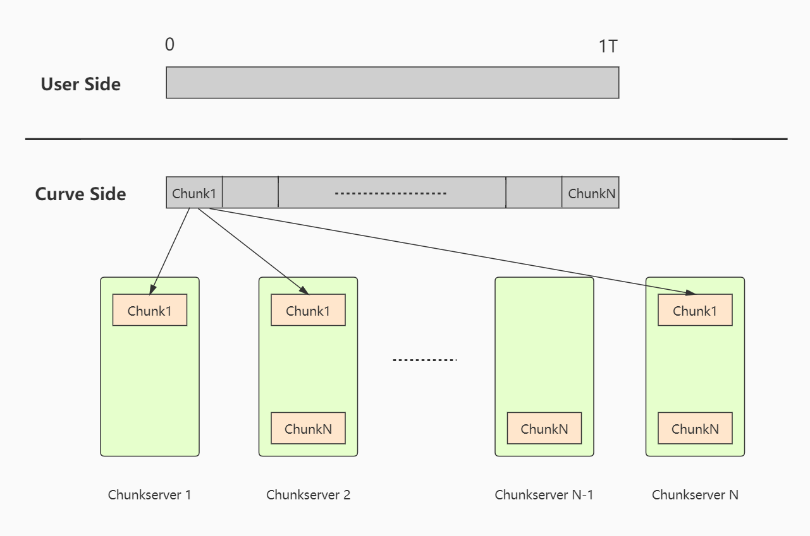
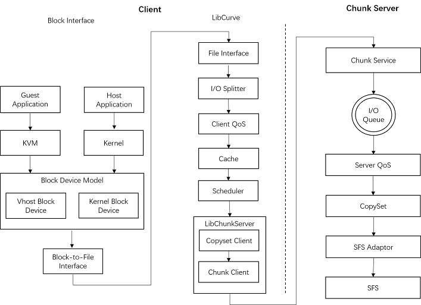
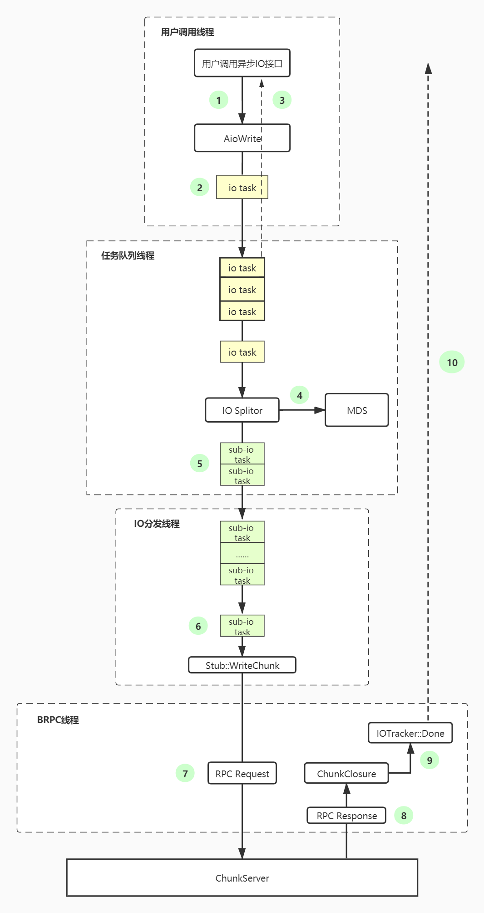

[中文版](../cn/curve-client.md)

# Curve Client

## 1 Outline

As a centralized distributed storage system, Curve consists of Client module for user's requests, Chunkserver module for basic storage, metadata server MDS and snapshot system.

Curve client serves the upper layer by dynamic library libcurve, which can be linked by external processes like QEMU and Curve-NBD for utilizing services provided by Curve (Curve client will no longer provide services directly to QEMU and Curve-NBD after the hot upgrade, see [NEBD](../en/nebd_en.md) for more details). Thus, Curve client can be regarded as the entrance of user's operations.

## 2 Curve Client Functions

Curve provides block storage service based on its underlying distributed file storage system, and Curve client provides user data storage services interfaces. From user's aspect, what Curve have provided is a block device capable for reading and writing randomly, which corresponds to a file in CurveFS that stored on different nodes of the cluster. To make it clear, let's use an example to illustrate this idea:

When a user create a block device of 1T, this block device corresponds to a 1T size file on CurveFS.

> It should be noticed that this 1T file is nothing but only a logical concept, and only Curve client and MDS will notice its existence. This file is impercetible for chunk servers.

 
Figure 1: Example of the mapping between user's block device and its storage

For the user, the 1T block device is a continuous address for reading and writing. But from Curve's side, this block device is a space consists of many chunks with unique ID, and every chunk corresponds to a piece of physical space on Chunkserver. Figure 1 above illustrates this relationship.

Curve client communicate with storage cluster by RPC, and from the description above we can try to make a conclusion on what Curve client should do:

### 2.1 Providing Interface

Users operate block devices using interface provided by Curve client, including creating, opening, reading and writing. For achieving the best performance, asynchronous reading/writing interfaces are provided.

### 2.2 I/O Splitting

From figure 1 we can see, user's block device is actually split and stored in nodes by chunks, this is for higher concurrency and data reliability.

When writing to Curve client, the client will receive the offset, length and actual data of the I/O. The corresponding space of offset + length may cover more than one chunk, and chunks may be stored in different chunk server, so the Curve client should transfer user's block device I/O request to the chunk request toward different chunk server and dispatch.

### 2.3 I/O Tracking

I/O are split according to the offset and length. For example, if a user send an I/O request with offset = 0 and length = 2 * chunk size, this request will be split into at least two when arrive the client since the I/O target space crosses two chunks on different chunk server. In the client, both the I/O interface and writing chunk are asynchronous, and as a result tracking every split I/Os and record their returns are necessary. The request will return to the user only when every split I/Os have returned.

### 2.4 Metadata Fetching and Caching

Curve client is a stateless component without saving any metadata of any file. But the I/O splitting we discussed above require the mapping data of chunk to physical chunk on chunk server, which are fetched from MDS. MDS will persist routing information of files, when user write a block device, client will fetch the metadata of this file from MDS and save them in RAM for following using.

The metadata that a user I/O requires including:

1. File chunk -> chunk id: The mapping between logical chunks user's file and the physical chunks on chunk server.
2. Chunk id -> copyset id(raft group): The Raft group that those physical chunks belong to.
3. Copyset id -> serverlist: Chunk server list that Raft groups belong to.

### 2.5 MDS Failover Supports

MDS provides metadata storage services, and serves in cluster for improving availability. Only one MDS provides services at the same time, and others will monitor through Etcd, getting ready to replace the leader at any time.

Curve client will communicate with MDS by RPC when I/O is dispatched and the control panel is called, during which the  address of corresponding MDS is required. Therefore, the clients also needs to change the address if the service node in MDS cluster is switched.

### 2.6 Chunkserver Failover Supports

Similar with the high availability design of MDS, chunk server utilized Raft algorithm for multi-node data copying and high availability guarantee. When dispatching I/O request on client, the fetching of current leader of the Raft group is required, and the request will then sent to the leader node.

### 2.7 I/O Flow Control

Curve client will control the data flow when overload of the cluster is detected. I/O flow control from Curve client is essentially a method to relief the workload, but not a solution.

## 3 Curve Client Architecture

In the sections above we made an conclusion on what the client can do. In this section we'll focus on the architecture of the client from its modules and thread model.

### 3.1 Module Structure

Figure 2 shows the modules of the client. It should be mentioned that client QoS module has not implemented yet currently.

	 
	Figure 2: Curve client modules

### 3.2 Thread Module

     
    Figure 3: Thread module of Curve client

Figure 3 shows the thread module of Curve client. Use asynchronous I/O request as an example, for the client there are 4 kinds of threads involved:

1. User thread: When a user initiates an asynchronous I/O request, AioWrite interface of Curve client will be called. AioWrite will encapsulate user's request and place it into a task queue, and this user call will return at this stage.
2. Task queue thread: This thread will monitor the task queue, and once an I/O task enter, it will fetch from the queue and split the I/O into sub-I/Os and place them into the I/O dispatching queue.
3. I/O dispatching thread: According to the info of sub-I/Os from above, this thread will sends RPC requests to corresponding chunk server nodes.
4. BRPC thread: This thread deals with RPC sending and receives RPC response. The call back function Closure will be called after the RPC request returned. If every sub-I/Os return successfully, the call back function of their corresponding I/O will also be called (by the BRPC thread).

## 4 Highlights

### 4.1 MetaCache

During the I/O splitting, metadata of the file is required. These data will not be persisted in the client, and will only be fetched from the MDS when needed.

In order to avoid frequent communication from client to MDS, the client will cache the metadata fetched from MDS, and we have mentioned about these data in section 2.4.

#### 4.1.1 Metadata Update

Once a file has been allocated its chunk ID and copyset ID, these information will remain unchanged.

In the three types of metadata we've mentioned above, the only one that will change is the mapping between copyset ID and server list. This is because of the configuration change caused by situations like nodes outage, unbalance load. In these cases, the chunk server list of the corresponding copyset will change.

Curve client trigger metadata update also by RPC. The metadata being updated including:

1. Leader information of the Raft group

   The request of the client will be sent to the leader of the Raft group, and the client will fetch the leader info of current Raft group (cached in meta cache). If a request was sent to the chunk server that is no longer the leader, the client will initiate a GetLeader request to other chunk servers in current Raft group. This request can be sent to any of them since every node will know the leader if a new one has been elected. After knowing the new leader, the client will update the meta cache, then resend the request to the new leader.

2. Peer info in Raft group

   In such an extreme case that all peers in a Raft group are change due to unexpected issues like node failure, GetLeader request will not able to get the real leader. Client will fetch the new Raft group info from MDS in this case after retried for many times.

### 4.2 I/O Request Retry

I/O dispatching thread will send asynchronous RPC requests after getting I/O tasks, and will call the call back function after the RPC request returned. In the call back function, the return value of the RPC request will be examined to determine whether the request has succeeded. If failed and retry is needed, the RPC request will be resent in the call back function.

> For read/write request, the retry time will be set to a relatively high value in order to let the I/O request return successfully as much as possible. Because for block device, the error returned will makes the user believes that the block device has damaged and the disk has error.

There will be pre-processing for the RPC retries in two cases:

1. Chunk server overload

   In this case, the error code of the RPC response will be OVERLOAD, which means the chunk server is suffering a high workload. If the client retry directly in this time, it's very likely that another OVERLOAD will return. In this scenario, the client should sleep for a while before next retry.

   On client side, we introduced Exponential Backoff for the retry interval and random jitter for the sleeping time to avoid retry right after many of the request returned OVERLOAD.

2. RPC Timeout

   There are many explanations for this result, but timeout caused by the overload of chunk servers due to too many requests is usually the most common case.

   In this scenario, if the threshold for RPC timeout remain unchanged, the same thing would probably happen again, and the user's I/O request will not return even after a long time. Thus, the retry will first increase the threshold in this case.
