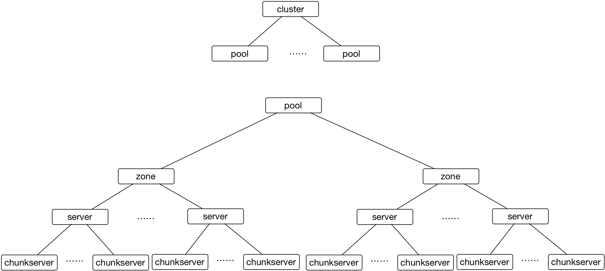
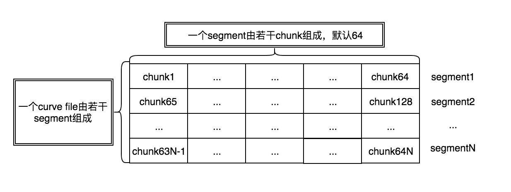
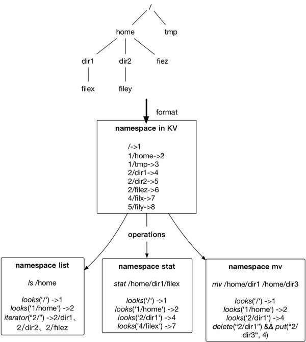
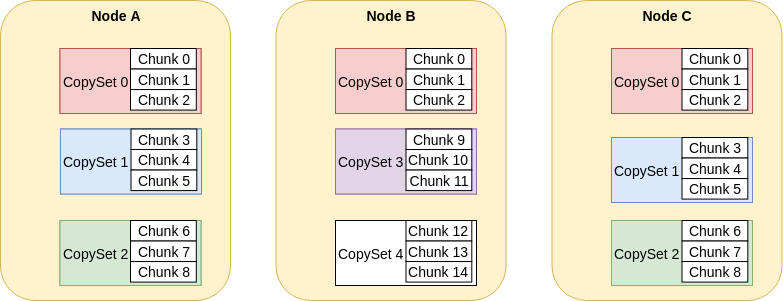
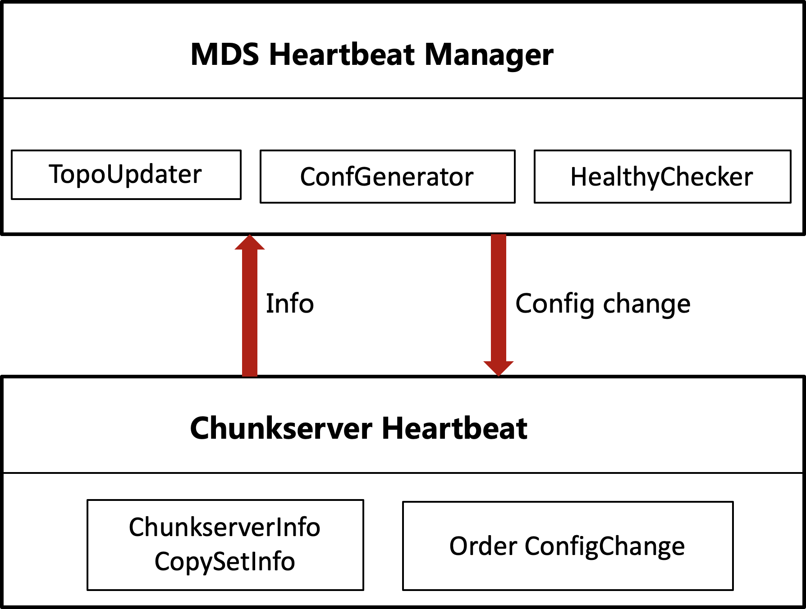
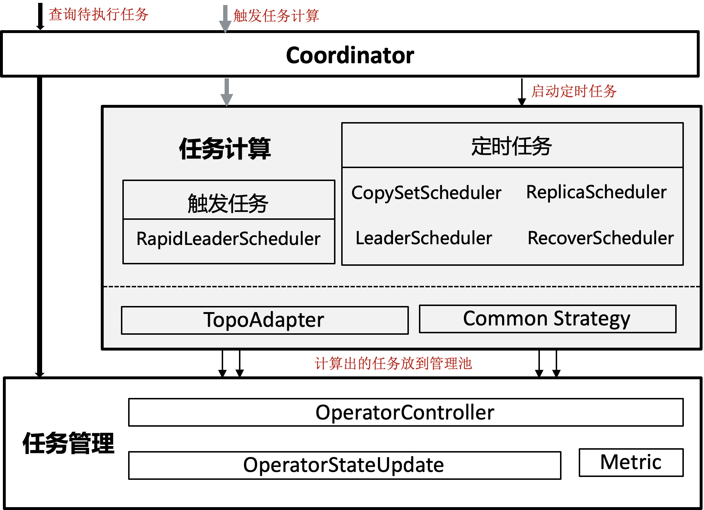

[中文版](../cn/mds.md)

# MDS

## Summary

MDS is the center node of the system, responsible for managing metadata, collecting cluster status data and scheduling. MDS consists of following components:

- Topology: Managing topology metadata of the cluster
- Nameserver: Managing file metadata
- Copyset: Replica placement strategy
- Heartbeat: Receiving and replying to heartbeat message from chunkserver, collecting load status and copyset info of chunkserver
- Schedule: Module for fault tolerance and load balance

## Topology

 Topology module is for managing and coordinating servers. It provides business-oriented functional and non-functional service listed below by coordinating network and the placement of servers.

1. Failure domain isolation: placing replicas in different servers, different racks or under different network switch
2. Isolation and sharing: data of different users can isolated from each other on or share certain physical resources

Figure 1 shows the topological diagram of CURVE and the explanation of corresponding components.

 Figure 1: Topological diagram of CURVE

**chunkserver**：A chunkserver is an abstraction of a physical disk (SSD in our scenario) in a server (physical), and disk is the service unit of chunkserver.

**server:** Server represent an actual physical server, to one of which any chunkservers must belong.

**zone:** Zone is the unit of failure isolation. In common cases, servers (a physical machine) of different zones should at least be deployed under different racks. To become stricter for some scenarios, they should be deployed under different groups of racks (racks that share the same set of leaf switches). A server must be owned by a certain zone.

**pool:** Pool is for implementing physical isolation of resources. Servers are not able to communicate across their pool. In the maintenance of the system, we can arrange a pool for a new set of machines, and extend the storage by pools. Extending storage by adding machines inside a pool is supported, but this is not recommended since it will affect the copyset number of every chunkserver.

Learned from the design of Ceph, CURVE introduced the concept of logical pool on top of a physical pool in order to satisfy the requirement of building a unified storage system. In our design, we support the coexist of block storage (based on multi-replica), online object storage (based on three replicas storage that support appends, to be implemented) and nearline object storage (based on Erasure Code storage that support appends, to be implemented).

 Figure 2: An example of the relation between logical pool and physical pool

Figure 2 is an example of the N:1 relation between logical pool and physical pool, and many types file can be stored in a physical pool. Multi pools are also supported by CURVE, which means you can configure a single physical pool for only one logical pool. 

With the help of CURVE client system, logical pool can achieve a physical isolation of data from different users by specifying and restricting their behaviors (to be developed).

**logicalPool**: A logical pool is for building pools of different characteristics on logical aspect (e.g. ). AppendECFile pool, AppendEC pool and PageFile pool shown in the figure above). This is for user level data isolation and sharing.

## NameServer

NameServer is for managing metadata of namespace, including (for more details please check curve/proto/nameserver2.proto):

``FileInfo:`` File information. 

``PageFileSegment:`` segment is the smallest unit of files spaces assignment.

``PageFileChunkInfo:`` chunks are the smallest unit for data fragmentation.

Figure 3 below shows the relation between segment and chunk:

 Figure 3: Relation between segment and chunk

Namespace info is rather intuitive, which is the hierachy of files:

 Figure 4: Example of namespace data and operations 

Figure 4 illustrates how namespace info is stored in form of KV pairs. The key consists of parent directory ID and target directory ID (seperated by a '/'), and the value is the ID of the target file. In this way we struck a great balance between the workload of some of the operations we implemented:

1. List: List all file and directories under a certain directory.
2. Find: Find a specific file under a location
3. Rename: Rename a file or a directory

Currently, encoded metadata is stored in etcd.

## CopySet

The unit of CURVE fragmentation is called a chunk, which occupies 16MB of spaces by default. In the scenario of large scale storage, many chunks will be created. With such a great amount of chunks, it will be stressful to store and manage corresponding metadata. To solve this problem, we introduced copyset to our system. In the scenario of block device based on replica storage, a copyset is a group of chunkservers that stores same replicas, and a chunkserver can store different copysets. The concept of copyset is proposed by Asaf et al. in paper *Copysets: Reducing the Frequency of Data Loss in Cloud Storage*. Basically it's for improving data persistency in distributed system and reduce the rate of data loss.

We introduced copyset for three reasons:

1. Reduce metadata: If we store replica relation for every chunk, for each chunk we need chunk ID + 3× node ID = 20 bytes of metadata. In the scenario of 1PB data and 5MB chunk size, there will be 5GB of metadata. But if we introduce copyset between chunks and replica groups, for each chunk we only need 12 bytes of metadata (chunk ID + copyset ID = 12 bytes), which reduces total metadata size to 3GB.

2. Reduce the number of replica groups (a group of replicas for the same chunk): Imagine a scenario with 256K replica groups, in this case huge amount of RAM will be occupied for their data. Also, massive data flow will be created when secondary replicas send regular heartbeat to their primary. With copyset introduced, we can do liveness probe and configuration changing in granularity of copyset.

3. Improve the reliability of data: When replicas are scattered too randomly in different servers, data reliability will be challenged when large-scale correlated failures occurred. For more details of this, please refer to the copyset paper. 

Figure 5 demonstrates the relation between ChunkServer, Copyset and Chunk:

 Figure 5: Relation between chunk, copyset and chunkserver

## Heartbeat

Heartbeat is for data exchange between center node and data nodes, and it works in following ways:

	1. Monitor online status(online/offline) of chunkservers by regular heartbeats from chunkserver.
	2. Record status information(disk capacity, disk load, copyset load etc.) reported by chunkservers for Ops tools.
	3. Served as a reference by receiving regular heartbeats for scheduler module to balance workload and change configurations.
	4. Detect the difference between the copyset info from chunksevers and mds by comparing the copyset epoch reported by chunkservers, then synchronize them.
	5. Implement configurations changing by distributing configurations changes from mds in replies to chunkserver heartbeat, and monitor the progress of the changing in upcoming heartbeats.

From figure 6 you can see the structure of heartbeat module:

 Figure 6: Structure of heartbeat module

##### MDS side

On MDS side, heartbeat module consists of three parts:

*TopoUpdater*: This part updates info in Topology module according to copyset info reported by chunkservers. 

*ConfGenerator*: Forward info reported by copyset to scheduler, and fetch operations for copyset to execute.

*HealthyChecker:* Update chunkserver status by checking the time gap between current time and the last heartbeat of a chunkserver.

##### Chunkserver side

As for chunkserver side, there are two parts including:

*ChunkServerInfo/CopySetInfo*: Fetch copyset info on chunkserver currently and report the info to MDS.

*Order ConfigChange*: Summit operations distributed by MDS to corresponding copyset.

## Schedule

System scheduling is for implementing auto fault tolerance and load balancing, which are core issues of distributed system, and are also two of the decisive features for whether or not CURVE can be deployed in production environment. Auto fault tolerance promises that data loss caused by commonly seen abnormals (e.g. disk failure and system outage) will be fixed automatically without people getting involved. Load balancing and resources balancing make sure that the system can make the best use of hardware resources like disk, CPU and memory.

 Figure 7 Structure of scheduler module

Figure 7 shows the structure of the scheduler module.

**Coordinator:** Coordinator serves as the interface of the scheduler module. After receiving copyset info provided by heartbeats from chunkserver, coordinator will decide whether there's any configuration change for current copyset, and will distribute the change if there is.

**Task calculation：**Task calculation module is for generating tasks by calculating data of corresponding status. This module consists of a few regular tasks and a triggerable task. Regular tasks include CopySetScheduler, LeaderScheduler, ReplicaScheduler and RecoverScheduler. CopySetScheduler is the scheduler for copyset balancing, generating copysets immigration tasks according to their distribution. LeaderScheduler is the scheduler for leader balancing, which responsible for changing leader according to leaders' distribution. ReplicaScheduler is for scheduling replica number, managing the generation and deletion of replica by analysing current replica numbers of a copyset, while RecoverScheduler controls the immigration of copysets according to their liveness. For triggerable task, RapidLeaderScheduler is for quick leader balancing, triggered by external events, and generates multiple leader changing task at a time to make leaders of the cluster balance as quick as possible. Another two modules are TopoAdapter and CommonStrategy. The former one is for fetching data required by topology module, while the later one implements general strategies for adding and removing replica.

**Task managing：**Task managing module manages tasks generated by task calculation module. Inside this module we can see components OperatorController, OperatorStateUpdate and Metric, responsible for fetching and storing tasks, updating status according to copyset info reported and measuring tasks number respectively.