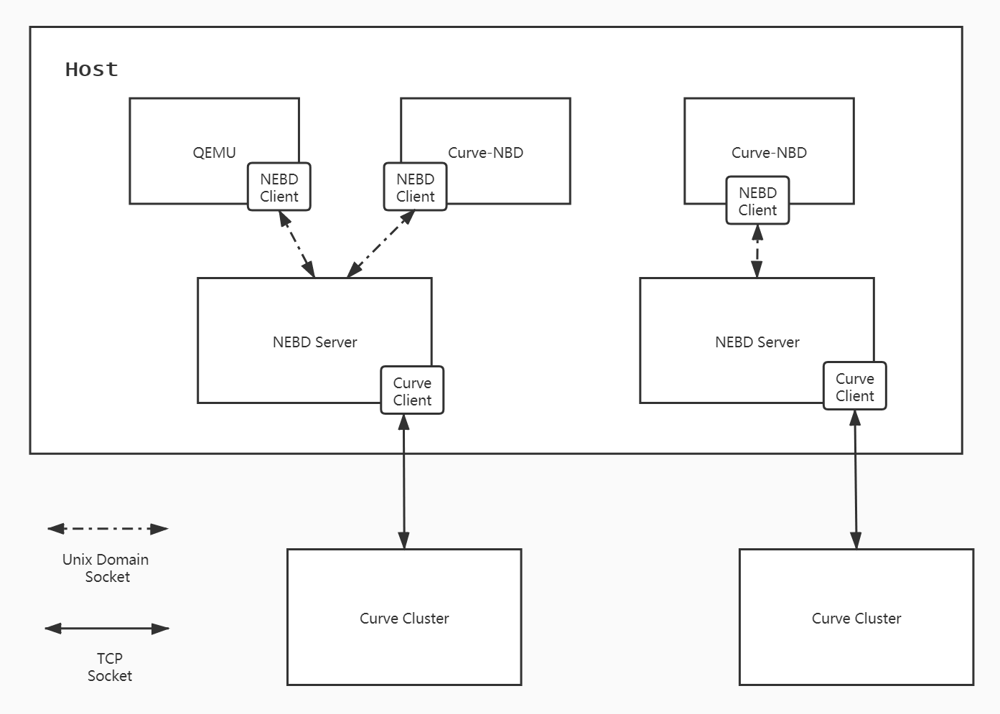
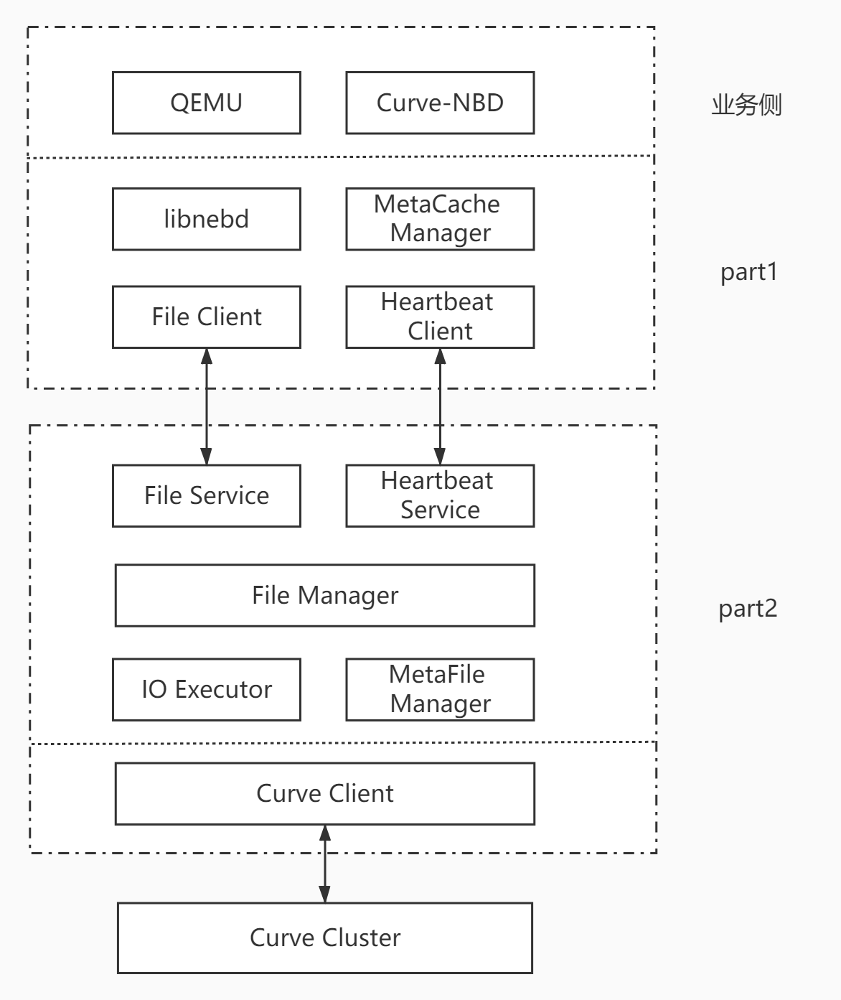
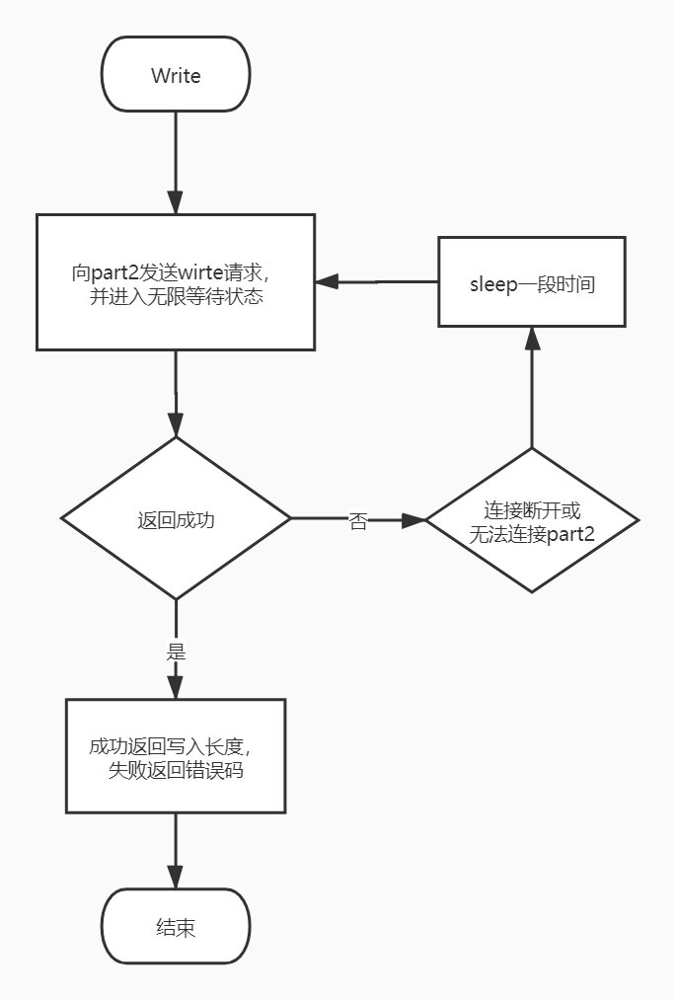

[中文版](../cn/nebd.md)

### Overview

CURVE client serves as the entrance of the services provided by CURVE, providing dynamic link library for QEMU/CURVE-NBD for calling. As a result, restarting QEMU/CURVE-NBD is necessary when CURVE Client needs to be updated.

In order to relief the impact of updating on applications based on CURVE, we decoupled CURVE client and its applications, and imported the hot upgrade module **NEBD** in between.

### NEBD Structure

 Figure 1: NEBD structure

Figure1 shows the deployment structure of NEBD.

- NEBD Client (**part1** in source code directory): NEBD Client corresponds to applications based on CURVE, including QEMU and CURVE-NBD.  An NEBD client connects to specified NEBD server through Unix Domain Socket.

- NEBD Server(**part2** in source code directory)：NEBD Server is responsible for receiving the requests from part1, then call CURVE client for corresponding operations. An NEBD server can receive requests from different NEBD clients.

Also, figure 1 shows that instead of CURVE client, NEBD client is now the component that serves the application above. In this case, the applications will still be influenced when NEBD client is being upgraded. So in our design, we simplified the processing logic of NEBD client as much as possible, which means it will only be responsible for request forwarding and limited retries for requests if needed.

There are few steps for NEBD server/CURVE client's upgrade:

1. Install the latest version of CURVE client/NEBD server
2. Stop running processes of part2
3. Restart processes of part2

In our practice, we use daemon to monitor the processes of part2, and start them if not exist.

Also, notice that from the stop of processes of part2 to the start of the new ones, only 1 to 5 seconds are required in our test and production environment.

#### Structure of Modules

 Figure 2: Structure of each module

Figure 2 show the components of NEBD client and NEBD server.

##### part1

- libnebd: API interface for upper level applications, including open/close and read/write.

- File Client: The implementations of libnebd interface, send users' requests to NEBD server.

- MetaCache Manager: Record information of files already opened currently.

- Heartbeat Client: Sent regular heartbeat carrying opened file info to NEBD server.

##### part2

- File Service: Receive and deal with file requests from NEBD client.

- Heartbeat Service: Receive and process heartbeat from NEBD client.

- File Manager: Manage opened files on NEBD server.

- IO Executor: Responsible for the actual execution of file requests, which calls the interface of CURVE client and send requests to storage clusters.

- Metafile Manager: Manage metadata files, and also responsible for metadata persistence, or load persistent data from files.

### Key Points

1. Retry procedure of part1:

   As what we've mentioned above, part1 only execute limited retries, and this characteristic can be reflected in two aspects:

   1. There's no time out for RPC requests from part1.

   2. Part1 only executes retries for errors of RPC requests themselves, and forward error      codes return by RPC to upper level directly.

   

Use Write request as an example, and figure3 is the flow chart of the request:

- Forward Write request from upper level to part2 through RPC requests, and wait without setting the time out.
  
  - If the RPC requests return successfully, return to upper level corresponding to the RPC response. 
    
  - If disconnection occurs of unable to connect, wait for a while and retry.
    

   
  
   
 Figure 3: Flow chart of write request sent by NEBD client

  
   Other requests follow similar procedures as write request does.
  
2. Heartbeat management:

   In order to avoid upper level application finishing without closing files opened, part2 will check heartbeat status of files (opened files info reported by part1 through regular heartbeat), and will close the files of which the last heartbeat time has exceeded the threshold.

   The difference between closing files with time out heartbeat and files that requested to close by upper level applications is that the time-out closing will not remove file info from metafile. But there's a case that an upper level application suspended somehow and recovered later, this will also cause a heartbeat time out and therefore corresponding files are closed. Thus, when part2 receiving requests from part1, it will first check whether the metafile own the records for current files. If it does and corresponding files are in closed status, part2 will first open corresponding files and execute following requests.

