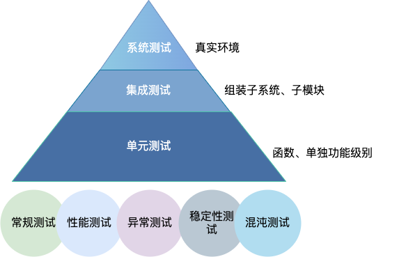
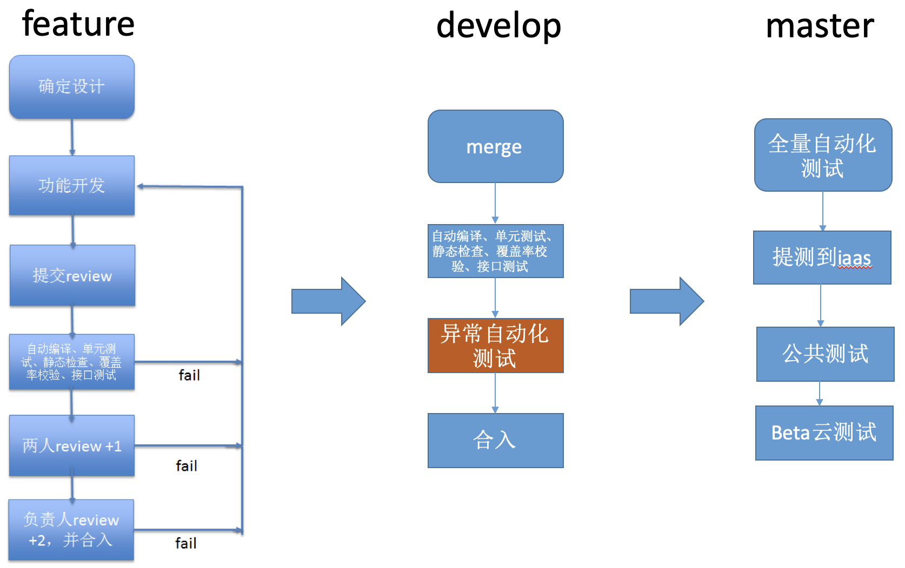
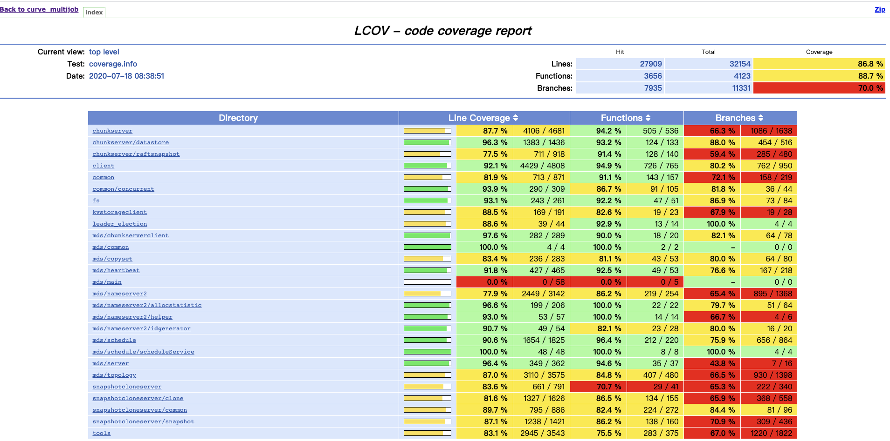
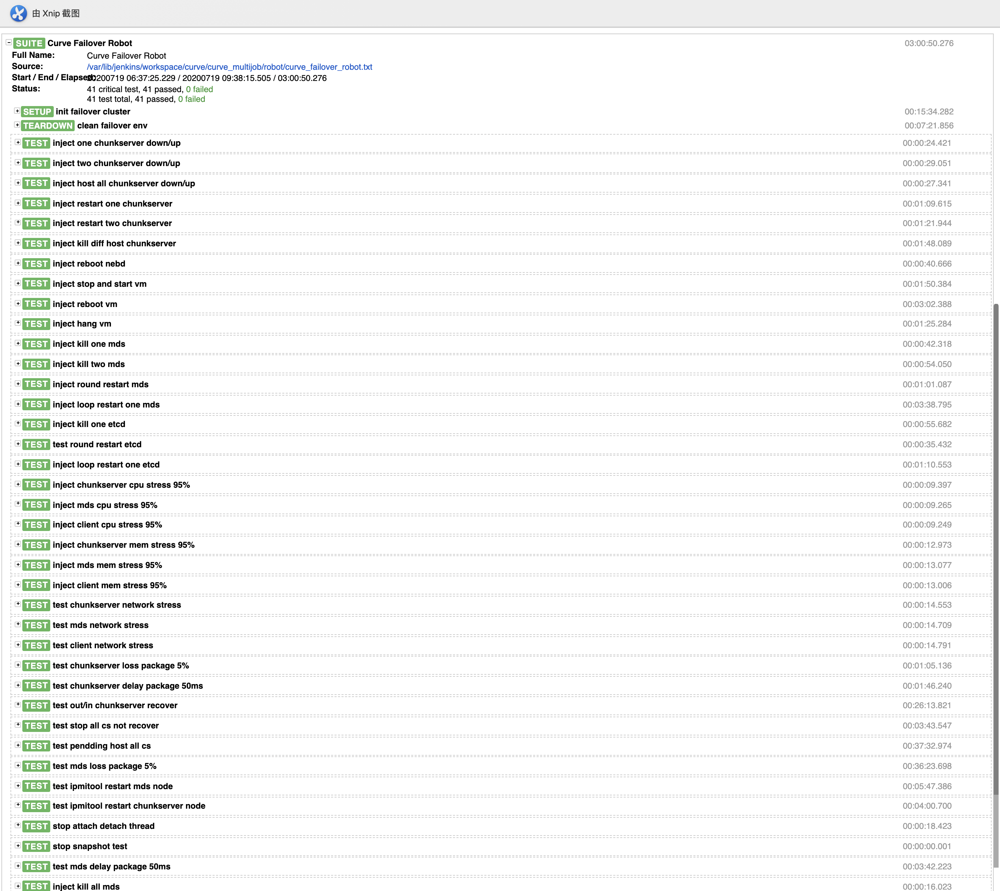
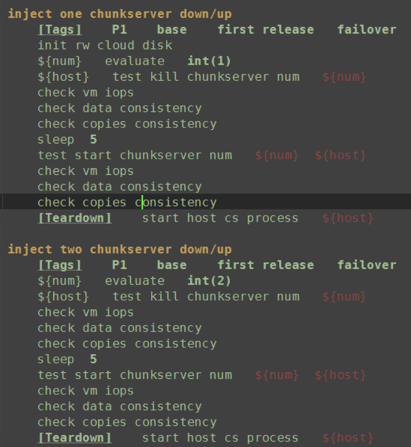
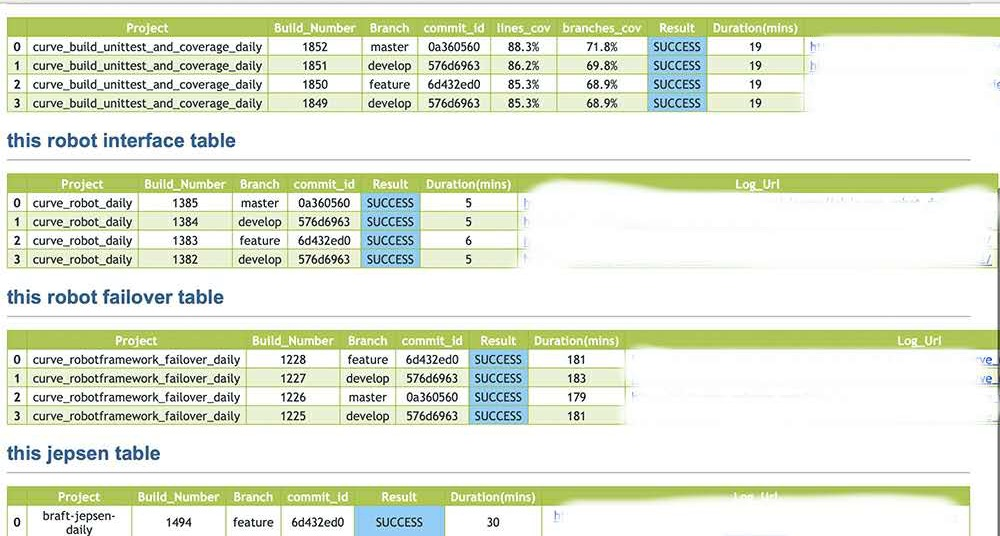

# Curve Quality Control

## Introduction

The quality control of Curve is the key to the maintenance and development of the project. In the following chapters, we'll introduce in theories and procedures.

### Quality control theories
Different levels of tests are included in Curve for testing the correctness of newly introduced and current functions more efficiently. These tests includes:

- **Unit test**

  Unit test can help us find out problems at the least cost when testing the correctness of a module, a function or a class.

- **Integration test**

  Based on unit testing, integration test is for testing whether all the software units achieve the technical specifications when assembled into modules, subsystems or systems according to the design.

  The goal of integration test is to construct the program using components that already passed unit test according to the design requirements, since a single high quality module is not enough to guarantee the quality of the entire system. Many hidden failures are caused by unexpected interactions between high quality modules. Thus, the test will try to ensure that the units are combined to operate in accordance with the intended intention and the incremental behavior is correct by testing the interface between the units and the integrated functions.

- **System test**
  

System test is a "black box" test based on the software requirements specification. It's a thorough test of the integrated system for verifying that the correctness and performance of the behavior and output, rather than a simple task, of the software system can meet the requirements. Thus, it's called the "prophet question" of testing.  Therefore, system test should be carried out in accordance with the test plan, and its input, output, and other dynamic operating behaviors should be compared with the software specification.  There are many methods for this test, including functional test, performance test, random testing, etc.

    

  ### Procedures
The quality of the code merged into the repository is controlled through strict procedures to ensure that each line of code merged will not affect the function of the main process before submitted to QA, and conform to the code style guide (Curve is developed using C++, and uses ``cpplint``  and ``cppcheck`` for code style checking).  We have already transfer the development of Curve to GitHub, and this procedure has been be transplanted.

Two important steps should be mentioned: **manual reviewing and continuous integration (CI)**

  

  

## Theories

### Unit Test

Unit test for testing the correctness of a module, a function, or a class, it will guarantee the correctness of module's behavior in a great extend, and serves as the most basic test in the procedure of software development. **Code coverage** is used to measure the completeness of the unit test.  Figure 4 below shows a statistical chart of Curve code coverage, calculated by the tool "lcov (for c++)", and rendered by "genhtml". Other languages such as go also have their own  Coverage statistics tool.  The unit tests of curve modules are under folder "curve/test".

     
    Figure 4 Curve code coverage result

### Integration test

#### necessity

The issues to be considered in the integration test are mainly the problems after the modules are connected:

- Whether the data passing through the module interface will be lost;
- Whether the combination of sub-functions can meet the expectation;
- Whether the sub-modules will affect each other;
- Whether the error accumulation of a single module will be amplified to an unacceptable level; 

Therefore, it is necessary to conduct a integration test to find and eliminate the problems above that may occur in the module connection after the unit test, and finally construct the required software subsystem or system.

#### Content

- **Function test**
  
  Function test is to conduct a comprehensive test on the functions provided by the module from user's prospective. Before the test, it is necessary to design sufficient test cases, considering various system states and parameter input to decide whether the module can still work as usual, and return the expected results. In this process, a scientific test cases design method is required to consider various input scenarios, and complete the test process with least cases and execution steps.
  
- **Exception test**
  
  Different from function test and performance test, exception test is another test for discovering performance bottlenecks caused by exceptions such as system exception, dependencies exception and the exception of the application itself in order to improve the stability of the system. Common exceptions include disk errors, network errors, data errors or program restarts, etc.  We use software to simulate exceptions in the development stage, such as "libfiu" in C++ and "gofail'' in go, which can simulate various exceptions.

- **Scale test**
  
  This is to test whether the module can work normally under a certain scale, and whether it will crash or shows exceptions by observing the utilization of system resources. For example, test whether there will be errors when opening a large number of files and whether the memory usage will be too large.

- **Concurrent/pressure test**

  Functional test is more of a single-threaded test. It is also necessary to test the module in a concurrent scenario to observe whether it can still work normally, and whether there will be errors in logic or data. When considering the concurrency degree, we consider a larger pressure, for example, 2 times, 10 times or more than our normal scenario.

#### Test case design

Here we provide an [example of the test case for datastore module](quality-integration-example.md).

### System test

As mentioned at the beginning, the system test is a black box test. The system test of Curve usually conducted by QA. Tests include are: normal test, performance test, stability test, exception test and chaos test.

- Normal test is basically manual test for newly added functions;

- Performance test is for testing the performance;

- Stability test requires the system to run for a certain amount of time under normal pressure

- Anomaly test injects software and hardware exception into the normal process

- Chaos test is to randomly combine software and hardware exceptions in normal process  

Unit tests and integration tests are usually coded by developers in code development and can be accumulated continuously. In the process of system testing, we also hope to automate test cases as much as possible to reduce manual regression costs, so that test cases can continue to accumulate.
      There is also a very important reason: many hidden problems are occasional, and cannot be triggered frequently by manual test.
      Currently, **exception test and chaos test** are automated in Curve.

#### The practice on automatic exception test 

#### Framework used ——Robotframework

- Supports keywords, tests are flexible
- Comprehensive test report
- Compatible with Jenkins CI
- Sufficient third party libraries supported (ssh, paramiko, request, multiprocess)
- Diversified parameters, supports batch running modes including log level definition, tag filtering and random scramble.

#### Principles of test cases design

- No need to bind to a specific environment, "pull up at will"
- Self configurable (able to configure environment definition, workspace path and test load)
- Case independence
- Case universality (curve ceph nbs lvm)
- Tag standardized (priority, version, running time)
- Consider improving coverage (rich scenes, disordered sequence, some random sleep)
- Polling instead of sleep
- Accuracy (checkpoint)
- Stability (avoid environmental factors, other module interference)
- Control the test cases runtime  (Consider some compromises)

#### High pressure multi-level malfunctions

High pressure multi-level malfunctions is the chaos test of Curve, based on robotframework but injects malfunctions randomly selected.

## Procedure control

As introduced in the beginning, Curve's procedure control is mainly strict code integration and regular CI triggering.

Strict code depends on two parts: 

1. Code review. We use gerrit platform, two code review+1 and CI +1 will be required before the code can be merged.  Code review is a procedure replied on manual during the code submission, but it is also very important, and will have relatively high requirements for code readability.

   2. CI. We configured to use Jekins. Benefits from the automation of our tests, unit test, integration test and exception test will be required to pass before the code can be merged, which greatly reduces the appearance of low-level bugs.

Regular CI triggering: After the automation, the test becomes very convenient. Frequent triggering can help us find many corner cases.

