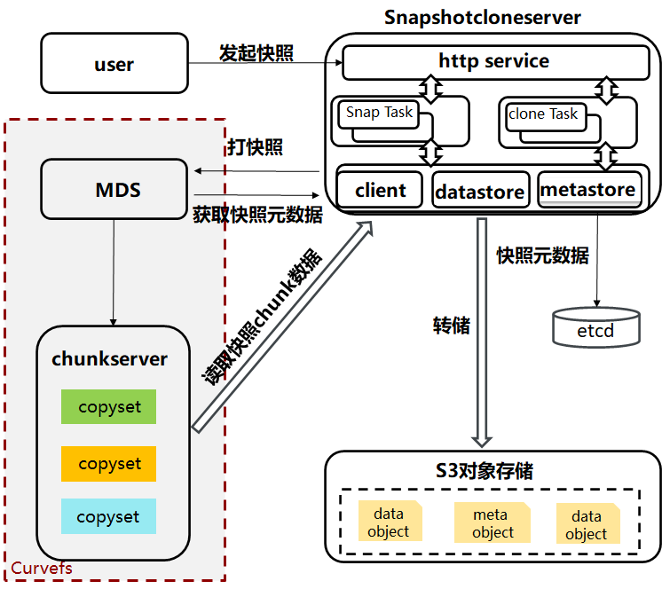
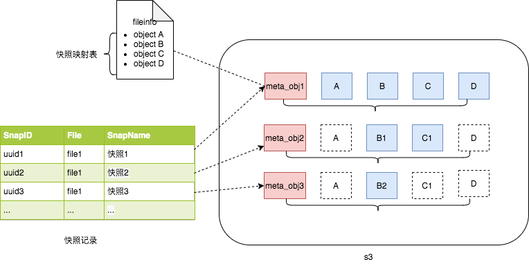
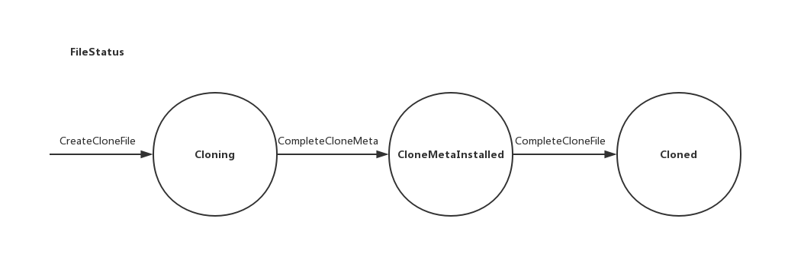

[中文版](../cn/curve snapshot.md)

# Curve Snapshot & Clone

## 1、Snapshot

### 1.1 Intro to Curve snapshot

Snapshot is the read-only copy of the entire data of a cloud disk at a certain moment, and is an convenient and efficient way for data disaster tolerance, commonly used in data backup, creating mirrors and application disaster tolerance. Snapshot system provides users an snapshot service interface, by which users can create, delete or cancel a snapshot, or recover data from snapshot, and even create their own mirror.

The snapshot service works as an independent component from core services of Curve, and it supports multi-level snapshot, which means a full backup for the first snapshot and incremental snapshot for the following ones. In the first snapshot, data will be stored entirely on S3, and only the modified data will be stored in the following tasks for saving spaces. The storing of snapshot data to S3 is asynchronous. Leader election and a high availability is implemanted by Etcd, and unfinished tasks will be resume automatically when the service restart.

### 1.2 Curve Snapshot Architecture

Figure 1 shows the architecture of Curve snapshot service.

 Figure 1: Architecture of Curve snapshot

#### Snapshot System

After receiving requests from users, the system will create temporary snapshot by calling the interfaces of CurveFS, then it will store the temporary data to object storage system and persist metadata of the snapshot to database. The functions of snapshot system can be concluded into two parts:

1. Provides snapshot interface for user to operate the snapshot datat.
2. Managing the snapshot data, and control the snapshot data flow in the system using the interface from CurveFS and object storage system.

#### CurveFS

CurveFS provides RPC interface used by snapshot system for creating, deleting and reading snapshot. On the creation of the snapshot, CurveFS is the provider of the snapshot data for snapshot system to store in object storage system, and in the recovering process from snapshot, CurveFS is the receiver of the snapshot fetched from object storage system.

#### Object Storage

Object storage is the underlying system for storing snapshot data, and provides only interfaces for creating, deleting, uploading and downloading objects. 

Object storage provides storage capabilities for snapshot data, and only provides interfaces for creating, deleting, uploading and downloading object files. It is called by the snapshot module to store the snapshot data read from CurveFS or download the snapshot data from the object storage system and write it into CurveFS to restore the volume file. Curve uses NOS as the object storage system.

### 1.3 Snapshot Procedure

Here's what would happen when the user initiates a snapshot request to the snapshot system. The request will goes to the HTTP service layer, in which a specific snap task will be generated and handed over to the snapshot task manager for scheduling. The process of taking a snapshot is that a temporary snapshot in CurveFS will first be generated, then dumped to the object storage system, and finally deleted.

The following steps are for creating a snapshot:

1. Generate snapshot records and persist them to Etcd. Several judgments are required for this step: For the same volume, there can only be one snapshot being taken at the same time, so it is necessary to judge whether the volume has a snapshot request being processed. Theoretically, unlimited snapshots are supported by the system, and in the implementation we put a limit to the depth of snapshot, which can be modified in the configuration file. For this reason, we also need to determine whether the number of snapshot exceeds the limit. If every thing works well, the metadata of the original volume will be read from MDS and a snapshot record will be generated and persisted to Etcd. The status of the snapshot generated in this step is 'pending'.

2. Create temporary snapshot on CurveFS, retuen seqNum of the snapshot created, then update the seqNum of the snapshot record.
4. Create snapshot mapping table (see 1.4.1), and save it to object storage S3.
6. Store snapshot data from CurveFS to object storage S3. When storing, the snapshot system first reads the snapshot data from CurveFS, then uploads the data to the S3.
8. Delete the temporary snapshot.
10. Update snapshot status to 'done'.

### 1.4 Organization of Snapshot Data

Each snapshot has a corresponding record in the snapshot system and a persisted one in Etcd, and a uuid as the unique identifier.

#### 1.4.1 Organization of snapshot data on S3

Snapshot data is stored in S3 in chunks, and each chunk corresponds to an object on S3. The object that stores data is called a data object, and each snapshot also has an meta object that records the metadata. The meta object records the file information of the snapshot and the mapping table between the snapshot chunk and the object. The meta object consists of 2 parts:

1. Snapshot file information, including original data volume name, volume size and chunk size, etc.
2. Snapshot chunk mapping table, recording the list of snapshot data objects.

Figure 2 is a sample of the sanpshot data.

 Figure 2: Snapshot data format

### 1.5 Interface of Curve Snapshot System

Please refer to the [document](../cn/snapshotcloneserver_interface.md) of snapshot and clone.

## 2、Clone

### 2.1 Intro to Curve Clone Module

In section 1 we introduced the snapshot system, which is for creating snapshots of  files of CurveFS and incrementally dump the data to S3. But for a complete snapshot system, supporting only the snapshot creation is not enough, file recovery and cloning is the reason why take snapshot. In this section we introduce Curve cloning (recovering can be considered as cloning to some extend).

According to the data source, there are two kinds of cloning, including cloning from snapshot and cloning from mirror, and if dividing by whether the data is entirely cloned before the service is provided, it can be divided into delayed cloning and non-delayed cloning.

### 2.2 Architecture of Curve Cloning

Figure 3 shows the architecture of Curve cloning.

 Figure 3: Architecture of Curve cloning

In figure 3, we can see components and their responsibility below.

MDS: Responsible for managing file information and file status, and provides  interface for managing and querying files.

SnapshotCloneServer: Take charge of the management of snapshot and clone task information, and processes their logic.

S3 Object Storage: For storing snapshot data.

Chunk Server: The actual place that stores the file data, and supports "Lazy Clone"  by using copy-on-read mechanism. When the Client initiates a read request to data on a cloned volume, if the area of target data has not been written, the system will copy data from the mirror (stored in CurveFS) or snapshot (stored in S3), return the data to the Client and write it to the chunk file asynchronously.

### 2.3. Clone Procedure

For cloning of CurveFS, it's basically copying the data from the source location (the source location is the location of the object being copied. If cloned from snapshot, the source location is the location of the object on S3, and if cloned from a file on CurveFS, the source location will be the object location on chunk server) to the target location (which is the location of the chunk generated). In actual scenarios, waiting for all data to be copied synchronously is not necessary in many cases, and we can copy only when the data is actually used. Therefore, a 'lazy' flag indicating whether to clone in a lazy way can be set. If this flag is marked true, it means coping when it is actually used, and if marked false, waiting for all data to be copied to chunk server is required. Since the data at the source location is only needed when reading the data, a copy-on-read strategy is adopted.

#### 2.3.1 Creating Clone Volume

Here are steps for creating a clone of a volume

1. The user specifies the file or snapshot to be cloned, and sends a request to create a clone volume to SnapshotCloneServer.

2. After receiving the request, the SnapshotCloneServer obtains data from  locally saved snapshot information of the snapshot clone system (currently persisted to Etcd) or from MDS according to whether the cloned object is a snapshot or a file.
3. The SnapshotCloneServer will then send a 'CreateCloneFile' request to MDS. For the newly created file, the initial version should be set to 1. After receiving the request, MDS will create a new file and set the status of the file to 'Cloning' (the meaning of different file status will be explained in the following chapters).  It should be noted that the file created at the beginning will be placed in a temporary directory. For example, if the file that the user request to clone is named 'des', then this step will create the file with the name '/clone/des'.
4. After the creation of the file, SnapshotCloneServer will queries the location info of each chunk: If the cloned object is a file, only the file name is needed, and as for snapshot, the server will first obtain the meta object on S3 for analysis to obtain the information of the chunk, then allocates copyset for chunks on each segment through MDS. After that, the server will calls the 'CreateCloneChunk' interface of ChunkServer to create a new chunk file with the version 1 for each acquired chunk. Source location information is recorded in the chunk, if the cloned object is a file, format '/filename/offset@cs' will be used as the location ('filename' means the name of the data source file, and @cs indicates that the file data is on the chunk server), and if the cloned object is a snapshot, the server use 'url@s3' as the location ('url' means the source data url on S3, @s3 indicates that the source data is on S3)
5. After creating all chunks on the chunk server and recording the source data information, the SnapshotCloneServer will modifies the status of the file to 'CloneMetaInstalled' through 'CompleteCloneMeta' interface. Up till this step, the process of the lazy and non-lazy method are the same, and their difference  will be reflected in the following steps.
6. If the user specifies a lazy clone, the SnapshotCloneServer will first rename the previously created file from '/clone/des' to "des", in this way the user can access the newly created file and mount it for reading and writing. Lazy clone will not continue the following data copy unless the 'flatten' interface of the snapshot system is called explicitly. Then, the SnapshotCloneServer will continue to call 'RecoverChunk' circularly to asynchronously trigger the copy of the chunk data on the chunk server. After all chunks are successfully copied, interface 'CompleteCloneFile' will be called with the specified file name 'des' (the file has been renamed earlier) to change the status of the file to 'Cloned'. 
7. If lazy clone is not specified, that means the service will be provided only after the synchronization of all the data. The SnapshotCloneServer first circularly calls 'RecoverChunk' to trigger the copy of the chunk data on the chunk server, and when all the chunk data is copied, it will calls 'CompleteCloneFile' with specified file name '/clone/des' to change the status of the file to 'Cloned'. Then, file '/clone/des' will be renamed to 'des' for using.

#### 2.3.2 File Recovery

Essencially, the recovery operation is based on cloning. To explain cloning in a simplified way, it is to create a temporary file and treat it as a clone, then delete the original file and rename the new file to the original name. The attributes of the new file are the same as the one (including file name, file size, file version, etc.). During the recovery process, the main differences between recovery and cloning are:

1. Before the recovery, the information of the original file will be obtained, and then the file name, version number and file size of the original file will be used as parameters to create a new file. The new file will be placed under the '/clone' directory just like the clone.

2. The version number specified when calling 'CreateCloneChunk' is the actual version number of the chunk in the snapshot.
3. After the recovery, the original file will be overwritten when the new file is renamed to the original file name.

#### 2.3.3 Writing Cloned Volume

The writing process of a cloned volume is just like writing a normal volume. The difference is that the chunk of the cloned volume will record the bitmap. When data is written, the bit in the corresponding position will be set to 1 in order to distinguish the unwritten area that need to be read from the clone source.

#### 2.3.4 Reading Cloned Volume

In few steps:

1. The client initiates the request.
2. After receiving the request, the chunk server will determine the flag that represents the position of the source object recorded on the written chunk, and then determine whether the corresponding bit in the bitmap of the read area is 1, and will trigger the copy if it is.
3. The chunk server then copies data from the source object through the recorded position in slice (with 1MB size in default and configurable).
4. After the successful copy, return the data to the user.

#### 2.3.5 File Status

In the procedure above, we've mentioned that the cloned file has many status. What do these different status mean and what are their functions?

 Figure 4: Status transformation of a cloned file

Figure 4 shows the status transformation of a cloned file.

- Cloning

  Cloning is the initial status of a cloned file. At this stage, it means that the SnapshotCloneServer is creating a chunk and loading its data source location information to itself. During this process, the file is unavailable, and the user can only see the task information.
At this stage for the cloning, there will be a file under the '/clone' directory, but for recovery, the original file also exists under the directory.
  
- CloneMetaInstalled

  The file is in this status means that the source location information of chunk has been loaded successfully. If the user specifies the lazy method, the file in this status can be provided for external mounting. During this status, the SnapshotCloneServer will trigger data coping from the data source for each chunk, and snapshot is not allowed.

  In this status, if the clone is lazy, the file will be moved to the actual directory, and the origin file will be removed first if it is file recovering. For non-lazy, the location of the file will be the same as the 'Cloning' status.

- Cloned

  This status means that all chunk data has been copied, and the file at this time can provide all of the services. The file will be moved to the actual directory, and the origin file will be removed first if it is file recovering.

