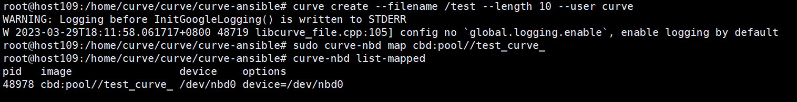

[TOC]

## Curve-CSI 与 CurveBS v2.5 使用对接

    curve-csi使用说明参考<https://github.com/opencurve/curve-csi/blob/master/docs/README.md>

    本文的补充curve-csi使用说明中Requirements部分，即用curveadm容器化部署curvebs服务端，用ansible在物理机上部署curvebs客户端，包括nebd nbd sdk。

    物理机上部署curvebs客户端后,curve-csi就可以调用物理机上curve命令创建卷，curve-csi通过nebd服务挂载nbd。

    curvebs版本使用release2.5。

### 环境信息

| 主机名     | 系统      | IP         |
| ------- | ------- | ---------- |
| 主控机     | debian9 | ip         |
| host109 | debian9 | ip.*.*.109 |
| host110 | debian9 | ip.*.*.110 |
| host111 | debian9 | ip.*.*.111 |

### curve\_release2.5 编译

#### 源码编译

```shell
    # 下载curve release2.5 源码
    $ git clone https://github.com/opencurve/curve.git -b release2.5
    # 编译curve release2.5 
    $ cd /编译路径/curve
    $ bash replace-curve-repo.sh
    $ bash mk-tar.sh
    # 编译完成所需的二进制和ansile脚本，用于部署curvebs客户端
    $ cd /编译路径/curve/build
    $ ls 
      curve nbd-package nebd-package
```

#### 镜像编译

```shell
    # 编译curve release2.5镜像，用于部署curvebs服务端
    $ cd /编译路径/curve
    $ make image stor=bs tag=wfcurvedocker/curvebs:v2.5 os=debian9
    # 根据需求查看Makefile和docker/debian9/中Dockefile文件
    $ make help
    # 将镜像上传到本地docker仓库，需要建本地dokcer仓库
    $ docker tag wfcurvedocker/curvebs:v2.5 ip.*.*.202:5000/wfcurvedocker/curvebs:v2.5
    # docker 离线仓库配置参考
      https://blog.csdn.net/weixin_37926734/article/details/123279987

```

### curvebs 服务端部署

#### curveadm 部署

curveadm 部署参考

<https://github.com/opencurve/curveadm/wiki/install-curveadm#%E5%AE%89%E8%A3%85-curveadm>

```shell
    $ bash -c "$(curl -fsSL https://curveadm.nos-eastchina1.126.net/script/install.sh)"
```

#### curvebs服务端配置

yaml配置参考

<https://github.com/opencurve/curveadm/tree/develop/configs/bs/cluster>

```yaml
hosts.yaml
    global:
      user: root
      ssh_port: 22
      private_key_file: /root/.ssh/id_rsa
    
    hosts:
      - host: host109
        hostname: ip.*.*.109
      - host: host110
        hostname: ip.*.*.110
      - host: host111
        hostname: ip.*.*.111
```

```yaml
format.yaml
    host:
      - host109
      - host110
      - host111
    disk:
      - /dev/nvme0n1:/data/chunkserver0:50  # device:mount_path:format_percent%
      - /dev/nvme1n1:/data/chunkserver1:50
      - /dev/nvme2n1:/data/chunkserver2:50
```

```yaml
topology.yaml 
    kind: curvebs
    global:
      container_image: ip.*.*.202:5000/wfcurvedocker/curvebs:v2.5 #编译的镜像地址
      log_dir: ${home}/logs/${service_role}${service_replicas_sequence}
      data_dir: ${home}/data/${service_role}${service_replicas_sequence}
      variable:
        home: /tmp
        machine1: host109
        machine2: host110
        machine3: host111
    
    etcd_services:
      config:
        listen.ip: ${service_host}
        listen.port: 2391
        listen.client_port: 2390
      deploy:
        - host: ${machine1}
        - host: ${machine2}
        - host: ${machine3}
    
    mds_services:
      config:
        listen.ip: ${service_host}
        listen.port: 6666
        listen.dummy_port: 6667
      deploy:
        - host: ${machine1}
        - host: ${machine2}
        - host: ${machine3}
    
    chunkserver_services:
      config:
        listen.ip: ${service_host}
        listen.port: 82${format_replicas_sequence}  # 8200,8201,8202
        data_dir: /data/chunkserver${service_replicas_sequence}  # /data/chunkserver0, /data/chunksever1
        copysets: 100
        chunkfilepool.enable_get_chunk_from_pool: false
      deploy:
        - host: ${machine1}
          replicas: 3
        - host: ${machine2}
          replicas: 3
        - host: ${machine3}
          replicas: 3
    
    snapshotclone_services:
      config:
        listen.ip: ${service_host}
        listen.port: 5555
        listen.dummy_port: 8081
        listen.proxy_port: 8080
      deploy:
        - host: ${machine1}
        - host: ${machine2}
        - host: ${machine3}
```

#### curvebs 服务端部署步骤

curvebs部署参考
<https://github.com/opencurve/curveadm/wiki/curvebs-cluster-deployment>

```shell
    # 进入curveadm配置目录，根据参考和需求修改
    $ cd configs/bs/cluster
    # 添加主机
    $ curveadm hosts commit hosts.yaml
    # 格式化磁盘
    $ curveadm format -f format.yaml
    # 添加集群
    $ curveadm cluster add curvebs2.5 -f topology.yaml
    # 切换集群
    $ curveadm cluster checkout curvebs2.5
    # 部署集群
    $ curveadm deploy --skip snapshotclone
    # 查看集群运行情况
    $ curveadm status
```

### curvebs 客户端部署

#### 环境准备具体步骤

 ansile部署curvebs参考
    <https://github.com/opencurve/curve/blob/master/docs/cn/deploy.md>

1.  root用户登录机器，创建curve用户

```shell
    $ adduser curve
```

2.  设置curve用户免密sudo

```shell
    $ su  # 进入root用户
    $ apt install sudo  # 安装sudo，如果没有安装过的话
    $ echo "curve ALL=(ALL) NOPASSWD:ALL" > /etc/sudoers.d/curve 
    $ sudo -iu curve  # 切换到curve用户
    $ sudo ls  # 测试sudo是否正确配置
```

3.  安装ansible 2.5.9

```shell
    $ apt install python
    $ apt install python-pip
    $ pip install ansible==2.5.9
    $ ansible-playbook  # 如果没有报错的话说明安装成功，报错的话执行下面两步
    $ pip install --upgrade pip
    $ pip install --upgrade setuptools
```

4.  配置ssh登陆到所有机器（包括自己），假设三台机器的ip分别为ip.*.*.109,ip.*.*.110,ip.*.*.111

```shell
    $ ssh-keygen  # 生成ssh秘钥
    $ ssh-copy-id root@ip.*.*.109  # 拷贝key到第一个机器
    $ ssh-copy-id root@ip.*.*.110  # 拷贝key到第二个机器
    $ ssh-copy-id root@ip.*.*.111  # 拷贝key到第三个机器
    $ ssh ip.*.*.109  # 挨个验证一下配置是否正确
```

#### curvebs客户端配置

1.  拷贝脚本和二进制到ip.*.*.109节点 /home/curve目录

```shell
    $ cp /编译目录/curve/build/curve  /home/curve/
    $ cp /编译目录/curve/build/nebd-package /home/curve/
    $ cp /编译目录/curve/build/nbd-package  /home/curve/
```

2.  修改curve-ansible中client.ini配置文件

```shell
    $ cd /home/curve/curve/curve-ansible
    $ vim client.ini
```

```yaml
client.ini

    [client]
    #所需部署客户端的地址
    client109 ansible_ssh_host=ip.*.*.109
    # 仅用于生成配置中的mds地址，curvebs服务端mds地址，curveadm status 可以查看
    [mds]
    mds109 ansible_ssh_host=ip.*.*.109
    mds110 ansible_ssh_host=ip.*.*.110
    mds111 ansible_ssh_host=ip.*.*.111
    [client:vars]
    nebd_package_version="1.0.2+e3fa47f"
    nbd_package_version=""
    sdk_package_version="0.0.6.1+160be351"
    deploy_dir="${HOME}"
    nebd_start_port=9000
    nebd_port_max_range=5
    nebd_need_sudo=true
    client_config_path=/etc/curve/client.conf
    nebd_client_config_path=/etc/nebd/nebd-client.conf
    nebd_server_config_path=/etc/nebd/nebd-server.conf
    nebd_data_dir=/data/nebd
    nebd_log_dir=/data/log/nebd
    curve_sdk_log_dir=/data/log/curve
    py_client_config_path=/etc/curve/py_client.conf
    clean_log_when_clean=true
    curvetab_path=/etc/curve
    curve_service_path=/etc/systemd/system
    
    [mds:vars]
    mds_port=6666
    
    [all:vars]
    need_confirm=true
    update_config_with_puppet=false
    ansible_ssh_port=22
    lib_install_prefix=/usr/local
    bin_install_prefix=/usr
    #需要改成ssh
    ansible_connection=ssh
    wait_service_timeout=20
    curve_bin_dir=/usr/bin
    start_by_daemon=true
    install_with_deb=false
    sudo_or_not=True
    ansible_become_user=curve
    ansible_become_flags=-iu curve
```

#### curvebs服务端安装

1.  安装 Nebd 服务和 NBD 包

```shell
    $ cd /home/curve/curve/curve-ansible
    $ ansible-playbook -i client.ini deploy_nebd.yml
    $ ansible-playbook -i client.ini deploy_nbd.yml
    $ ansible-playbook -i client.ini deploy_curve_sdk.yml
```

2.  nebd配置修改和状态查看

```shell
    # nebd配置路径
    $ cat /etc/curve/client.conf
    # nebd服务查看
    $ systemctl status nebd-daemon.service
    # nebd重启服务
    $ systemctl restart nebd-daemon.service
```

3.  验证curvebs集群是否可用
curve卷命令参考
	https://github.com/opencurve/curve/blob/master/docs/cn/k8s_csi_interface.md
	
```shell
    # 创建卷
    $ curve create --filename /test --length 10 --user curve
    # 挂载卷
    $ sudo curve-nbd map cbd:pool//test_curve_
    # 查看挂载状态
    $ curve-nbd list-mapped
```


### curve-csi 部署

    curve-csi使用说明参考<https://github.com/opencurve/curve-csi/blob/master/docs/README.md>
